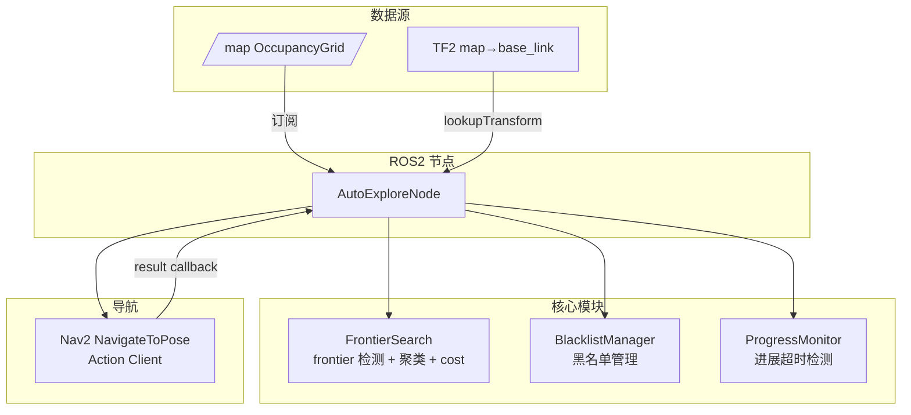
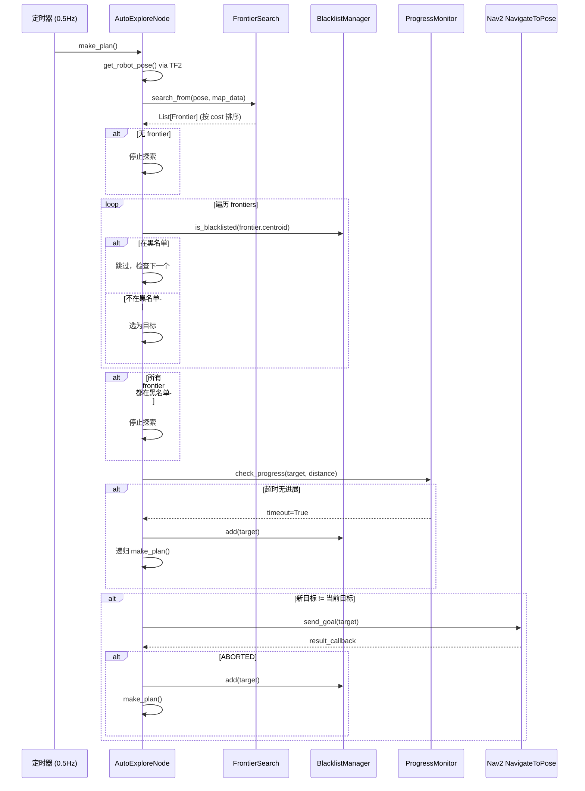

# 设计文档：Frontier Explore V4

## 概述

基于 m-explore-ros2 (explore_lite) 核心算法，纯 Python 重写自主探索建图系统 `auto_explore.py`。系统订阅 `/map` (OccupancyGrid)，通过 BFS 检测 frontier cell 并聚类为 cluster，使用 `distance × potential_scale - size × gain_scale` 的 cost 函数选择最优 frontier，通过 Nav2 `NavigateToPose` action 导航。引入黑名单机制（导航失败/超时自动拉黑，5 格容差）和 progress 超时检测（同一目标 15 秒无进展自动拉黑），解决当前版本严重的卡住问题。

核心改进点：frontier 聚类选中心点（而非单个 cell）、黑名单避免重复尝试失败目标、progress 超时自动脱困、cost 函数平衡距离与面积。所有 frontier 都在黑名单时自动停止探索。

## 架构



## 主循环时序图



## 组件与接口

### 组件 1：Frontier（数据结构）

```python
@dataclass
class Frontier:
    """一个 frontier cluster"""
    size: int = 0                          # cluster 包含的 cell 数量
    min_distance: float = float('inf')     # cluster 最近点到机器人的距离
    cost: float = 0.0                      # cost 函数计算结果
    centroid: tuple[float, float] = (0.0, 0.0)  # cluster 质心（世界坐标）
    middle: tuple[float, float] = (0.0, 0.0)    # 距机器人最近的点（世界坐标）
    points: list[tuple[float, float]] = field(default_factory=list)  # 所有点
```

**职责**：
- 存储单个 frontier cluster 的几何信息和 cost

### 组件 2：FrontierSearch

**用途**：从 OccupancyGrid 中检测所有 frontier，聚类并计算 cost

```python
class FrontierSearch:
    def __init__(self, potential_scale: float, gain_scale: float,
                 min_frontier_size: float, resolution: float): ...

    def search_from(self, robot_pos: tuple[float, float],
                    map_data: np.ndarray, width: int, height: int,
                    origin_x: float, origin_y: float,
                    resolution: float) -> list[Frontier]: ...

    def _build_new_frontier(self, initial_cell: int, reference: int,
                            frontier_flag: list[bool],
                            map_data: np.ndarray, width: int, height: int,
                            origin_x: float, origin_y: float,
                            resolution: float) -> Frontier: ...

    def _is_new_frontier_cell(self, idx: int, frontier_flag: list[bool],
                              map_data: np.ndarray, width: int, height: int) -> bool: ...

    def _frontier_cost(self, frontier: Frontier) -> float: ...
```

**职责**：
- 从机器人位置出发 BFS 遍历 free space
- 检测 unknown cell 且相邻 free cell 的 frontier cell
- BFS 聚类连通 frontier cell 为 cluster
- 过滤小于 min_frontier_size 的 cluster
- 计算每个 cluster 的 cost 并排序返回

### 组件 3：BlacklistManager

**用途**：管理导航失败/超时的 frontier 黑名单

```python
class BlacklistManager:
    def __init__(self, tolerance: int, resolution: float): ...
    def add(self, point: tuple[float, float]) -> None: ...
    def is_blacklisted(self, point: tuple[float, float]) -> bool: ...
    def clear(self) -> None: ...

    @property
    def size(self) -> int: ...
```

**职责**：
- 存储被拉黑的世界坐标点
- 判断给定点是否在黑名单内（tolerance × resolution 容差）
- 支持清空黑名单

### 组件 4：ProgressMonitor

**用途**：检测同一目标是否有进展

```python
class ProgressMonitor:
    def __init__(self, timeout: float): ...
    def update(self, goal: tuple[float, float], distance: float,
               current_time: float) -> bool: ...
    def reset(self) -> None: ...
```

**职责**：
- 跟踪当前目标和距离
- 目标变化或距离减小时重置计时器
- 超时返回 True 表示需要拉黑当前目标

### 组件 5：AutoExploreNode

**用途**：ROS2 节点，协调所有组件

```python
class AutoExploreNode(Node):
    def __init__(self): ...
    def _map_callback(self, msg: OccupancyGrid) -> None: ...
    def _get_robot_pose(self) -> tuple[float, float] | None: ...
    def _make_plan(self) -> None: ...
    def _send_goal(self, target: tuple[float, float]) -> None: ...
    def _goal_result_callback(self, future) -> None: ...
```

**职责**：
- 订阅 /map，缓存最新地图数据
- 通过 TF2 获取机器人位姿
- 定时调用 make_plan 执行探索循环
- 管理 Nav2 action client 发送导航目标
- 处理导航结果回调（成功/失败/取消）

## 数据模型

### OccupancyGrid 值映射

```python
UNKNOWN = -1       # 未探索区域
FREE = 0           # 自由空间（0-49 视为 free）
OCCUPIED_THRESH = 50  # 占据阈值（>=50 视为障碍）
```

**验证规则**：
- map_data 为 int8 数组，值域 [-1, 100]
- width × height == len(map_data)
- resolution > 0

### 坐标转换

```python
# cell index → grid (x, y)
gx = idx % width
gy = idx // width

# grid → world
wx = origin_x + (gx + 0.5) * resolution
wy = origin_y + (gy + 0.5) * resolution

# world → grid
gx = int((wx - origin_x) / resolution)
gy = int((wy - origin_y) / resolution)

# grid → cell index
idx = gy * width + gx
```


## 算法伪代码与形式化规约

### 算法 1：search_from — Frontier 检测与聚类

```python
def search_from(robot_pos, map_data, width, height, origin_x, origin_y, resolution):
    """从机器人位置出发，BFS 检测所有 frontier 并聚类"""
    # 将机器人世界坐标转为 grid 坐标
    mx = int((robot_pos[0] - origin_x) / resolution)
    my = int((robot_pos[1] - origin_y) / resolution)

    if not (0 <= mx < width and 0 <= my < height):
        return []  # 机器人在地图外

    frontier_flag = [False] * (width * height)
    visited_flag = [False] * (width * height)

    # 找到最近的 free cell 作为 BFS 起点
    start = nearest_free_cell(my * width + mx, map_data, width, height)
    bfs = deque([start])
    visited_flag[start] = True

    frontier_list = []

    while bfs:
        idx = bfs.popleft()

        for nbr in nhood4(idx, width, height):
            if map_data[nbr] >= 0 and map_data[nbr] < OCCUPIED_THRESH and not visited_flag[nbr]:
                # free cell，加入 BFS 队列继续搜索
                visited_flag[nbr] = True
                bfs.append(nbr)
            elif is_new_frontier_cell(nbr, frontier_flag, map_data, width, height):
                # frontier cell，开始聚类
                frontier_flag[nbr] = True
                new_frontier = build_new_frontier(nbr, start, frontier_flag,
                                                   map_data, width, height,
                                                   origin_x, origin_y, resolution)
                if new_frontier.size * resolution >= min_frontier_size:
                    frontier_list.append(new_frontier)

    # 计算 cost 并排序
    for f in frontier_list:
        f.cost = potential_scale * f.min_distance * resolution - gain_scale * f.size * resolution
    frontier_list.sort(key=lambda f: f.cost)

    return frontier_list
```

**前置条件**：
- `map_data` 非空，长度 == width × height
- `robot_pos` 为有效世界坐标
- `resolution` > 0

**后置条件**：
- 返回列表按 cost 升序排列
- 每个 Frontier 的 size × resolution >= min_frontier_size
- 每个 Frontier 的 centroid 为其所有点的质心

**循环不变量**：
- BFS 队列中所有 cell 已被标记为 visited
- 所有已发现的 frontier cell 已被标记为 frontier_flag
- 不会重复处理同一个 cell

### 算法 2：build_new_frontier — Frontier 聚类

```python
def build_new_frontier(initial_cell, reference, frontier_flag,
                       map_data, width, height, origin_x, origin_y, resolution):
    """从一个 frontier cell 出发，BFS 聚类所有连通的 frontier cell"""
    frontier = Frontier()
    frontier.size = 1

    # 参考点（机器人附近的 free cell）世界坐标
    ref_x = origin_x + (reference % width + 0.5) * resolution
    ref_y = origin_y + (reference // width + 0.5) * resolution

    bfs = deque([initial_cell])
    cx_sum, cy_sum = 0.0, 0.0

    while bfs:
        idx = bfs.popleft()

        for nbr in nhood8(idx, width, height):
            if is_new_frontier_cell(nbr, frontier_flag, map_data, width, height):
                frontier_flag[nbr] = True
                wx = origin_x + (nbr % width + 0.5) * resolution
                wy = origin_y + (nbr // width + 0.5) * resolution

                frontier.points.append((wx, wy))
                frontier.size += 1
                cx_sum += wx
                cy_sum += wy

                # 更新最近距离
                dist = math.sqrt((ref_x - wx) ** 2 + (ref_y - wy) ** 2)
                if dist < frontier.min_distance:
                    frontier.min_distance = dist
                    frontier.middle = (wx, wy)

                bfs.append(nbr)

    frontier.centroid = (cx_sum / frontier.size, cy_sum / frontier.size)
    return frontier
```

**前置条件**：
- `initial_cell` 是有效的 frontier cell（unknown 且相邻 free）
- `frontier_flag[initial_cell]` 已被设为 True

**后置条件**：
- 返回的 Frontier 包含所有与 initial_cell 8-连通的 frontier cell
- centroid 为所有点的算术平均
- min_distance 为 cluster 中距参考点最近的距离

**循环不变量**：
- 所有已处理的 frontier cell 的 frontier_flag 为 True
- cx_sum / cy_sum 为已处理点的坐标累加和
- frontier.size 等于已处理点数

### 算法 3：is_new_frontier_cell — Frontier Cell 判定

```python
def is_new_frontier_cell(idx, frontier_flag, map_data, width, height):
    """判断 cell 是否为新的 frontier cell"""
    # 必须是 unknown 且未被标记
    if map_data[idx] != UNKNOWN or frontier_flag[idx]:
        return False

    # 至少有一个 4-连通邻居是 free
    for nbr in nhood4(idx, width, height):
        if 0 <= map_data[nbr] < OCCUPIED_THRESH:
            return True

    return False
```

**前置条件**：
- `idx` 在 [0, width × height) 范围内

**后置条件**：
- 返回 True 当且仅当：map_data[idx] == -1 且 frontier_flag[idx] == False 且存在至少一个 4-连通 free 邻居

### 算法 4：goalOnBlacklist — 黑名单检查

```python
def is_blacklisted(point, blacklist, tolerance, resolution):
    """检查点是否在黑名单容差范围内"""
    for bl_point in blacklist:
        if (abs(point[0] - bl_point[0]) < tolerance * resolution and
            abs(point[1] - bl_point[1]) < tolerance * resolution):
            return True
    return False
```

**前置条件**：
- `tolerance` >= 0，`resolution` > 0

**后置条件**：
- 返回 True 当且仅当存在黑名单中的点，使得 x 和 y 方向差值均小于 tolerance × resolution

### 算法 5：make_plan — 主规划循环

```python
def make_plan(self):
    """主规划循环 — 对应 explore.cpp::makePlan()"""
    pose = self.get_robot_pose()
    if pose is None:
        return

    frontiers = self.search.search_from(pose, ...)

    if not frontiers:
        self.stop_exploration()
        return

    # 找第一个不在黑名单的 frontier
    target_frontier = None
    for f in frontiers:
        if not self.blacklist.is_blacklisted(f.centroid):
            target_frontier = f
            break

    if target_frontier is None:
        self.stop_exploration()  # 所有 frontier 都在黑名单
        return

    target = target_frontier.centroid
    same_goal = self._same_point(self.prev_goal, target)

    # 更新 progress monitor
    if not same_goal or self.prev_distance > target_frontier.min_distance:
        self.last_progress_time = self.get_clock().now()
        self.prev_distance = target_frontier.min_distance

    self.prev_goal = target

    # progress 超时检查
    elapsed = (self.get_clock().now() - self.last_progress_time).nanoseconds / 1e9
    if elapsed > PROGRESS_TIMEOUT:
        self.blacklist.add(target)
        self.make_plan()  # 递归重新规划
        return

    # 目标未变则不重复发送
    if same_goal:
        return

    self.send_goal(target)
```

**前置条件**：
- TF2 可用，/map 已接收
- Nav2 action server 已连接

**后置条件**：
- 要么发送新导航目标，要么停止探索
- 超时的目标已加入黑名单

### 算法 6：goal_result_callback — 导航结果处理

```python
def goal_result_callback(self, future):
    """导航结果回调 — 对应 explore.cpp::reachedGoal()"""
    result = future.result()
    status = result.status

    if status == GoalStatus.STATUS_SUCCEEDED:
        pass  # 成功，等下次 make_plan 选新目标
    elif status == GoalStatus.STATUS_ABORTED:
        self.blacklist.add(self.current_goal)  # 导航失败，拉黑
        self.make_plan()  # 立即重新规划
        return
    elif status == GoalStatus.STATUS_CANCELED:
        return  # 被取消，不做处理

    self.make_plan()  # 成功后立即寻找新目标
```

**前置条件**：
- future 包含有效的导航结果

**后置条件**：
- ABORTED 时目标已加入黑名单并触发重新规划
- SUCCEEDED 时触发重新规划寻找新目标
- CANCELED 时不做额外操作

## 关键函数形式化规约

### nhood4(idx, width, height) → list[int]

```python
def nhood4(idx: int, w: int, h: int) -> list[int]:
    """返回 4-连通邻居索引"""
```

**前置条件**：0 <= idx < w × h，w > 0，h > 0
**后置条件**：返回列表中所有索引在 [0, w×h) 范围内，最多 4 个元素
**循环不变量**：N/A

### nhood8(idx, width, height) → list[int]

```python
def nhood8(idx: int, w: int, h: int) -> list[int]:
    """返回 8-连通邻居索引"""
```

**前置条件**：0 <= idx < w × h，w > 0，h > 0
**后置条件**：返回列表中所有索引在 [0, w×h) 范围内，最多 8 个元素，包含 nhood4 的所有结果
**循环不变量**：N/A

### nearest_free_cell(start, map_data, width, height) → int

```python
def nearest_free_cell(start: int, map_data: np.ndarray, w: int, h: int) -> int:
    """BFS 找到距 start 最近的 free cell"""
```

**前置条件**：0 <= start < w × h
**后置条件**：返回的 idx 满足 0 <= map_data[idx] < OCCUPIED_THRESH，或在无 free cell 时返回 start
**循环不变量**：BFS 队列中所有 cell 已被标记为 visited

## 示例用法

```python
import rclpy
from rclpy.node import Node

# 创建并运行节点
rclpy.init()
node = AutoExploreNode()
rclpy.spin(node)
node.destroy_node()
rclpy.shutdown()
```

```python
# 单元测试示例：frontier 检测
# 5x5 地图：中间 free，边缘 unknown
map_data = np.array([
    -1, -1, -1, -1, -1,
    -1,  0,  0,  0, -1,
    -1,  0,  0,  0, -1,
    -1,  0,  0,  0, -1,
    -1, -1, -1, -1, -1,
], dtype=np.int8)

search = FrontierSearch(potential_scale=1e-3, gain_scale=1.0,
                        min_frontier_size=0.0, resolution=0.05)
frontiers = search.search_from(
    robot_pos=(0.125, 0.125),  # 地图中心
    map_data=map_data, width=5, height=5,
    origin_x=0.0, origin_y=0.0, resolution=0.05
)
assert len(frontiers) > 0
assert all(f.size > 0 for f in frontiers)
```

```python
# 单元测试示例：黑名单
bl = BlacklistManager(tolerance=5, resolution=0.05)
bl.add((1.0, 2.0))
assert bl.is_blacklisted((1.0, 2.0)) == True
assert bl.is_blacklisted((1.1, 2.1)) == True   # 在容差内
assert bl.is_blacklisted((5.0, 5.0)) == False   # 超出容差
```

```python
# 单元测试示例：progress monitor
pm = ProgressMonitor(timeout=15.0)
assert pm.update(goal=(1.0, 2.0), distance=5.0, current_time=0.0) == False
assert pm.update(goal=(1.0, 2.0), distance=5.0, current_time=16.0) == True  # 超时
assert pm.update(goal=(1.0, 2.0), distance=4.0, current_time=17.0) == False  # 有进展，重置
```

## 正确性属性

*属性是系统在所有有效执行中应保持为真的特征或行为——本质上是关于系统应该做什么的形式化陈述。属性作为人类可读规范与机器可验证正确性保证之间的桥梁。*

### Property 1: Frontier Cell 判定正确性

*For any* OccupancyGrid 和任意栅格单元 idx，is_new_frontier_cell(idx) 返回 True 当且仅当 map_data[idx] == UNKNOWN(-1) 且 frontier_flag[idx] == False 且至少存在一个 4-连通邻居为 Free_Cell（值在 [0, 50) 范围内）

**Validates: Requirements 1.1, 1.2, 1.3**

### Property 2: Frontier 质心为算术平均

*For any* search_from() 返回的 Frontier，其 centroid 应等于其 points 列表中所有点的算术平均值

**Validates: Requirement 2.2**

### Property 3: Frontier min_distance 与 middle 一致性

*For any* search_from() 返回的 Frontier，其 min_distance 应等于 points 中距参考点最近的欧氏距离，且 middle 应为该最近点的世界坐标

**Validates: Requirements 2.3, 2.4**

### Property 4: Frontier 最小尺寸过滤

*For any* search_from() 返回的 Frontier，其 size × resolution 应大于等于 min_frontier_size

**Validates: Requirement 2.5**

### Property 5: Cost 计算与排序

*For any* search_from() 返回的 Frontier 列表，每个 Frontier 的 cost 应等于 `min_distance × resolution × potential_scale - size × resolution × gain_scale`，且列表按 cost 升序排列（∀ i < j, frontiers[i].cost <= frontiers[j].cost）

**Validates: Requirements 3.1, 3.2**

### Property 6: 黑名单容差判定

*For any* BlacklistManager、任意已添加的黑名单点和任意查询点，is_blacklisted(query) 返回 True 当且仅当存在黑名单中的点 bl 使得 |query.x - bl.x| < tolerance × resolution 且 |query.y - bl.y| < tolerance × resolution

**Validates: Requirements 4.1, 4.2, 4.3**

### Property 7: 黑名单 clear 清空

*For any* 非空的 BlacklistManager，执行 clear() 后 size 应为 0，且之前所有已添加的点均不再被 is_blacklisted 判定为 True

**Validates: Requirement 4.4**

### Property 8: ProgressMonitor 超时检测

*For any* ProgressMonitor 和任意 (goal, distance, time) 更新序列，当连续收到相同 goal 且 distance 未减小的时间超过 timeout 时应返回 True；当 goal 变化或 distance 减小时应重置计时器并返回 False

**Validates: Requirements 5.1, 5.2, 5.3, 5.4**

### Property 9: 邻域计算正确性

*For any* 有效的 (idx, width, height)，nhood4 返回最多 4 个索引且全部在 [0, width×height) 范围内；nhood8 返回最多 8 个索引且全部在有效范围内；nhood8 的结果应包含 nhood4 的所有结果

**Validates: Requirements 10.1, 10.2, 10.3, 10.4**

### Property 10: 坐标转换 round-trip

*For any* 有效的栅格坐标 (gx, gy)、origin 和 resolution，将栅格坐标转换为世界坐标再转换回栅格坐标应得到原始值（grid → world → grid round-trip）

**Validates: Requirements 12.1, 12.2, 12.3, 12.4**

### Property 11: 地图外坐标返回空列表

*For any* OccupancyGrid 和超出地图范围的机器人坐标，search_from() 应返回空的 Frontier 列表

**Validates: Requirement 9.3**

## 错误处理

### 场景 1：TF2 查询失败

**条件**：lookupTransform(map → base_link) 抛出异常
**响应**：记录警告日志，跳过本次 make_plan，等待下次定时器触发
**恢复**：TF 恢复后自动继续

### 场景 2：地图未接收

**条件**：make_plan 时 map_data 为 None
**响应**：记录信息日志，跳过本次规划
**恢复**：收到 /map 消息后自动继续

### 场景 3：机器人在地图外

**条件**：机器人 TF 坐标转换为 grid 坐标后超出地图范围
**响应**：记录错误日志，返回空 frontier 列表
**恢复**：机器人回到地图范围内后自动恢复

### 场景 4：Nav2 Action Server 不可用

**条件**：NavigateToPose action server 未响应
**响应**：启动时阻塞等待连接（带超时日志）
**恢复**：连接成功后开始探索

### 场景 5：导航目标被 ABORTED

**条件**：Nav2 返回 ABORTED 状态
**响应**：将目标加入黑名单，立即调用 make_plan 重新规划
**恢复**：自动选择下一个最优 frontier

## 测试策略

### 单元测试

- `FrontierSearch.search_from()`：验证不同地图布局下的 frontier 检测和聚类
- `FrontierSearch._is_new_frontier_cell()`：验证 frontier cell 判定逻辑
- `BlacklistManager`：验证添加、查询、容差判定
- `ProgressMonitor`：验证超时检测、进展重置
- `nhood4/nhood8`：验证边界条件（角落、边缘）

### 属性基测试

**测试库**：hypothesis

- 随机生成 OccupancyGrid，验证所有返回的 frontier cell 确实是 unknown 且相邻 free
- 随机生成黑名单点和查询点，验证容差判定的对称性和一致性
- 随机生成 progress 序列，验证超时逻辑的正确性

### 集成测试

- 模拟完整探索循环：构造已知地图，验证节点能正确检测 frontier、发送导航目标、处理结果
- 验证黑名单 + progress 超时的联动：模拟卡住场景，验证自动脱困

## 性能考量

- BFS 遍历整个地图的时间复杂度 O(W×H)，对于 4000×4000 的大地图可能较慢
- 使用 numpy 数组存储 map_data，避免 Python list 的性能开销
- frontier_flag 和 visited_flag 使用 Python list[bool]（比 numpy bool array 在逐元素访问时更快）
- 规划频率 0.5Hz，给 BFS 留足计算时间
- 黑名单查询 O(N)，N 为黑名单大小，通常 < 100，不构成瓶颈

## 安全考量

- 不涉及网络通信安全（纯 ROS2 本地通信）
- TF 查询使用 try-except 防止异常崩溃
- 导航目标验证：确保发送的坐标在地图范围内
- 递归 make_plan 需要防止无限递归（黑名单机制保证终止）

## 依赖

- `rclpy`：ROS2 Python 客户端
- `numpy`：地图数据处理
- `tf2_ros`：TF2 坐标变换
- `nav_msgs`：OccupancyGrid 消息
- `nav2_msgs`：NavigateToPose action
- `action_msgs`：GoalStatus
- `geometry_msgs`：PoseStamped
- `collections.deque`：BFS 队列
- `math`：距离计算
- `dataclasses`：Frontier 数据结构
