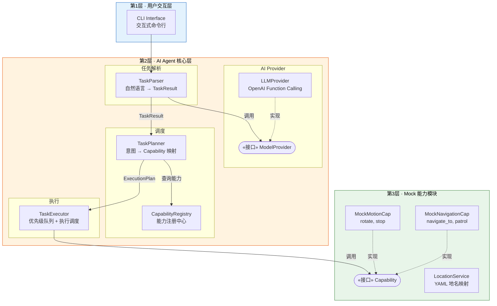
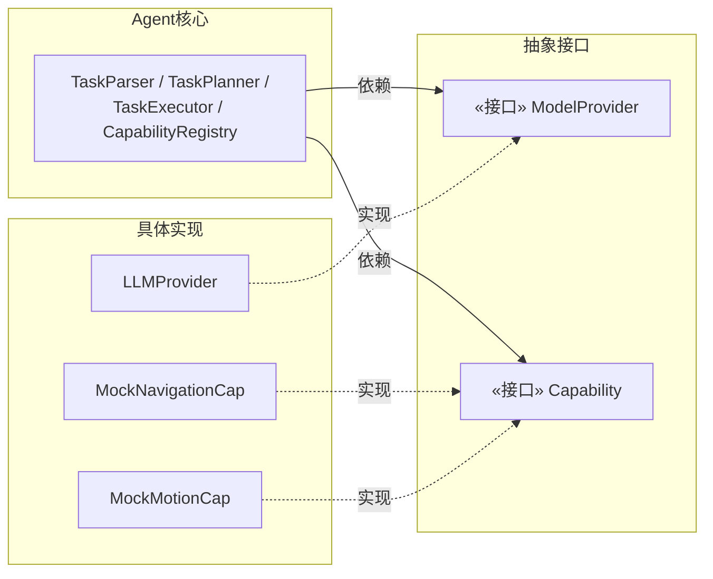
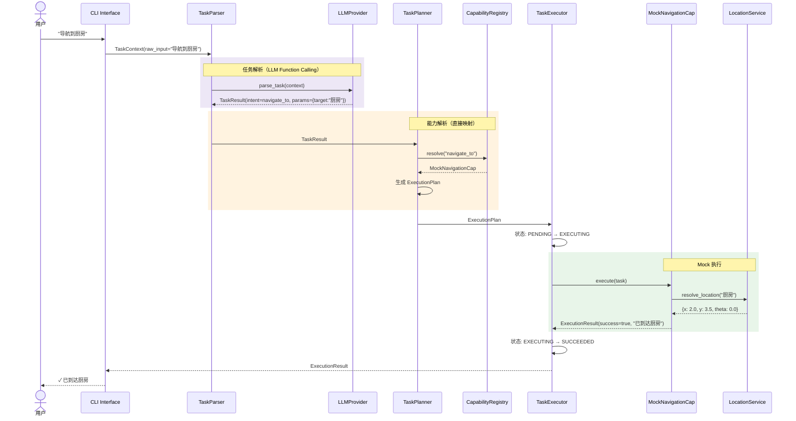

# 设计文档：MOSAIC 初期验证 Demo

## 概述

本设计文档定义 MOSAIC 系统的初期验证 Demo 骨架。目标是从完整 MOSAIC 架构中提取最小可行子集，验证 Agent 调度框架的端到端可行性：自然语言输入 → LLM 任务解析 → 能力解析 → Capability 执行 → 结果回传。

Demo 聚焦于 Agent 核心调度管道和插件化架构的跑通，不涉及 SceneGraph 构建、ARIA 多层记忆、VLA 集成、视觉/操作模块等高级特性。底层机器人能力使用 Mock 实现，LLM 调用使用 OpenAI Function Calling。

### Demo 范围裁剪

| 完整 MOSAIC 组件 | Demo 是否包含 | 说明 |
|---|---|---|
| 抽象接口层（ModelProvider / Capability / CapabilityRegistry） | ✅ 完整保留 | 架构基石 |
| Agent 核心调度（TaskParser → TaskPlanner → TaskExecutor） | ✅ 简化版 | TaskPlanner 简化为直接意图→能力映射，不含 LLM 规划 |
| 数据模型（TaskContext / TaskResult / ExecutionResult 等） | ✅ 完整保留 | 管道数据流基础 |
| LLMProvider + OpenAI Function Calling | ✅ 包含 | 验证 LLM 任务解析 |
| NavigationCapability（Mock） | ✅ Mock 实现 | 验证 Capability 插件机制 |
| MotionCapability（Mock） | ✅ Mock 实现 | 验证多能力注册 |
| LocationService | ✅ YAML 版本 | 语义地名解析 |
| CLI 交互接口 | ✅ 包含 | 用户交互入口 |
| 配置管理（YAML） | ✅ 包含 | 系统配置 |
| ARIA 多层记忆 / SceneGraph | ❌ 不包含 | 后续迭代 |
| SceneGraphBuilder / SceneGraphValidator | ❌ 不包含 | 后续迭代 |
| ManipulationModule / VisionModule / SearchModule | ❌ 不包含 | 后续迭代 |
| ROS 2 真实通信 | ❌ 不包含 | Demo 使用 Mock，不依赖 ROS 2 运行时 |
| VLA 端到端操作 | ❌ 不包含 | 后续迭代 |

## 架构

### Demo 系统分层

Demo 保留 MOSAIC 的 3 层架构，但大幅简化第 3 层（能力模块全部 Mock，不依赖 ROS 2）：



### 依赖倒置

Demo 严格遵循 MOSAIC 的依赖倒置原则。Agent 核心仅依赖抽象接口，Mock 实现可随时替换为真实实现：




### 数据流：Demo 端到端管道

以用户输入 "导航到厨房" 为例，展示 Demo 的完整数据流：



## 组件与接口

### 1. interfaces_abstract 模块

定义所有核心抽象接口，与完整 MOSAIC 保持一致。

#### ModelProvider

```python
from abc import ABC, abstractmethod

class ModelProvider(ABC):
    """AI 模型提供者抽象接口"""

    @abstractmethod
    async def parse_task(self, context: TaskContext) -> TaskResult:
        """解析自然语言指令为结构化任务"""
        pass

    @abstractmethod
    def get_supported_intents(self) -> list[str]:
        """返回支持的意图类型列表"""
        pass
```

#### Capability

```python
from abc import ABC, abstractmethod
from typing import Callable, Optional

class Capability(ABC):
    """机器人能力抽象接口"""

    @abstractmethod
    def get_name(self) -> str: pass

    @abstractmethod
    def get_supported_intents(self) -> list[str]: pass

    @abstractmethod
    async def execute(self, task: Task, feedback_callback: Callable = None) -> ExecutionResult:
        """执行任务"""
        pass

    @abstractmethod
    async def cancel(self) -> bool: pass

    @abstractmethod
    async def get_status(self) -> CapabilityStatus: pass

    @abstractmethod
    def get_capability_description(self) -> str:
        """返回能力的自然语言描述（供 LLM 理解能力边界）"""
        pass
```

#### CapabilityRegistry

```python
class CapabilityRegistry:
    """能力注册中心 — 管理 Capability 的注册、注销和意图解析"""

    def register(self, capability: Capability) -> None:
        """注册 Capability，自动纳入其支持的意图"""
        ...

    def unregister(self, name: str) -> None:
        """注销 Capability"""
        ...

    def resolve(self, intent: str) -> Capability:
        """根据意图解析到对应 Capability，未找到时抛出明确错误"""
        ...

    def list_capabilities(self) -> list[CapabilityInfo]:
        """返回所有已注册 Capability 的信息"""
        ...
```

### 2. agent_core 模块

#### TaskParser

```python
class TaskParser:
    """任务解析器 — 自然语言 → 结构化 TaskResult
    委托 ModelProvider 完成实际解析
    """

    def __init__(self, model_provider: ModelProvider):
        self._provider = model_provider

    async def parse(self, context: TaskContext) -> TaskResult:
        """解析自然语言指令"""
        result = await self._provider.parse_task(context)
        self._validate(result)
        return result

    def _validate(self, result: TaskResult) -> None:
        """校验解析结果合法性（intent 非空等）"""
        ...
```

#### TaskPlanner（Demo 简化版）

Demo 版 TaskPlanner 不含 LLM 规划和 SceneGraph 验证，仅做意图→能力的直接映射：

```python
class TaskPlanner:
    """Demo 版任务规划器 — 直接意图映射
    简化逻辑：TaskResult.intent → CapabilityRegistry.resolve() → ExecutionPlan
    不含 LLM 规划、SceneGraph 验证、重规划等高级特性
    """

    def __init__(self, registry: CapabilityRegistry):
        self._registry = registry

    async def plan(self, task_result: TaskResult) -> ExecutionPlan:
        """将 TaskResult 映射为 ExecutionPlan"""
        # 单任务：直接映射
        # 多子任务：逐个映射为有序动作序列
        ...
```

#### TaskExecutor

```python
class TaskExecutor:
    """任务执行器 — 内置优先级队列 + 执行调度
    职责：
    1. 接收 ExecutionPlan，按序执行
    2. 调用 Capability.execute()
    3. 跟踪状态流转：PENDING → EXECUTING → SUCCEEDED/FAILED/CANCELLED
    4. 支持配置化重试策略
    """

    async def execute_plan(self, plan: ExecutionPlan) -> ExecutionResult:
        """执行整个计划"""
        ...

    async def submit_task(self, task: Task) -> None:
        """将任务入队到优先级队列"""
        ...

    async def cancel_task(self, task_id: str) -> bool:
        """取消指定任务"""
        ...
```

### 3. model_providers 模块

#### LLMProvider

```python
class LLMProvider(ModelProvider):
    """基于 OpenAI Function Calling 的 ModelProvider 实现
    从 CapabilityRegistry 动态获取意图列表，自动生成函数定义
    """

    def __init__(self, client: OpenAIClient, registry: CapabilityRegistry):
        self._client = client
        self._registry = registry

    async def parse_task(self, context: TaskContext) -> TaskResult:
        """通过 Function Calling 解析自然语言"""
        functions = self._build_function_definitions()
        response = await self._client.chat_completion(
            messages=[...],
            functions=functions
        )
        return self._parse_response(response)

    def _build_function_definitions(self) -> list[dict]:
        """从 Registry 动态生成 Function Calling schema"""
        ...
```

#### OpenAIClient

```python
class OpenAIClient:
    """OpenAI API 异步客户端
    - 使用 httpx 异步 HTTP 调用
    - 指数退避重试（最多 3 次）
    - API 参数通过 YAML 配置，密钥通过环境变量注入
    """

    async def chat_completion(self, messages, functions=None, **kwargs) -> dict:
        """调用 ChatCompletion API"""
        ...
```

### 4. capabilities 模块（Mock 实现）

#### MockNavigationCapability

```python
class MockNavigationCapability(Capability):
    """Mock 导航能力 — 模拟 navigate_to 和 patrol 意图
    内部通过 LocationService 解析语义地名
    execute() 模拟异步延迟后返回成功
    """

    def __init__(self, location_service: LocationService):
        self._location_service = location_service

    def get_name(self) -> str:
        return "navigation"

    def get_supported_intents(self) -> list[str]:
        return ["navigate_to", "patrol"]

    async def execute(self, task: Task, feedback_callback=None) -> ExecutionResult:
        """模拟导航执行"""
        target = task.params.get("target")
        coords = self._location_service.resolve_location(target)
        # 模拟异步延迟
        await asyncio.sleep(0.1)
        return ExecutionResult(task_id=task.task_id, success=True, message=f"已到达{target}")
```

#### MockMotionCapability

```python
class MockMotionCapability(Capability):
    """Mock 运动能力 — 模拟 rotate 和 stop 意图"""

    def get_supported_intents(self) -> list[str]:
        return ["rotate", "stop"]

    async def execute(self, task: Task, feedback_callback=None) -> ExecutionResult:
        """模拟运动执行"""
        await asyncio.sleep(0.05)
        return ExecutionResult(task_id=task.task_id, success=True, message="运动完成")
```

#### LocationService

```python
class LocationService:
    """语义地名服务 — 维护地名到坐标的 YAML 映射
    支持运行时查询、添加和热加载
    """

    def __init__(self, config_path: str = "config/locations.yaml"):
        self._locations: dict[str, dict] = {}
        self._config_path = config_path

    def load(self) -> None:
        """从 YAML 文件加载地名映射"""
        ...

    def resolve_location(self, name: str) -> Optional[dict[str, float]]:
        """语义地名 → 坐标"""
        ...

    def add_location(self, name: str, coords: dict[str, float]) -> None:
        """添加地名映射"""
        ...

    def list_locations(self) -> dict[str, dict[str, float]]:
        """列出所有已注册地名"""
        ...
```

### 5. interfaces 模块

#### CLIInterface

```python
class CLIInterface:
    """交互式命令行界面
    - 接收用户自然语言输入
    - 支持中文和英文指令
    - 将 ExecutionResult 转化为中文文本输出
    - 支持 "退出"/"exit" 安全关闭
    """

    async def run(self) -> None:
        """主循环：读取输入 → Agent 处理 → 展示结果"""
        ...

    def format_result(self, result: ExecutionResult) -> str:
        """将 ExecutionResult 格式化为用户可读文本"""
        ...
```

### 6. config 模块

#### ConfigManager

```python
class ConfigManager:
    """配置管理器 — 读取和管理 YAML 配置"""

    def __init__(self, config_path: str = "config/agent_config.yaml"):
        self._config: dict = {}

    def load(self) -> None:
        """加载配置文件"""
        ...

    def get(self, key: str, default=None) -> Any:
        """获取配置项"""
        ...
```


## 数据模型

### 核心数据结构

与完整 MOSAIC 保持一致，Demo 使用其中的核心子集：

```python
from dataclasses import dataclass, field
from enum import Enum
from typing import Any, Optional
import uuid
from datetime import datetime

class TaskStatus(Enum):
    """任务状态枚举"""
    PENDING = "pending"
    EXECUTING = "executing"
    SUCCEEDED = "succeeded"
    FAILED = "failed"
    CANCELLED = "cancelled"

class CapabilityStatus(Enum):
    """能力状态枚举"""
    IDLE = "idle"
    BUSY = "busy"
    ERROR = "error"

@dataclass
class TaskContext:
    """任务上下文 — 在整个管道中传递"""
    raw_input: str
    language: str = "zh"
    timestamp: datetime = field(default_factory=datetime.now)
    metadata: dict[str, Any] = field(default_factory=dict)

@dataclass
class TaskResult:
    """任务解析结果"""
    intent: str
    params: dict[str, Any] = field(default_factory=dict)
    sub_tasks: list['TaskResult'] = field(default_factory=list)
    confidence: float = 1.0
    raw_response: Optional[str] = None

    def to_dict(self) -> dict: ...
    @classmethod
    def from_dict(cls, data: dict) -> 'TaskResult': ...

@dataclass
class Task:
    """可执行任务"""
    task_id: str = field(default_factory=lambda: str(uuid.uuid4()))
    intent: str = ""
    params: dict[str, Any] = field(default_factory=dict)
    priority: int = 1
    status: TaskStatus = TaskStatus.PENDING
    context: Optional[TaskContext] = None
    created_at: datetime = field(default_factory=datetime.now)
    retry_count: int = 0

@dataclass
class PlannedAction:
    """计划中的单个动作"""
    action_name: str
    parameters: dict[str, Any] = field(default_factory=dict)
    capability_name: str = ""
    task: Optional[Task] = None
    description: str = ""

@dataclass
class ExecutionPlan:
    """有序动作序列"""
    plan_id: str
    actions: list[PlannedAction]
    original_task: Optional[TaskResult] = None
    current_index: int = 0

    def peek_next(self) -> Optional[PlannedAction]: ...
    def advance(self) -> None: ...
    def is_complete(self) -> bool: ...

@dataclass
class ExecutionResult:
    """执行结果 — 沿管道回传"""
    task_id: str
    success: bool
    message: str
    status: TaskStatus = TaskStatus.SUCCEEDED
    data: dict[str, Any] = field(default_factory=dict)
    error: Optional[str] = None

@dataclass
class CapabilityInfo:
    """能力信息"""
    name: str
    supported_intents: list[str]
    status: CapabilityStatus = CapabilityStatus.IDLE
    description: str = ""
```

### 配置文件结构

#### agent_config.yaml

```yaml
# Demo Agent 配置
model_provider:
  type: "llm"
  config:
    model: "gpt-4"
    api_base: "https://api.openai.com/v1"
    temperature: 0.1
    timeout: 30

# Capability 加载列表
capabilities:
  - name: "navigation"
    class: "capabilities.mock_navigation.MockNavigationCapability"
    enabled: true
  - name: "motion"
    class: "capabilities.mock_motion.MockMotionCapability"
    enabled: true

# 重试策略
retry:
  max_retries: 3
  backoff_base: 2

# 日志
logging:
  level: "INFO"
```

#### locations.yaml

```yaml
locations:
  厨房: {x: 2.0, y: 3.5, theta: 0.0}
  客厅: {x: 0.0, y: 0.0, theta: 0.0}
  卧室: {x: -1.0, y: 2.0, theta: 1.57}
  充电桩: {x: 0.0, y: 0.0, theta: 0.0}
  大门: {x: 3.0, y: -1.0, theta: 3.14}
```

## 错误处理

| 错误类型 | 处理策略 |
|---------|---------|
| LLM API 失败 | 指数退避重试（最多 3 次），耗尽后返回错误 ExecutionResult |
| 意图解析失败 | 返回错误 ExecutionResult，提示用户重新输入 |
| 未注册意图 | CapabilityRegistry 返回明确错误信息 |
| Capability 执行失败 | 按配置重试，失败后返回错误 ExecutionResult |
| 配置文件错误 | 启动时校验，失败则拒绝启动 |
| CLI 异常 | 显示友好错误提示，系统保持可用 |

所有错误最终封装为 ExecutionResult 回传给用户，不产生未处理异常。

## 测试策略

### 属性测试（Hypothesis）

| 属性 | 描述 |
|------|------|
| Registry round-trip | 注册 Capability 后 resolve 返回该实例，注销后不再返回 |
| 未注册意图错误 | resolve 未注册意图返回明确错误 |
| 优先级队列排序 | 任务按优先级从高到低出队 |
| 状态机合法转换 | 任务状态仅沿合法路径流转 |
| TaskResult JSON round-trip | 序列化再反序列化产生等价对象 |
| LocationService round-trip | 添加地名后查询返回相同坐标 |
| 管道错误传播 | 任何阶段异常封装为 ExecutionResult，不产生未处理异常 |

### 单元测试（pytest）

- 接口结构验证：抽象类定义完整性
- Mock Capability 行为验证
- CLI 退出命令处理
- 配置文件加载
- 端到端管道集成测试（全 Mock）

### 测试目录

```
test/
└── mosaic_demo/
    ├── test_capability_registry.py
    ├── test_task_executor.py
    ├── test_data_models.py
    ├── test_location_service.py
    ├── test_llm_client.py
    ├── test_cli_interface.py
    └── test_pipeline.py
```

## 性能考量

Demo 阶段无严格性能要求，但需注意：
- LLM API 调用延迟（1-5 秒），CLI 应提示"正在处理..."
- Mock Capability 使用 asyncio.sleep 模拟执行延迟，保持异步架构

## 安全考量

- OpenAI API 密钥通过环境变量 `OPENAI_API_KEY` 注入，禁止硬编码
- 配置文件不包含敏感信息

## 依赖

| 依赖 | 用途 |
|------|------|
| httpx | OpenAI API 异步 HTTP 调用 |
| pyyaml | YAML 配置文件解析 |
| hypothesis | 属性测试 |
| pytest | 单元测试 |
| pytest-asyncio | 异步测试支持 |

## 项目目录结构

```
mosaic_demo/
├── interfaces_abstract/          # 抽象接口层
│   ├── __init__.py
│   ├── model_provider.py         # ModelProvider 抽象基类
│   ├── capability.py             # Capability 抽象基类
│   ├── capability_registry.py    # CapabilityRegistry
│   └── data_models.py            # 核心数据结构
├── agent_core/                   # Agent 核心调度
│   ├── __init__.py
│   ├── task_parser.py            # TaskParser
│   ├── task_planner.py           # TaskPlanner（Demo 简化版）
│   └── task_executor.py          # TaskExecutor（含优先级队列）
├── model_providers/              # AI Provider 实现
│   ├── __init__.py
│   ├── llm_provider.py           # LLMProvider
│   └── openai_client.py          # OpenAI API 客户端
├── capabilities/                 # Capability 实现
│   ├── __init__.py
│   ├── mock_navigation.py        # MockNavigationCapability
│   ├── mock_motion.py            # MockMotionCapability
│   └── location_service.py       # LocationService
├── interfaces/                   # 用户交互
│   ├── __init__.py
│   └── cli_interface.py          # CLI 交互接口
├── config/                       # 配置文件
│   ├── agent_config.yaml
│   └── locations.yaml
└── main.py                       # 入口文件
```

## 正确性属性

*属性是在系统所有合法执行中都应成立的特征或行为——本质上是对系统行为的形式化声明。属性是人类可读规格说明与机器可验证正确性保证之间的桥梁。*

### 属性 1：CapabilityRegistry 注册-解析 round-trip

*对于任意* Capability 实例及其支持的意图列表，注册到 CapabilityRegistry 后，通过任意一个支持的意图调用 `resolve` 应返回该 Capability 实例。

**验证需求: 2.1, 2.2**

### 属性 2：CapabilityRegistry 注销后不可解析

*对于任意* 已注册的 Capability，注销后通过其之前支持的任意意图调用 `resolve` 应抛出异常。

**验证需求: 2.3, 2.4**

### 属性 3：未注册意图解析错误

*对于任意* 不在 CapabilityRegistry 中的意图字符串，调用 `resolve` 应抛出包含明确错误信息的异常。

**验证需求: 2.3**

### 属性 4：TaskParser 验证 — 空意图拒绝

*对于任意* intent 为空字符串的 TaskResult，TaskParser 的校验逻辑应拒绝该结果并返回错误。

**验证需求: 3.2, 3.3**

### 属性 5：TaskPlanner 单意图映射

*对于任意* 包含单个意图的 TaskResult（无子任务），TaskPlanner 生成的 ExecutionPlan 应恰好包含一个动作，且该动作的 capability_name 与 Registry 中解析到的 Capability 一致。

**验证需求: 4.1**

### 属性 6：TaskPlanner 多子任务映射

*对于任意* 包含 N 个子任务的 TaskResult，TaskPlanner 生成的 ExecutionPlan 应包含 N 个有序动作，且动作顺序与子任务顺序一致。

**验证需求: 4.2**

### 属性 7：TaskExecutor 状态机合法转换

*对于任意* 任务执行序列，任务状态仅沿合法路径流转：PENDING → EXECUTING → SUCCEEDED/FAILED/CANCELLED。不存在从 SUCCEEDED 回到 EXECUTING 等非法转换。

**验证需求: 5.2, 5.3, 5.7**

### 属性 8：TaskExecutor 执行顺序保持

*对于任意* 包含多个动作的 ExecutionPlan，TaskExecutor 调用 Capability 的顺序应与动作序列的顺序严格一致。

**验证需求: 5.1**

### 属性 9：TaskExecutor 重试行为

*对于任意* 执行失败的 Capability，TaskExecutor 应按配置的最大重试次数进行重试，重试次数不超过配置值。

**验证需求: 5.4, 5.5**

### 属性 10：LocationService 添加-查询 round-trip

*对于任意* 地名字符串和坐标字典（包含 x、y、theta），添加到 LocationService 后查询该地名应返回相同的坐标。

**验证需求: 8.2, 8.4**

### 属性 11：LocationService 未注册地名返回 None

*对于任意* 不在 LocationService 中的地名字符串，查询应返回 None。

**验证需求: 8.3**

### 属性 12：TaskResult 序列化 round-trip

*对于任意* 合法的 TaskResult 实例（包含任意 intent、params、sub_tasks、confidence），`to_dict` 后再 `from_dict` 应产生与原始实例等价的对象。

**验证需求: 12.3**

### 属性 13：管道错误传播

*对于任意* 管道阶段（TaskParser / TaskPlanner / TaskExecutor）中抛出的异常，Agent 应将其封装为 ExecutionResult 回传，不产生未处理异常。

**验证需求: 13.1, 13.2**

### 属性 14：CLIInterface 输入封装

*对于任意* 用户输入字符串，CLIInterface 应将其正确封装为 TaskContext，其中 raw_input 等于原始输入。

**验证需求: 10.2**

### 属性 15：CLIInterface 结果格式化

*对于任意* ExecutionResult（成功或失败），CLIInterface 的 `format_result` 方法应返回包含执行状态和消息的中文可读文本。

**验证需求: 10.3**

### 属性 16：ConfigManager 查询默认值

*对于任意* 不存在于配置中的 key 和任意默认值，ConfigManager 的 `get` 方法应返回该默认值。

**验证需求: 11.2**

### 属性 17：OpenAIClient 重试次数上限

*对于任意* 持续失败的 API 调用，OpenAIClient 的重试次数不应超过配置的最大重试次数（3 次）。

**验证需求: 9.2, 9.3**

### 属性 18：MockNavigationCapability 成功结果包含地名

*对于任意* 已注册的地名，MockNavigationCapability 执行 navigate_to 后返回的 ExecutionResult 的 message 应包含该地名。

**验证需求: 6.3**

### 属性 19：Function Calling 响应解析

*对于任意* 合法的 OpenAI Function Calling 响应（包含 function_call.name 和 function_call.arguments），LLMProvider 应将其正确解析为 TaskResult，其中 intent 等于 function_call.name。

**验证需求: 3.5**
