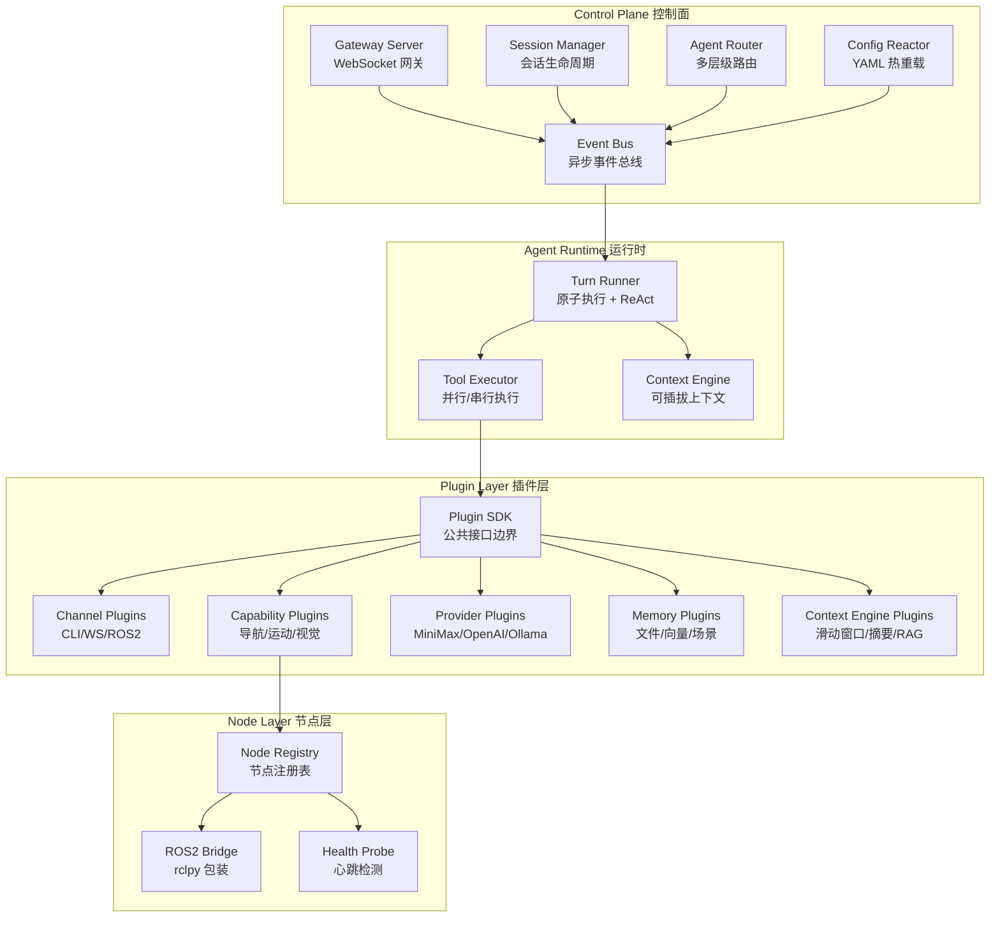
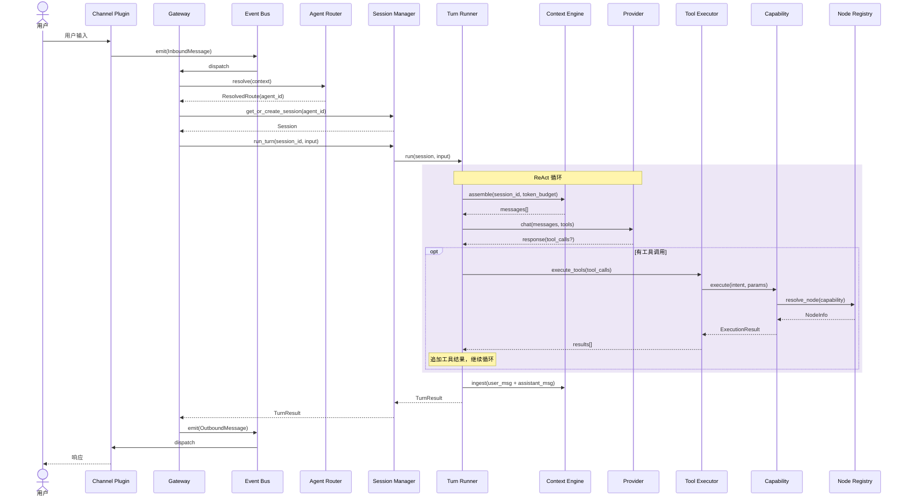

# 设计文档：MOSAIC v2 全面架构重构

## 概述

MOSAIC v2 是对 v1 线性管道 Demo 的全面重建，目标是构建一个事件驱动、插件优先、支持多 Agent 协作的机器人智能体框架。借鉴 OpenClaw 的 Gateway/ACP 架构模式，v2 采用四层架构：Control Plane（控制面）→ Agent Runtime（运行时）→ Plugin Layer（插件层）→ Node Layer（节点层），通过异步 EventBus 解耦所有组件。

核心设计原则：
- **事件驱动**：异步 EventBus 替代 v1 同步管道，所有组件通过事件通信
- **插件优先**：基于 Python Protocol 的零继承耦合，插件通过 SDK 公共边界交互
- **会话隔离**：完整的 Session 生命周期管理，支持并发控制和资源回收
- **可观测性**：结构化日志 + 指标收集 + 分布式追踪，覆盖全链路

### v2 相对于 v1 的关键修正

基于对 v2 方案的合理性分析，设计中做了以下修正：

1. **Event 比较问题**：`frozen=True` dataclass 的 Event 需实现 `__lt__` 以支持 PriorityQueue 元组比较
2. **PluginRegistry discover() 闭包**：`lambda e=entry: e` 中 entry 已是实例而非工厂函数，修正为传递真正的工厂函数
3. **Provider 不使用排他性 Slot**：多个 Provider 应共存（如同时配置 OpenAI 和 Ollama），通过配置选择默认 Provider，而非互斥
4. **Planner 不作为 Slot**：Planner 是 TurnRunner 的内部策略，不是可替换插件
5. **gRPC/MQTT/sandbox 标记为可选**：对研究项目过重，核心只保留 WebSocket + asyncio
6. **ROS2 Bridge 集成**：明确定义通过 rclpy 的 Node 包装器与 ROS2 交互

## 架构

### 四层架构总览




### 核心数据流



## 组件与接口

### 1. Event Bus — 异步事件总线

系统神经中枢，所有组件通过事件解耦通信。

```python
from __future__ import annotations
import asyncio
from enum import Enum
from dataclasses import dataclass, field
from typing import Any, Callable, Awaitable
from datetime import datetime
import uuid

class EventPriority(Enum):
    """事件优先级"""
    CRITICAL = 0   # 安全/紧急停止
    HIGH = 1       # 执行结果
    NORMAL = 2     # 常规消息
    LOW = 3        # 日志/遥测

@dataclass(frozen=True)
class Event:
    """不可变事件对象"""
    type: str
    payload: dict[str, Any]
    source: str
    event_id: str = field(default_factory=lambda: str(uuid.uuid4())[:8])
    timestamp: datetime = field(default_factory=datetime.now)
    priority: EventPriority = EventPriority.NORMAL
    correlation_id: str | None = None
    session_id: str | None = None

    def __lt__(self, other: Event) -> bool:
        """支持 PriorityQueue 比较（修正 v2 方案中的比较问题）"""
        if self.priority.value != other.priority.value:
            return self.priority.value < other.priority.value
        return self.timestamp < other.timestamp

EventHandler = Callable[[Event], Awaitable[None]]

class EventBus:
    """异步事件总线 — 优先级队列 + 通配符订阅 + 中间件"""

    def __init__(self, max_queue_size: int = 10000):
        self._handlers: dict[str, list[EventHandler]] = {}
        self._queue: asyncio.PriorityQueue = asyncio.PriorityQueue(
            maxsize=max_queue_size
        )
        self._running = False
        self._middlewares: list[Callable[[Event], Event | None]] = []

    def on(self, event_type: str, handler: EventHandler) -> Callable:
        """订阅事件，支持通配符 'capability.*'"""
        self._handlers.setdefault(event_type, []).append(handler)
        return lambda: self._handlers[event_type].remove(handler)

    async def emit(self, event: Event) -> None:
        """发射事件（经过中间件链）"""
        for mw in self._middlewares:
            event = mw(event)
            if event is None:
                return
        await self._queue.put(event)  # Event 自身实现 __lt__

    def use(self, middleware: Callable[[Event], Event | None]):
        """注册中间件"""
        self._middlewares.append(middleware)

    async def start(self):
        """启动事件分发循环"""
        self._running = True
        while self._running:
            event = await self._queue.get()
            await self._dispatch(event)

    async def stop(self):
        self._running = False

    async def _dispatch(self, event: Event):
        """分发到匹配的 handler"""
        tasks = []
        for pattern, handlers in self._handlers.items():
            if self._matches(pattern, event.type):
                tasks.extend(handler(event) for handler in handlers)
        if tasks:
            await asyncio.gather(*tasks, return_exceptions=True)

    @staticmethod
    def _matches(pattern: str, event_type: str) -> bool:
        if pattern == "*":
            return True
        if pattern.endswith(".*"):
            return event_type.startswith(pattern[:-1])
        return pattern == event_type
```


### 2. Plugin SDK — 零继承耦合插件接口

基于 Python Protocol 定义插件公共边界，所有插件类型通过 Protocol 约束而非继承。

```python
# mosaic/plugin_sdk/types.py
from __future__ import annotations
from typing import Protocol, Any, runtime_checkable, AsyncIterator
from dataclasses import dataclass, field
from enum import Enum

# ── 插件元数据 ──

@dataclass(frozen=True)
class PluginMeta:
    """插件元数据"""
    id: str
    name: str
    version: str
    description: str
    kind: str  # "capability" | "provider" | "channel" | "memory" | "context-engine"
    author: str = ""
    config_schema: dict | None = None

# ── 通用类型 ──

class HealthState(Enum):
    HEALTHY = "healthy"
    DEGRADED = "degraded"
    UNHEALTHY = "unhealthy"

@dataclass
class HealthStatus:
    state: HealthState
    message: str = ""

@dataclass
class ExecutionContext:
    session_id: str
    turn_id: str = ""
    metadata: dict[str, Any] = field(default_factory=dict)

@dataclass
class ExecutionResult:
    success: bool
    data: dict[str, Any] = field(default_factory=dict)
    message: str = ""
    error: str | None = None

# ── 能力插件协议 ──

@runtime_checkable
class CapabilityPlugin(Protocol):
    """能力插件接口 — 导航/运动/视觉等"""
    meta: PluginMeta

    def get_supported_intents(self) -> list[str]: ...
    def get_tool_definitions(self) -> list[dict[str, Any]]: ...
    async def execute(self, intent: str, params: dict, ctx: ExecutionContext) -> ExecutionResult: ...
    async def cancel(self) -> bool: ...
    async def health_check(self) -> HealthStatus: ...

# ── Provider 插件协议（非排他性，多 Provider 共存）──

@dataclass
class ProviderConfig:
    model: str = ""
    temperature: float = 0.7
    max_tokens: int = 4096
    extra: dict[str, Any] = field(default_factory=dict)

@dataclass
class ProviderResponse:
    content: str
    tool_calls: list[dict[str, Any]] = field(default_factory=list)
    usage: dict[str, int] = field(default_factory=dict)
    raw_content: Any = None

@runtime_checkable
class ProviderPlugin(Protocol):
    """Provider 插件接口 — LLM 提供者（多 Provider 共存，配置选择默认）"""
    meta: PluginMeta

    async def chat(self, messages: list[dict], tools: list[dict] | None,
                   config: ProviderConfig) -> ProviderResponse: ...
    async def stream(self, messages: list[dict], tools: list[dict] | None,
                     config: ProviderConfig) -> AsyncIterator: ...
    async def validate_auth(self) -> bool: ...

# ── 通道插件协议 ──

@dataclass
class OutboundMessage:
    session_id: str
    content: str
    metadata: dict[str, Any] = field(default_factory=dict)

@dataclass
class SendResult:
    success: bool
    error: str | None = None

@runtime_checkable
class ChannelPlugin(Protocol):
    """通道插件接口 — CLI/WebSocket/ROS2 Topic"""
    meta: PluginMeta

    async def start(self) -> None: ...
    async def stop(self) -> None: ...
    async def send(self, message: OutboundMessage) -> SendResult: ...
    def on_message(self, handler: Callable) -> None: ...

# ── 记忆插件协议 ──

@dataclass
class MemoryEntry:
    key: str
    content: str
    metadata: dict[str, Any] = field(default_factory=dict)
    score: float = 0.0

@runtime_checkable
class MemoryPlugin(Protocol):
    """记忆插件接口 — 文件/向量/场景记忆"""
    meta: PluginMeta

    async def store(self, key: str, content: str, metadata: dict) -> None: ...
    async def search(self, query: str, top_k: int = 5) -> list[MemoryEntry]: ...
    async def get(self, key: str) -> MemoryEntry | None: ...
    async def delete(self, key: str) -> bool: ...

# ── 上下文引擎插件协议 ──

@dataclass
class AssembleResult:
    messages: list[dict[str, Any]]
    token_count: int

@dataclass
class CompactResult:
    removed_count: int
    remaining_count: int

@runtime_checkable
class ContextEnginePlugin(Protocol):
    """上下文引擎接口 — 滑动窗口/摘要压缩/RAG"""
    meta: PluginMeta

    async def ingest(self, session_id: str, message: dict) -> None: ...
    async def assemble(self, session_id: str, token_budget: int) -> AssembleResult: ...
    async def compact(self, session_id: str, force: bool = False) -> CompactResult: ...
```

### 3. Plugin Registry — 插件注册表

管理插件的发现、注册、实例化和生命周期。Provider 使用注册表而非排他性 Slot。

```python
# mosaic/plugin_sdk/registry.py
from typing import Any, Callable

PluginFactory = Callable[[], Any]  # 返回插件实例的工厂函数

class PluginRegistry:
    """插件注册表 — 工厂模式 + 懒加载"""

    def __init__(self):
        self._factories: dict[str, PluginFactory] = {}
        self._instances: dict[str, Any] = {}
        self._kind_index: dict[str, list[str]] = {}  # kind → [plugin_id]
        # 排他性 Slot（仅 memory 和 context-engine）
        self._slots: dict[str, str] = {}  # slot_key → active_plugin_id
        # Provider 注册表（非排他，多 Provider 共存）
        self._default_provider: str = ""

    def register(self, plugin_id: str, factory: PluginFactory, kind: str):
        """注册插件工厂（修正：传工厂函数而非实例）"""
        self._factories[plugin_id] = factory
        self._kind_index.setdefault(kind, []).append(plugin_id)

    def resolve(self, plugin_id: str) -> Any:
        """解析并实例化插件（懒加载）"""
        if plugin_id not in self._instances:
            factory = self._factories.get(plugin_id)
            if not factory:
                raise KeyError(f"插件未注册: {plugin_id}")
            self._instances[plugin_id] = factory()
        return self._instances[plugin_id]

    def set_slot(self, slot_key: str, plugin_id: str):
        """设置排他性 Slot（仅 memory / context-engine）"""
        self._slots[slot_key] = plugin_id

    def resolve_slot(self, slot_key: str) -> Any:
        """通过 Slot 解析当前活跃插件"""
        plugin_id = self._slots.get(slot_key, "")
        if not plugin_id:
            raise KeyError(f"Slot 未配置: {slot_key}")
        return self.resolve(plugin_id)

    def set_default_provider(self, plugin_id: str):
        """设置默认 Provider（非排他，其他 Provider 仍可用）"""
        self._default_provider = plugin_id

    def resolve_provider(self, plugin_id: str | None = None) -> Any:
        """解析 Provider（指定或默认）"""
        pid = plugin_id or self._default_provider
        return self.resolve(pid)

    def list_by_kind(self, kind: str) -> list[str]:
        """列出指定类型的所有插件 ID"""
        return self._kind_index.get(kind, [])

    def discover(self, package: str = "plugins"):
        """自动发现插件包（修正：使用工厂函数而非实例）"""
        import importlib, pkgutil
        categories = ["channels", "capabilities", "providers", "memory", "context_engines"]
        for category in categories:
            try:
                pkg = importlib.import_module(f"{package}.{category}")
                for _, name, _ in pkgutil.iter_modules(pkg.__path__):
                    try:
                        mod = importlib.import_module(f"{package}.{category}.{name}")
                        if hasattr(mod, "create_plugin"):
                            # 修正：传递工厂函数，而非立即调用的实例
                            self.register(name, mod.create_plugin, category.rstrip("s"))
                    except Exception:
                        pass  # 单个插件加载失败不影响系统
            except ModuleNotFoundError:
                pass
```


### 4. Session Manager — 会话生命周期管理

借鉴 OpenClaw AcpSessionManager，管理 Session 的完整生命周期和并发控制。

```python
# mosaic/gateway/session_manager.py
import asyncio
import uuid
import time
from enum import Enum
from dataclasses import dataclass, field
from typing import Any

class SessionState(Enum):
    INITIALIZING = "initializing"
    READY = "ready"
    RUNNING = "running"
    WAITING = "waiting"
    SUSPENDED = "suspended"
    CLOSED = "closed"

@dataclass
class Session:
    session_id: str = field(default_factory=lambda: str(uuid.uuid4()))
    agent_id: str = "default"
    channel_id: str = ""
    state: SessionState = SessionState.INITIALIZING
    turn_count: int = 0
    created_at: float = field(default_factory=time.time)
    last_active_at: float = field(default_factory=time.time)
    metadata: dict[str, Any] = field(default_factory=dict)

class SessionManager:
    """会话管理器 — 生命周期 + 并发控制 + 空闲回收

    状态流转: INITIALIZING → READY → RUNNING ⇄ WAITING → CLOSED
                                                  ↓
                                              SUSPENDED → CLOSED
    """

    def __init__(self, max_concurrent: int = 10, idle_timeout_s: float = 300):
        self._sessions: dict[str, Session] = {}
        self._max_concurrent = max_concurrent
        self._idle_timeout_s = idle_timeout_s
        self._locks: dict[str, asyncio.Lock] = {}

    async def create_session(self, agent_id: str, channel_id: str) -> Session:
        """创建新会话（含并发限制检查）"""
        self._enforce_concurrent_limit()
        session = Session(agent_id=agent_id, channel_id=channel_id)
        self._sessions[session.session_id] = session
        self._locks[session.session_id] = asyncio.Lock()
        session.state = SessionState.READY
        return session

    async def run_turn(self, session_id: str, user_input: str, turn_runner) -> Any:
        """执行一个 Turn（原子操作，session 级锁保护）"""
        session = self._require_session(session_id)
        async with self._locks[session_id]:
            session.state = SessionState.RUNNING
            session.turn_count += 1
            session.last_active_at = time.time()
            try:
                result = await turn_runner.run(session, user_input)
                session.state = SessionState.WAITING
                return result
            except Exception:
                session.state = SessionState.WAITING
                raise

    async def close_session(self, session_id: str) -> None:
        """关闭会话"""
        session = self._sessions.pop(session_id, None)
        if session:
            session.state = SessionState.CLOSED
            self._locks.pop(session_id, None)

    async def evict_idle_sessions(self) -> list[str]:
        """回收空闲会话"""
        now = time.time()
        evicted = []
        for sid, session in list(self._sessions.items()):
            if (session.state == SessionState.WAITING and
                now - session.last_active_at > self._idle_timeout_s):
                session.state = SessionState.SUSPENDED
                evicted.append(sid)
        return evicted

    def get_session(self, session_id: str) -> Session | None:
        return self._sessions.get(session_id)

    def _enforce_concurrent_limit(self):
        active = sum(1 for s in self._sessions.values()
                     if s.state in (SessionState.RUNNING, SessionState.READY))
        if active >= self._max_concurrent:
            raise RuntimeError(f"并发会话数已达上限: {self._max_concurrent}")

    def _require_session(self, session_id: str) -> Session:
        session = self._sessions.get(session_id)
        if not session:
            raise KeyError(f"会话不存在: {session_id}")
        if session.state == SessionState.CLOSED:
            raise RuntimeError(f"会话已关闭: {session_id}")
        return session
```

### 5. Turn Runner — 原子执行引擎

一个 Turn = 用户输入 → [LLM 推理 → 工具调用]* → 最终响应。Planner 作为内部策略而非插件。

```python
# mosaic/runtime/turn_runner.py
import asyncio
import time
import uuid
from dataclasses import dataclass, field
from typing import Any

@dataclass
class TurnResult:
    success: bool
    response: str
    tool_calls: list[dict] = field(default_factory=list)
    execution_results: list[dict] = field(default_factory=list)
    tokens_used: int = 0
    duration_ms: float = 0.0
    turn_id: str = ""

class TurnRunner:
    """Turn 级原子执行器 — ReAct 循环 + 并行工具调用

    Planner 是内部策略（非插件 Slot），通过 ReAct 循环实现：
    1. 组装上下文 → 2. LLM 推理 → 3. 工具调用（可选）→ 4. 循环或返回
    """

    def __init__(self, registry, event_bus, hooks,
                 max_iterations: int = 10, turn_timeout_s: float = 120):
        self._registry = registry
        self._event_bus = event_bus
        self._hooks = hooks
        self._max_iterations = max_iterations
        self._turn_timeout_s = turn_timeout_s

    async def run(self, session, user_input: str) -> TurnResult:
        """执行完整 Turn"""
        start = time.monotonic()
        turn_id = f"turn-{session.session_id[:8]}-{session.turn_count}"

        # 触发 turn.start 钩子
        await self._hooks.emit("turn.start", {
            "session_id": session.session_id, "turn_id": turn_id
        })

        try:
            result = await asyncio.wait_for(
                self._run_react_loop(session, user_input, turn_id, start),
                timeout=self._turn_timeout_s,
            )
            await self._hooks.emit("turn.end", {
                "session_id": session.session_id, "turn_id": turn_id,
                "success": result.success
            })
            return result
        except Exception as e:
            await self._hooks.emit("turn.error", {
                "session_id": session.session_id, "error": str(e)
            })
            raise

    async def _run_react_loop(self, session, user_input: str,
                               turn_id: str, start: float) -> TurnResult:
        """ReAct 循环核心"""
        # 1. 组装上下文
        context_engine = self._registry.resolve_slot("context-engine")
        context = await context_engine.assemble(session.session_id, token_budget=4096)
        messages = context.messages + [{"role": "user", "content": user_input}]

        # 2. 收集工具定义
        tools = self._collect_tool_definitions()

        # 3. 获取 Provider
        provider = self._registry.resolve_provider()

        all_tool_calls = []
        all_results = []

        for iteration in range(self._max_iterations):
            await self._hooks.emit("llm.before_call", {
                "session_id": session.session_id, "iteration": iteration
            })

            response = await provider.chat(messages, tools, config=ProviderConfig())

            await self._hooks.emit("llm.after_call", {
                "session_id": session.session_id,
                "has_tool_calls": bool(response.tool_calls)
            })

            # 无工具调用 → 最终响应
            if not response.tool_calls:
                await context_engine.ingest(session.session_id,
                    {"role": "user", "content": user_input})
                await context_engine.ingest(session.session_id,
                    {"role": "assistant", "content": response.content})
                return TurnResult(
                    success=True, response=response.content,
                    tool_calls=all_tool_calls, execution_results=all_results,
                    tokens_used=response.usage.get("total_tokens", 0),
                    duration_ms=(time.monotonic() - start) * 1000,
                    turn_id=turn_id,
                )

            # 有工具调用 → 并行执行
            tool_results = await self._execute_tools(response.tool_calls, session)
            all_tool_calls.extend(response.tool_calls)
            all_results.extend(tool_results)

            # 追加到消息历史
            messages.append({"role": "assistant", "content": "", "tool_calls": response.tool_calls})
            for tc, tr in zip(response.tool_calls, tool_results):
                messages.append({
                    "role": "tool", "tool_call_id": tc.get("id", ""),
                    "content": str(tr),
                })

        raise RuntimeError(f"Turn 超过最大迭代次数: {self._max_iterations}")

    async def _execute_tools(self, tool_calls: list[dict], session) -> list[dict]:
        """并行执行工具调用"""
        tasks = []
        for tc in tool_calls:
            cap = self._resolve_capability_for_tool(tc["name"])
            ctx = ExecutionContext(session_id=session.session_id)
            tasks.append(cap.execute(tc["name"], tc.get("arguments", {}), ctx))
        results = await asyncio.gather(*tasks, return_exceptions=True)
        return [
            r if not isinstance(r, Exception) else ExecutionResult(success=False, error=str(r))
            for r in results
        ]

    def _collect_tool_definitions(self) -> list[dict]:
        tools = []
        for pid in self._registry.list_by_kind("capability"):
            plugin = self._registry.resolve(pid)
            tools.extend(plugin.get_tool_definitions())
        return tools

    def _resolve_capability_for_tool(self, tool_name: str):
        for pid in self._registry.list_by_kind("capability"):
            plugin = self._registry.resolve(pid)
            if tool_name in [t["name"] for t in plugin.get_tool_definitions()]:
                return plugin
        raise KeyError(f"未找到工具: {tool_name}")
```


### 6. Agent Router — 多层级路由

多层级优先匹配，支持场景绑定、意图模式、通道绑定等路由策略。

```python
# mosaic/gateway/agent_router.py
import re
from dataclasses import dataclass, field

@dataclass
class RouteBinding:
    """路由绑定规则"""
    agent_id: str
    match_type: str  # "session" | "scene" | "intent" | "channel" | "capability"
    pattern: str = ""
    channel: str = ""
    scene: str = ""
    priority: int = 99

@dataclass
class ResolvedRoute:
    agent_id: str
    session_key: str
    matched_by: str

class AgentRouter:
    """多 Agent 路由器

    匹配优先级：
    1. 显式 session 绑定
    2. 场景绑定（厨房 → 厨房 Agent）
    3. 意图模式匹配（navigate_* → 导航 Agent）
    4. 通道绑定（ROS2 → 机器人 Agent）
    5. 默认 Agent
    """

    def __init__(self, bindings: list[RouteBinding] | None = None,
                 default_agent_id: str = "default"):
        self._bindings = sorted(bindings or [], key=lambda b: b.priority)
        self._default_agent_id = default_agent_id

    def resolve(self, context: dict) -> ResolvedRoute:
        """解析路由"""
        for binding in self._bindings:
            if self._matches(binding, context):
                return ResolvedRoute(
                    agent_id=binding.agent_id,
                    session_key=f"{binding.agent_id}:{context.get('channel', 'unknown')}",
                    matched_by=f"binding.{binding.match_type}",
                )
        return ResolvedRoute(
            agent_id=self._default_agent_id,
            session_key=f"{self._default_agent_id}:default",
            matched_by="default",
        )

    def _matches(self, binding: RouteBinding, context: dict) -> bool:
        if binding.match_type == "channel":
            return binding.channel == context.get("channel", "")
        if binding.match_type == "scene":
            return binding.scene == context.get("scene", "")
        if binding.match_type == "intent":
            return bool(re.match(binding.pattern, context.get("intent", "")))
        return False
```

### 7. Node Registry — 分布式能力节点

机器人场景独有：管理分布在不同硬件上的能力节点。

```python
# mosaic/nodes/node_registry.py
import time
from dataclasses import dataclass, field
from enum import Enum

class NodeStatus(Enum):
    CONNECTED = "connected"
    HEARTBEAT_MISS = "heartbeat_miss"
    DISCONNECTED = "disconnected"

@dataclass
class NodeInfo:
    node_id: str
    node_type: str  # "ros2_bridge" | "hardware_driver" | "sensor" | "remote"
    capabilities: list[str] = field(default_factory=list)
    status: NodeStatus = NodeStatus.CONNECTED
    last_heartbeat: float = field(default_factory=time.time)
    metadata: dict = field(default_factory=dict)

class NodeRegistry:
    """节点注册表 — 注册/注销/心跳/能力查找"""

    def __init__(self, heartbeat_timeout_s: float = 30):
        self._nodes: dict[str, NodeInfo] = {}
        self._heartbeat_timeout = heartbeat_timeout_s
        self._capability_index: dict[str, set[str]] = {}

    def register(self, node: NodeInfo) -> None:
        self._nodes[node.node_id] = node
        for cap in node.capabilities:
            self._capability_index.setdefault(cap, set()).add(node.node_id)

    def unregister(self, node_id: str) -> None:
        node = self._nodes.pop(node_id, None)
        if node:
            for cap in node.capabilities:
                self._capability_index.get(cap, set()).discard(node_id)

    def heartbeat(self, node_id: str) -> None:
        node = self._nodes.get(node_id)
        if node:
            node.last_heartbeat = time.time()
            node.status = NodeStatus.CONNECTED

    def resolve_nodes_for_capability(self, capability: str) -> list[NodeInfo]:
        """根据能力查找可用节点"""
        node_ids = self._capability_index.get(capability, set())
        return [
            self._nodes[nid] for nid in node_ids
            if self._nodes[nid].status == NodeStatus.CONNECTED
        ]

    def check_health(self) -> dict[str, NodeStatus]:
        """标记超时节点"""
        now = time.time()
        results = {}
        for node_id, node in self._nodes.items():
            if now - node.last_heartbeat > self._heartbeat_timeout:
                node.status = NodeStatus.HEARTBEAT_MISS
            results[node_id] = node.status
        return results
```

### 8. Hook Manager — 生命周期钩子

覆盖 Gateway、Session、Turn、LLM、Tool、Node、Context 全链路的钩子系统。

```python
# mosaic/core/hooks.py
import asyncio
from typing import Callable, Awaitable, Any

HookHandler = Callable[[dict[str, Any]], Awaitable[Any]]

# 预定义钩子点
HOOK_POINTS = [
    "gateway.start", "gateway.stop", "config.reload",
    "session.create", "session.close", "session.idle",
    "turn.start", "turn.end", "turn.error",
    "llm.before_call", "llm.after_call",
    "tool.before_exec", "tool.after_exec", "tool.permission",
    "node.connect", "node.disconnect", "node.health_change",
    "context.compact", "context.overflow",
]

class HookManager:
    """生命周期钩子 — 优先级排序 + 拦截链 + 超时保护"""

    def __init__(self):
        self._hooks: dict[str, list[tuple[int, HookHandler]]] = {}

    def on(self, point: str, handler: HookHandler, priority: int = 100):
        """注册钩子（priority 越小越先执行）"""
        self._hooks.setdefault(point, []).append((priority, handler))
        self._hooks[point].sort(key=lambda x: x[0])

    async def emit(self, point: str, context: dict[str, Any]) -> bool:
        """触发钩子链，返回 False 表示被拦截"""
        for _, handler in self._hooks.get(point, []):
            try:
                result = await asyncio.wait_for(handler(context), timeout=5.0)
                if result is False:
                    return False
            except (asyncio.TimeoutError, Exception):
                pass  # 单个 hook 失败不影响链
        return True
```

### 9. Config Manager — YAML 热重载

```python
# mosaic/core/config.py
import yaml
from pathlib import Path
from typing import Any, Callable

class ConfigManager:
    """配置管理器 — 点分路径取值 + 文件监听热重载"""

    def __init__(self, config_path: str = "config/mosaic.yaml"):
        self._path = Path(config_path)
        self._config: dict[str, Any] = {}
        self._listeners: list[Callable[[dict, dict], None]] = []

    def load(self) -> dict[str, Any]:
        with open(self._path) as f:
            self._config = yaml.safe_load(f) or {}
        return self._config

    def get(self, dotpath: str, default=None) -> Any:
        """点分路径取值: 'gateway.port' → 8765"""
        keys = dotpath.split(".")
        val = self._config
        for k in keys:
            if isinstance(val, dict):
                val = val.get(k)
            else:
                return default
        return val if val is not None else default

    def on_change(self, listener: Callable[[dict, dict], None]):
        self._listeners.append(listener)

    def reload(self):
        """手动重载配置"""
        old = self._config.copy()
        self.load()
        for listener in self._listeners:
            listener(old, self._config)
```


## 数据模型

### 核心事件类型

```python
# mosaic/protocol/events.py — 系统事件类型定义

# 入站消息事件
INBOUND_MESSAGE = "channel.inbound"
# 出站消息事件
OUTBOUND_MESSAGE = "channel.outbound"
# Turn 完成事件
TURN_COMPLETE = "turn.complete"
# 工具执行事件
TOOL_EXECUTED = "tool.executed"
# 节点状态变更
NODE_STATUS_CHANGED = "node.status_changed"
# 配置变更
CONFIG_CHANGED = "config.changed"
```

### 配置文件结构

```yaml
# config/mosaic.yaml
gateway:
  host: "0.0.0.0"
  port: 8765
  max_concurrent_sessions: 10
  idle_session_timeout_s: 300

agents:
  default:
    provider: "minimax"          # 默认 Provider（非排他）
    model: "MiniMax-M2.5"
    context_engine: "sliding-window"
    memory: "file-memory"
    max_turn_iterations: 10
    turn_timeout_s: 120

plugins:
  slots:
    memory: "file-memory"
    context-engine: "sliding-window"
  providers:                     # 多 Provider 共存
    default: "minimax"
    available:
      - "minimax"
      - "openai"
      - "ollama"

channels:
  cli:
    enabled: true
  websocket:
    enabled: true
    port: 8766
  ros2_topic:
    enabled: true
    subscribe_topic: "/user_command"
    publish_topic: "/agent_response"

nodes:
  heartbeat_timeout_s: 30
  auto_discovery: true

routing:
  bindings:
    - agent_id: "navigation_agent"
      match_type: "intent"
      pattern: "navigate_.*|patrol"
      priority: 1
    - agent_id: "default"
      match_type: "channel"
      channel: "*"
      priority: 99
```

### 目录结构

```
mosaic/                              # v2 顶层包
├── pyproject.toml
├── mosaic/
│   ├── __init__.py
│   ├── protocol/                    # 协议层
│   │   ├── events.py               # 事件类型定义
│   │   ├── messages.py             # 消息格式
│   │   └── errors.py              # 错误码
│   ├── gateway/                     # 控制面
│   │   ├── server.py              # WebSocket 网关
│   │   ├── session_manager.py     # 会话管理
│   │   ├── agent_router.py        # Agent 路由
│   │   └── config_reactor.py      # 配置热重载
│   ├── runtime/                     # Agent 运行时
│   │   ├── turn_runner.py         # Turn 执行器
│   │   ├── tool_executor.py       # 工具执行器
│   │   └── context_engine.py      # 上下文引擎接口
│   ├── plugin_sdk/                  # 插件 SDK
│   │   ├── __init__.py            # SDK 导出
│   │   ├── types.py               # 插件类型定义
│   │   └── registry.py            # 插件注册表
│   ├── core/                        # 核心基础设施
│   │   ├── event_bus.py           # 事件总线
│   │   ├── hooks.py               # 钩子系统
│   │   ├── config.py              # 配置管理
│   │   └── di.py                  # 依赖注入
│   ├── nodes/                       # 节点层
│   │   ├── node_registry.py       # 节点注册表
│   │   ├── ros2_bridge.py         # ROS2 Bridge
│   │   └── health_probe.py        # 健康探测
│   └── observability/               # 可观测性
│       ├── metrics.py             # 指标收集
│       ├── tracing.py             # 分布式追踪
│       └── logging.py             # 结构化日志
├── plugins/                         # 插件包
│   ├── channels/
│   │   ├── cli/                   # CLI 通道
│   │   ├── websocket/             # WebSocket 通道
│   │   └── ros2_topic/            # ROS2 Topic 通道
│   ├── capabilities/
│   │   ├── navigation/            # Nav2 导航
│   │   └── motion/                # 运动控制
│   ├── providers/
│   │   ├── minimax/               # MiniMax
│   │   ├── openai/                # OpenAI
│   │   └── ollama/                # 本地模型
│   ├── memory/
│   │   └── file_memory/           # 文件记忆
│   └── context_engines/
│       └── sliding_window/        # 滑动窗口
└── config/
    └── mosaic.yaml                # 统一配置
```

## 关键函数形式化规约

### EventBus.emit()

```python
async def emit(self, event: Event) -> None
```

**前置条件:**
- `event` 是合法的 `Event` 实例
- `event.type` 非空字符串
- EventBus 已初始化（`_queue` 存在）

**后置条件:**
- 若所有中间件返回非 None，event 被放入优先级队列
- 若任一中间件返回 None，event 被丢弃，队列不变
- 中间件按注册顺序执行

### SessionManager.run_turn()

```python
async def run_turn(self, session_id: str, user_input: str, turn_runner) -> Any
```

**前置条件:**
- `session_id` 对应一个存在且未关闭的 Session
- `user_input` 非空字符串
- `turn_runner` 实现 `run(session, user_input)` 方法

**后置条件:**
- Session.turn_count 增加 1
- Session.last_active_at 更新为当前时间
- 执行期间 Session.state == RUNNING
- 执行完成后 Session.state == WAITING（无论成功或失败）
- 同一 Session 的 Turn 串行执行（锁保护）

**循环不变量:** 无循环

### TurnRunner._run_react_loop()

```python
async def _run_react_loop(self, session, user_input, turn_id, start) -> TurnResult
```

**前置条件:**
- `session` 是有效的 Session 对象
- context-engine Slot 已配置
- 至少一个 Provider 已注册

**后置条件:**
- 返回 TurnResult 或抛出 RuntimeError（超过最大迭代）
- 所有工具调用结果记录在 TurnResult.execution_results 中
- 用户消息和助手响应已通过 context_engine.ingest() 持久化

**循环不变量:**
- `iteration < max_iterations`
- `messages` 列表单调递增（每次迭代追加工具结果）
- `all_tool_calls` 和 `all_results` 长度一致

### PluginRegistry.resolve()

```python
def resolve(self, plugin_id: str) -> Any
```

**前置条件:**
- `plugin_id` 非空字符串

**后置条件:**
- 若 plugin_id 已注册：返回插件实例（首次调用时通过工厂创建，后续返回缓存）
- 若 plugin_id 未注册：抛出 KeyError
- 同一 plugin_id 多次调用返回同一实例（单例语义）

### NodeRegistry.resolve_nodes_for_capability()

```python
def resolve_nodes_for_capability(self, capability: str) -> list[NodeInfo]
```

**前置条件:**
- `capability` 非空字符串

**后置条件:**
- 返回所有状态为 CONNECTED 且具备该能力的节点列表
- 返回列表可能为空（无可用节点）
- 不修改任何节点状态

## 算法伪代码

### Turn 执行算法

```python
ALGORITHM run_turn(session, user_input):
    """Turn 级原子执行"""
    INPUT: session (Session), user_input (str)
    OUTPUT: TurnResult
    PRECONDITION: session.state in {READY, WAITING}
    POSTCONDITION: session.state == WAITING

    BEGIN
        # 1. 状态转换
        session.state ← RUNNING
        session.turn_count ← session.turn_count + 1

        # 2. 组装上下文
        context ← context_engine.assemble(session.session_id, token_budget=4096)
        messages ← context.messages + [{"role": "user", "content": user_input}]
        tools ← collect_all_tool_definitions()

        # 3. ReAct 循环
        FOR iteration IN range(max_iterations) DO
            ASSERT len(messages) > 0  # 消息列表非空

            response ← provider.chat(messages, tools)

            IF response.tool_calls IS EMPTY THEN
                # 无工具调用 → 最终响应
                context_engine.ingest(session.session_id, user_msg)
                context_engine.ingest(session.session_id, assistant_msg)
                session.state ← WAITING
                RETURN TurnResult(success=True, response=response.content)
            END IF

            # 并行执行工具
            results ← parallel_execute(response.tool_calls)
            messages.append(assistant_message_with_tool_calls)
            FOR EACH (tool_call, result) IN zip(tool_calls, results) DO
                messages.append(tool_result_message)
            END FOR
        END FOR

        RAISE RuntimeError("超过最大迭代次数")
    END
```

### 插件发现与注册算法

```python
ALGORITHM discover_plugins(package):
    """自动发现并注册插件"""
    INPUT: package (str) — 插件包根路径
    OUTPUT: None (副作用：注册到 registry)
    PRECONDITION: package 是有效的 Python 包路径

    BEGIN
        categories ← ["channels", "capabilities", "providers", "memory", "context_engines"]

        FOR EACH category IN categories DO
            pkg ← import_module(f"{package}.{category}")
            IF pkg IS None THEN CONTINUE END IF

            FOR EACH module_name IN iter_modules(pkg) DO
                mod ← import_module(f"{package}.{category}.{module_name}")
                IF mod HAS "create_plugin" THEN
                    # 关键修正：注册工厂函数，而非实例
                    factory ← mod.create_plugin  # 函数引用，不调用
                    kind ← category.rstrip("s")
                    registry.register(module_name, factory, kind)
                END IF
            END FOR
        END FOR
    END
```

### Agent 路由算法

```python
ALGORITHM resolve_route(context):
    """多层级优先匹配路由"""
    INPUT: context (dict) — 包含 channel, scene, intent 等
    OUTPUT: ResolvedRoute
    PRECONDITION: bindings 已按 priority 升序排列

    BEGIN
        FOR EACH binding IN bindings DO
            match ← False

            CASE binding.match_type OF
                "session": match ← context.session_binding == binding.agent_id
                "scene":   match ← context.scene == binding.scene
                "intent":  match ← regex_match(binding.pattern, context.intent)
                "channel": match ← binding.channel == context.channel
            END CASE

            IF match THEN
                RETURN ResolvedRoute(
                    agent_id=binding.agent_id,
                    matched_by=f"binding.{binding.match_type}"
                )
            END IF
        END FOR

        RETURN ResolvedRoute(agent_id=default_agent_id, matched_by="default")
    END
```

## 示例用法

### 系统启动

```python
import asyncio
from mosaic.core.event_bus import EventBus
from mosaic.core.hooks import HookManager
from mosaic.core.config import ConfigManager
from mosaic.plugin_sdk.registry import PluginRegistry
from mosaic.gateway.session_manager import SessionManager
from mosaic.gateway.agent_router import AgentRouter
from mosaic.runtime.turn_runner import TurnRunner

async def main():
    # 1. 加载配置
    config = ConfigManager("config/mosaic.yaml")
    config.load()

    # 2. 初始化核心组件
    event_bus = EventBus()
    hooks = HookManager()
    registry = PluginRegistry()

    # 3. 发现并注册插件
    registry.discover("plugins")
    registry.set_slot("memory", config.get("plugins.slots.memory", "file-memory"))
    registry.set_slot("context-engine", config.get("plugins.slots.context-engine", "sliding-window"))
    registry.set_default_provider(config.get("plugins.providers.default", "minimax"))

    # 4. 初始化控制面
    session_manager = SessionManager(
        max_concurrent=config.get("gateway.max_concurrent_sessions", 10)
    )
    router = AgentRouter()
    turn_runner = TurnRunner(registry, event_bus, hooks)

    # 5. 启动事件循环
    asyncio.create_task(event_bus.start())

    # 6. 处理用户输入
    session = await session_manager.create_session("default", "cli")
    result = await session_manager.run_turn(
        session.session_id, "导航到厨房", turn_runner
    )
    print(result.response)

asyncio.run(main())
```

### 编写 Capability 插件

```python
# plugins/capabilities/navigation/__init__.py
from mosaic.plugin_sdk.types import (
    PluginMeta, CapabilityPlugin, ExecutionContext,
    ExecutionResult, HealthStatus, HealthState,
)

class NavigationCapability:
    """导航能力插件"""

    meta = PluginMeta(
        id="navigation", name="Navigation", version="0.1.0",
        description="Nav2 导航能力", kind="capability",
    )

    def get_supported_intents(self) -> list[str]:
        return ["navigate_to", "patrol"]

    def get_tool_definitions(self) -> list[dict]:
        return [{
            "name": "navigate_to",
            "description": "导航到指定位置",
            "parameters": {
                "type": "object",
                "properties": {
                    "target": {"type": "string", "description": "目标位置名称"}
                },
                "required": ["target"],
            },
        }]

    async def execute(self, intent: str, params: dict,
                      ctx: ExecutionContext) -> ExecutionResult:
        target = params.get("target", "")
        # 通过 NodeRegistry 找到 ROS2 Bridge 节点执行导航
        return ExecutionResult(success=True, message=f"已导航到{target}")

    async def cancel(self) -> bool:
        return True

    async def health_check(self) -> HealthStatus:
        return HealthStatus(state=HealthState.HEALTHY)

def create_plugin():
    """插件工厂函数"""
    return NavigationCapability()
```


## 错误处理

| 错误场景 | 触发条件 | 处理策略 | 恢复方式 |
|---------|---------|---------|---------|
| Provider 调用失败 | LLM API 超时/错误 | 指数退避重试（最多 3 次） | 重试耗尽后返回错误 TurnResult |
| 工具执行失败 | Capability 抛出异常 | asyncio.gather 捕获异常，封装为 ExecutionResult(success=False) | 将错误结果作为工具响应传回 LLM |
| 并发会话超限 | 活跃 Session 数 ≥ max_concurrent | 拒绝创建新 Session，抛出 RuntimeError | 等待现有 Session 完成或关闭 |
| Session 不存在 | run_turn 传入无效 session_id | 抛出 KeyError | 调用方重新创建 Session |
| Turn 超时 | 单次 Turn 执行超过 turn_timeout_s | asyncio.wait_for 抛出 TimeoutError | 触发 turn.error 钩子，Session 回到 WAITING |
| Turn 迭代超限 | ReAct 循环超过 max_iterations | 抛出 RuntimeError | 返回错误信息给用户 |
| 插件未注册 | resolve() 传入未知 plugin_id | 抛出 KeyError | 检查配置和插件发现 |
| 节点心跳超时 | 节点 last_heartbeat 超过阈值 | 标记为 HEARTBEAT_MISS | 后续请求不路由到该节点 |
| 配置文件错误 | YAML 格式错误或文件不存在 | load() 抛出异常 | 拒绝启动，提示修复配置 |
| 钩子执行超时 | 单个 hook handler 超过 5 秒 | asyncio.wait_for 超时跳过 | 继续执行后续 hook |

## 测试策略

### 单元测试（pytest + pytest-asyncio）

| 测试模块 | 覆盖范围 |
|---------|---------|
| test_event_bus.py | 事件发射/订阅/通配符/中间件/优先级排序 |
| test_plugin_registry.py | 注册/解析/懒加载/Slot/Provider 共存 |
| test_session_manager.py | 创建/关闭/并发限制/空闲回收/状态流转 |
| test_turn_runner.py | ReAct 循环/工具调用/超时/迭代限制 |
| test_agent_router.py | 多层级匹配/优先级/默认路由 |
| test_node_registry.py | 注册/注销/心跳/能力查找 |
| test_hook_manager.py | 注册/触发/拦截/超时保护 |
| test_config_manager.py | 加载/点分取值/热重载 |

### 属性测试（Hypothesis）

| 属性 | 描述 |
|------|------|
| Event 优先级排序 | PriorityQueue 中 CRITICAL 事件总是先于 LOW 事件出队 |
| Plugin 注册-解析 round-trip | 注册工厂后 resolve 返回工厂创建的实例 |
| Plugin 单例语义 | 同一 plugin_id 多次 resolve 返回同一实例 |
| Session 状态机合法转换 | Session 状态仅沿合法路径流转 |
| Router 优先级确定性 | 相同 context 总是路由到相同 agent |
| Node 注册-查找 round-trip | 注册节点后按能力查找返回该节点 |
| Config 点分路径取值 | 嵌套字典的点分路径取值与直接索引等价 |

### 集成测试

- 端到端管道：用户输入 → Channel → Gateway → Router → Session → TurnRunner → Provider(Mock) → Capability(Mock) → 响应
- 多 Session 并发：验证并发控制和 Session 隔离
- 插件热加载：运行时注册新插件，验证立即可用

### 测试目录

```
test/
└── mosaic_v2/
    ├── test_event_bus.py
    ├── test_plugin_registry.py
    ├── test_session_manager.py
    ├── test_turn_runner.py
    ├── test_agent_router.py
    ├── test_node_registry.py
    ├── test_hook_manager.py
    ├── test_config_manager.py
    └── test_e2e_pipeline.py
```

## 性能考量

- EventBus 使用 asyncio.PriorityQueue，单线程事件循环避免锁竞争
- Plugin 实例懒加载 + 缓存，避免启动时全量实例化
- Session 空闲回收释放内存，防止长期运行内存泄漏
- Turn 超时保护防止单次执行阻塞整个系统
- 工具并行执行（asyncio.gather）减少 Turn 延迟
- gRPC/MQTT 等重量级协议标记为可选扩展，核心仅依赖 WebSocket + asyncio

## 安全考量

- Provider API 密钥通过环境变量注入，禁止硬编码在配置文件中
- Hook `tool.permission` 支持工具执行前的权限审批
- Node 执行策略支持 allowlist，限制可执行的能力范围
- Session 并发限制防止资源耗尽攻击
- 配置文件不包含敏感信息，密钥通过 `${ENV_VAR}` 引用

## 依赖

| 依赖 | 用途 | 必需/可选 |
|------|------|---------|
| asyncio | 异步事件循环 | 必需（标准库） |
| dataclasses | 数据类定义 | 必需（标准库） |
| pyyaml | YAML 配置解析 | 必需 |
| httpx | HTTP 异步客户端（Provider 调用） | 必需 |
| websockets | WebSocket 网关 | 必需 |
| watchdog | 文件监听（配置热重载） | 可选 |
| rclpy | ROS2 Python 客户端 | 可选（ROS2 集成时） |
| hypothesis | 属性测试 | 开发依赖 |
| pytest / pytest-asyncio | 测试框架 | 开发依赖 |
| opentelemetry-api | 分布式追踪 | 可选（可观测性） |
| prometheus-client | 指标收集 | 可选（可观测性） |

## 正确性属性

*正确性属性是系统在所有合法执行中应保持的行为特征，是人类可读规约与机器可验证保证之间的桥梁。*

### 属性 1：Event 优先级排序

*对于任意*两个 Event e1(priority=CRITICAL) 和 e2(priority=LOW)，无论 timestamp 顺序如何，EventBus 总是先分发 e1 再分发 e2。

**Validates: Requirements 1.3, 1.4**

### 属性 2：EventBus 中间件拦截

*对于任意* Event，若中间件链中任一中间件返回 None，则该 Event 不会进入队列，不会被分发。

**Validates: Requirements 1.7, 1.8**

### 属性 3：Plugin 注册-解析 round-trip

*对于任意* plugin_id 和工厂函数 factory，注册后 resolve(plugin_id) 返回 factory() 创建的实例。

**Validates: Requirements 3.1, 3.2**

### 属性 4：Plugin 单例语义

*对于任意* 已注册的 plugin_id，多次调用 resolve(plugin_id) 返回同一对象实例（id 相同）。

**Validates: Requirement 3.3**

### 属性 5：Provider 非排他共存

*对于任意*数量的 Provider 注册，所有 Provider 均可通过 resolve(provider_id) 独立访问，设置默认 Provider 不影响其他 Provider 的可用性。

**Validates: Requirement 3.6**

### 属性 6：Session 状态机合法转换

*对于任意* Session，状态仅沿以下路径流转：INITIALIZING → READY → RUNNING ⇄ WAITING → CLOSED，或 WAITING → SUSPENDED → CLOSED。不存在从 CLOSED 到任何其他状态的转换。

**Validates: Requirement 4.10**

### 属性 7：Session 并发限制

*对于任意*时刻，状态为 RUNNING 或 READY 的 Session 数量不超过 max_concurrent。

**Validates: Requirements 4.2, 10.4, 11.3**

### 属性 8：Turn 原子性

*对于任意* Turn 执行，无论成功或失败，Session.state 最终回到 WAITING，Session.turn_count 恰好增加 1。

**Validates: Requirements 4.5, 4.6**

### 属性 9：Turn ReAct 循环终止

*对于任意* Turn 执行，ReAct 循环在以下条件之一满足时终止：(a) Provider 返回无工具调用的响应，(b) 迭代次数达到 max_iterations，(c) 超时。

**Validates: Requirements 5.3, 5.5, 5.6, 5.7**

### 属性 10：Router 确定性

*对于任意*相同的 context 和相同的 bindings 配置，AgentRouter.resolve() 总是返回相同的 ResolvedRoute。

**Validates: Requirements 6.1, 6.6**

### 属性 11：Node 注册-查找 round-trip

*对于任意* NodeInfo（status=CONNECTED），注册后通过其任一 capability 调用 resolve_nodes_for_capability 应返回包含该节点的列表。

**Validates: Requirement 7.3**

### 属性 12：Node 注销后不可查找

*对于任意*已注册的节点，注销后通过其 capability 查找不再返回该节点。

**Validates: Requirement 7.4**

### 属性 13：Hook 拦截语义

*对于任意*钩子链，若某个 handler 返回 False，则后续 handler 不再执行，emit() 返回 False。

**Validates: Requirement 8.4**

### 属性 14：Config 点分路径等价

*对于任意*嵌套字典 config 和点分路径 "a.b.c"，ConfigManager.get("a.b.c") 等价于 config["a"]["b"]["c"]。

**Validates: Requirement 9.2**

### 属性 15：Config 默认值回退

*对于任意*不存在于配置中的 dotpath 和任意默认值 d，ConfigManager.get(dotpath, d) 返回 d。

**Validates: Requirement 9.3**

### 属性 16：工具并行执行结果完整性

*对于任意* N 个工具调用，_execute_tools 返回恰好 N 个结果，顺序与输入一致，异常被封装为 ExecutionResult(success=False)。

**Validates: Requirements 5.10, 5.11, 10.3**

### 属性 17：EventBus 通配符匹配

*对于任意*事件类型 "a.b.c"，订阅 "a.*" 的 handler 会被触发，订阅 "a.b.*" 的 handler 也会被触发，订阅 "x.*" 的 handler 不会被触发。

**Validates: Requirements 1.5, 1.6**
