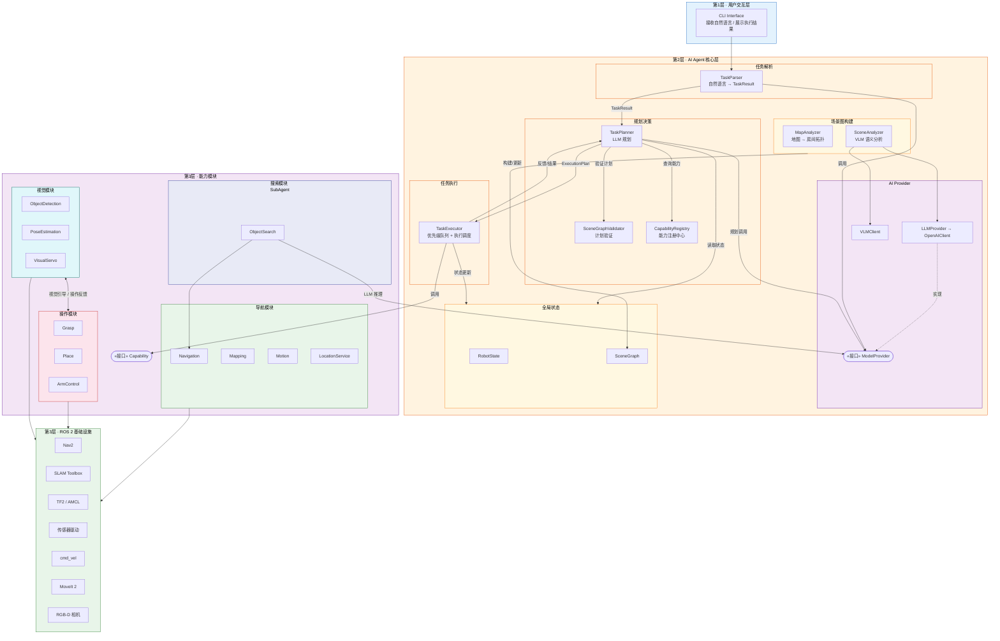
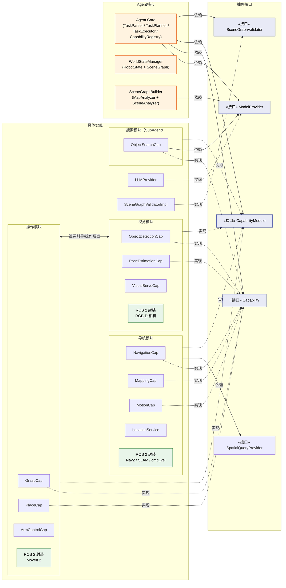
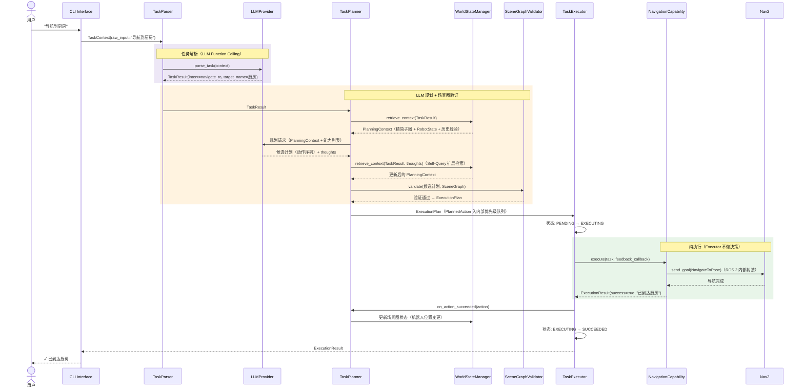
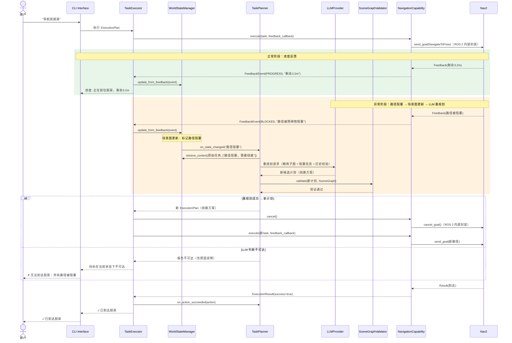
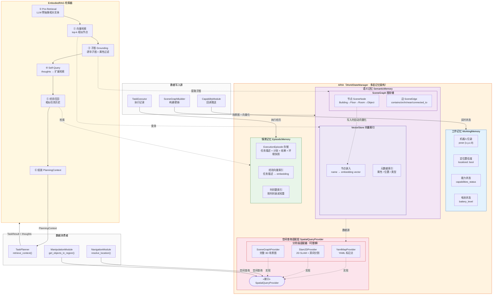

# MOSAIC 技术设计文档

> **MOSAIC** — Modular Orchestration System for Agent-driven Intelligent Control
> 面向 ROS 2 架构的 AI Agent 机器人任务调度系统

## 概述

MOSAIC 是面向人形机器人及带操作臂移动机器人的 AI Agent 任务调度系统。系统以 LLM 为规划核心，以 3D 场景图为环境表征，通过模块化插拔架构实现感知-决策-执行的完全解耦。

设计重心在于 Agent 化智能调度框架本身，底层机器人能力（导航、操作、视觉等）使用 Nav2、MoveIt 2、SLAM Toolbox 等开源方案做 demo 级验证。

### 核心架构特征

**3 层架构**：用户交互层 → AI Agent 核心层（含 AI Provider）→ 能力模块层 + ROS 2 基础设施。Agent 核心对 ROS 2 零感知，ROS 2 被完全封装在 CapabilityModule 内部。

**LLM-centric 规划**：任务规划由 LLM 基于 3D 场景图上下文进行常识推理和计划生成，SceneGraphValidator 验证计划可执行性。PDDL 降级为可选验证工具，不再是规划核心。

**ARIA 多层记忆**（Agent with Retrieval-augmented Intelligence Architecture）：全局状态管理采用三层记忆架构——工作记忆（实时状态）、语义记忆（场景图 + 向量索引）、情景记忆（执行历史）。参考 EmbodiedRAG（2024）的任务驱动子图检索，TaskPlanner 通过向量检索获取精简上下文而非全量场景图，token 消耗降低一个数量级。

**模块化能力插拔**：机器人能力按功能域组织为 CapabilityModule（导航、操作、视觉、搜索），支持运行时动态加载/卸载。Capability 分为纯执行、感知、协作、SubAgent 四类，SubAgent Capability 内部可使用 LLM 推理。

**视觉-操作闭环协作**：VisionModule 与 ManipulationModule 之间存在双向通讯——视觉引导操作（目标检测 + 位姿估计）、操作反馈视觉确认（eye-hand coordination）。

### 关键设计决策

| 决策 | 方案 | 理由 |
|---|---|---|
| 依赖倒置 | Agent 核心仅依赖抽象接口 | 替换任何实现（LLM/导航/操作），核心零修改 |
| AI Provider 位置 | 内置于 Agent 核心层（第2层） | TaskParser、TaskPlanner、SceneGraphBuilder 均直接依赖，避免跨层调用 |
| 全局状态存储 | ARIA 三层记忆 + EmbodiedRAG 检索 | 解决大规模环境下 LLM token 限制和注意力偏差 |
| 场景图构建 | SLAM 空间骨架 + VLM 语义填充 | 轻量级融合方案，适合 demo 阶段快速验证 |
| ROS 2 封装 | 完全封装在 CapabilityModule 内部 | Agent 核心不接触 ROS 2，保持框架通用性 |
| 任务执行 | TaskExecutor = 优先级队列 + 执行调度 | 合并 TaskQueue，减少组件间通信开销 |
| VLA 集成 | VLA 作为 Capability 封装，与 MoveIt 2 方案并列可切换 | MOSAIC 提供任务级规划（秒级），VLA 负责端到端精细操作控制（毫秒级），两者异步解耦、时间尺度分离 |

## 架构

### 系统分层总览

系统自上而下分为 3 层，每层只与相邻层交互，依赖方向始终向下（通过抽象接口）：



### 依赖倒置原则

Agent 核心（第2层）永远只依赖抽象接口，不依赖任何具体实现。替换任何具体实现（换 LLM 模型、换导航方案），Agent 核心代码零修改。AI Provider 作为核心层的内置组件，通过 ModelProvider 接口保持可替换性。ROS 2 被完全封装在 CapabilityModule 内部，Agent 核心不知道 ROS 2 的存在。



### 数据流：一条指令的完整旅程

以用户输入 "导航到厨房" 为例，展示 LLM-centric + 场景图 grounding 架构下的完整数据流：



### 执行中反馈驱动决策流（LLM 迭代重规划）

以导航过程中遇到路径阻塞为例，展示场景图状态变化如何触发 LLM 重规划：



## 组件与接口

### 1. interfaces_abstract 模块

定义系统所有核心抽象接口，是整个架构的契约层。

#### ModelProvider（model_provider.py）

```python
from abc import ABC, abstractmethod

class ModelProvider(ABC):
    """AI 模型提供者抽象接口"""

    @abstractmethod
    async def parse_task(self, context: TaskContext) -> TaskResult:
        """解析自然语言指令为结构化任务"""
        pass

    @abstractmethod
    def get_supported_intents(self) -> list[str]:
        """返回支持的意图类型列表"""
        pass
```

#### Capability（capability.py）

```python
from abc import ABC, abstractmethod
from typing import Callable

class Capability(ABC):
    """机器人能力抽象接口
    纯执行 Capability 只依赖 ROS 2 Adapter；
    SubAgent Capability 额外依赖 ModelProvider + WorldStateManager（只读），
    通过构造函数注入，接口层面不强制。
    """

    @abstractmethod
    def get_name(self) -> str: pass

    @abstractmethod
    def get_supported_intents(self) -> list[str]: pass

    @abstractmethod
    async def execute(self, task: Task, feedback_callback: Callable[[FeedbackEvent], None] = None) -> ExecutionResult:
        """执行任务
        feedback_callback: 执行过程中的实时反馈回调
        SubAgent Capability 内部可能多次调用 LLM + ROS 2，
        但对外行为与纯执行 Capability 一致
        """
        pass

    @abstractmethod
    async def cancel(self) -> bool: pass

    @abstractmethod
    async def get_status(self) -> CapabilityStatus: pass

    @abstractmethod
    def get_capability_description(self) -> str:
        """返回该 Capability 的自然语言描述（供 LLM 规划时理解能力边界）
        SubAgent Capability 应说明其内部会使用 LLM 推理
        """
        pass

    def is_sub_agent(self) -> bool:
        """标识该 Capability 是否为 SubAgent（内部使用 LLM）
        默认 False，SubAgent Capability 覆写为 True
        用于监控和调试，不影响调度逻辑
        """
        return False
```

#### CapabilityRegistry（capability_registry.py）

```python
class CapabilityRegistry:
    """能力注册中心 — 管理 CapabilityModule 和 Capability 的注册、注销和意图解析"""

    def register_module(self, module: CapabilityModule) -> None:
        """注册整个能力模块（批量注册模块内所有 Capability）"""
        ...
    def unregister_module(self, module_name: str) -> None:
        """注销整个能力模块（批量注销）"""
        ...
    def register(self, capability: Capability) -> None: ...
    def unregister(self, name: str) -> None: ...
    def resolve(self, intent: str) -> Capability: ...
    def list_capabilities(self) -> list[CapabilityInfo]: ...
    def list_modules(self) -> list[str]: ...
```

#### SpatialQueryProvider（spatial_query_provider.py）

```python
from abc import ABC, abstractmethod

class SpatialQueryProvider(ABC):
    """空间查询抽象接口 — ARIA 对外暴露的空间数据访问协议
    CapabilityModule 通过此接口获取空间信息，不直接依赖 SceneGraph 数据结构
    """

    @abstractmethod
    def resolve_location(self, name: str) -> Optional[dict[str, float]]: ...
    @abstractmethod
    def get_navigable_targets(self) -> list[dict[str, Any]]: ...
    @abstractmethod
    def get_room_topology(self) -> dict[str, Any]: ...
    @abstractmethod
    def is_path_clear(self, start: dict, goal: dict) -> bool: ...
    @abstractmethod
    def get_objects_in_region(self, region_id: str) -> list[dict[str, Any]]: ...
```

### 2. agent_core 模块

架构核心原则：**LLM 规划 + 场景图 Grounding + 形式化验证**。

LLM 基于 3D 场景图上下文进行常识推理和计划生成，SceneGraphValidator 验证计划可执行性，TaskExecutor 纯执行。PDDL 降级为可选验证工具，不再是规划核心。

#### 模块间关系

```
                    WorldStateManager（多层记忆架构）
           ┌──────────────┼──────────────────┐
     WorkingMemory     SemanticMemory     EpisodicMemory
    （工作记忆）       （语义记忆）        （情景记忆）
     RobotState      SceneGraph +         执行历史 +
     实时状态        向量索引(VectorStore)  任务经验
           │              │                    │
     CapabilityModule  SceneGraphBuilder    TaskExecutor
     回调同步          构建/更新+向量化      写入执行记录
           │              │                    │
           └──────────┬───┴────────────────────┘
                      │
              EmbodiedRAG 检索器
              任务驱动子图检索 + 经验召回
                      │
                      ▼ 精简上下文（非全量场景图）
               TaskPlanner（LLM 规划 + 验证）
                  │              │
          LLM 生成计划    SceneGraphValidator 验证
                  │              │
                  └──────┬───────┘
              生成/替换 ExecutionPlan
                      ▼
    TaskExecutor（优先级队列 + 执行调度）──→ Capability.execute()
                      │
              反馈事件写回三层记忆
```

#### TaskParser（任务解析器）

管道入口，负责将自然语言输入转化为结构化的 TaskResult。自身不做 NLP 处理，而是委托给 ModelProvider。

```python
class TaskParser:
    """任务解析器 — 自然语言 → 结构化 TaskResult
    职责：
    1. 接收 CLI 传入的 TaskContext
    2. 调用 ModelProvider.parse_task() 获取结构化解析结果
    3. 校验 TaskResult 合法性后传递给 TaskPlanner
    """

    async def parse(self, context: TaskContext) -> TaskResult:
        """解析自然语言指令"""
        ...

    def _validate(self, result: TaskResult) -> None:
        """校验解析结果的基本合法性（intent 非空等）"""
        ...
```

#### WorldStateManager / ARIA（多层记忆架构）

> **ARIA** — Agent with Retrieval-augmented Intelligence Architecture
> MOSAIC 系统的全局状态与上下文管理模块

参考 EmbodiedRAG（JHU APL, 2024）的 3D 场景图向量化检索、ReMEmbR（NVIDIA, 2024）的长时语义记忆、GraphRAG 的知识图谱混合检索，设计三层记忆架构。核心目标：LLM 规划时不再接收全量场景图，而是通过任务驱动检索获取精简、相关的上下文，解决大规模环境下的 token 限制和注意力偏差问题。

**三层记忆模型**：

| 记忆层 | 类比 | 存储内容 | 存储方式 | 生命周期 |
|---|---|---|---|---|
| 工作记忆 WorkingMemory | 人类短期记忆 | RobotState（位姿、传感器、能力状态） | 内存数据结构 | 实时覆写 |
| 语义记忆 SemanticMemory | 人类长期知识 | SceneGraph 节点/边 + 向量嵌入索引 | 图结构 + VectorStore | 持久化，增量更新 |
| 情景记忆 EpisodicMemory | 人类经验回忆 | 任务执行历史（成功/失败经验、重规划记录） | 向量嵌入 + 时间戳索引 | 持久化，按时间衰减 |

**ARIA 多层记忆架构框图**：



**EmbodiedRAG 检索流程**（参考 [EmbodiedRAG, arXiv:2410.23968](https://arxiv.org/abs/2410.23968)）：

```
用户指令 "把杯子放到厨房桌上"
        │
        ▼
  ① Pre-Retrieval（LLM 预抽象）
     LLM 基于任务文本（无需环境知识）推断相关实体：
     → {杯子, 桌子, 厨房}  +  相关属性 {位置, 可抓取性, 表面状态}
        │
        ▼
  ② 向量检索（SemanticMemory）
     将预抽象实体嵌入为向量，在 VectorStore 中检索 top-k 相似节点
     → 匹配到 SceneGraph 中的 cup_1, table_3, kitchen_room
        │
        ▼
  ③ 子图 Grounding
     以检索到的节点为锚点，提取诱导子图（含节点间关系边）
     + 过滤仅保留任务相关属性
     → 精简子图（~20 节点）而非全量场景图（~500 节点）
        │
        ▼
  ④ 经验召回（EpisodicMemory）
     检索相似任务的历史执行记录（成功路径 / 失败教训）
     → "上次在厨房抓杯子时，杯子在水槽旁而非桌上"
        │
        ▼
  ⑤ 上下文组装 → LLM 规划
     精简子图 + RobotState + 历史经验 → TaskPlanner
     token 量降低一个数量级，规划质量提升
```

**执行中反馈驱动检索更新**（EmbodiedRAG Self-Query 机制）：

TaskPlanner 在规划过程中产生的"思考"（thoughts）会反馈给检索器，动态扩展检索范围。例如 LLM 规划时发现需要"一个工具来翻转鸡蛋"，Self-Query 机制会自动检索"铲子"、"锅铲"等相关实体加入子图。

```python
class WorldStateManager:
    """多层记忆架构 — 融合 EmbodiedRAG 检索的全局状态中枢

    三层记忆：
    - WorkingMemory：机器人实时状态（内存），通过 CapabilityModule 回调同步
    - SemanticMemory：SceneGraph + VectorStore 向量索引，支持语义检索
    - EpisodicMemory：任务执行历史，向量化存储，支持经验召回

    核心创新：TaskPlanner 不直接读取全量 SceneGraph，
    而是通过 retrieve_context() 获取任务驱动的精简子图 + 历史经验
    """

    # —— 工作记忆（实时状态）——
    def get_state(self) -> RobotState: ...

    async def sync_robot_state(self) -> None:
        """定期通过 CapabilityModule 回调同步机器人状态"""
        ...

    # —— 语义记忆（场景图 + 向量索引）——
    def get_scene_graph(self) -> SceneGraph:
        """获取完整场景图（仅供 SceneGraphValidator 等内部组件使用）"""
        ...

    def update_scene_graph(self, scene_graph: SceneGraph) -> None:
        """SceneGraphBuilder 构建/更新场景图后写入，同步更新向量索引"""
        ...

    def index_scene_node(self, node: SceneNode) -> None:
        """将场景图节点嵌入为向量并索引到 VectorStore
        节点的语义标签（name）作为文档内容，属性作为元数据
        参考 EmbodiedRAG 的 Document Indexing 策略
        """
        ...

    # —— 情景记忆（执行历史）——
    def record_episode(self, episode: ExecutionEpisode) -> None:
        """记录一次任务执行经历（任务描述 + 计划 + 结果 + 环境快照）"""
        ...

    # —— EmbodiedRAG 检索（核心接口）——
    async def retrieve_context(self, task: TaskResult, planner_thoughts: list[str] = None) -> PlanningContext:
        """任务驱动的上下文检索 — TaskPlanner 的主要调用入口
        流程：
        1. Pre-Retrieval：LLM 从任务文本推断相关实体和属性（无需环境知识）
        2. 向量检索：在 VectorStore 中检索与预抽象实体最相似的场景图节点
        3. 子图 Grounding：以检索节点为锚点提取诱导子图 + 过滤任务相关属性
        4. Self-Query：若有 planner_thoughts，解析思考内容扩展检索范围
        5. 经验召回：从 EpisodicMemory 检索相似任务的历史经验
        6. 组装 PlanningContext 返回
        """
        ...

    # —— 状态更新 ——
    def update_from_feedback(self, event: FeedbackEvent) -> None:
        """根据执行反馈更新三层记忆，并通知监听者"""
        ...

    def update_from_execution_result(self, result: ExecutionResult) -> None:
        """任务完成后更新语义记忆（场景图状态）+ 写入情景记忆"""
        ...

    # —— 状态变更通知（观察者模式）——
    def subscribe(self, callback: Callable) -> None:
        """注册状态变更监听（TaskPlanner 注册此回调以感知环境变化）"""
        ...
```

**PlanningContext（规划上下文 — 检索结果封装）**：

```python
@dataclass
class PlanningContext:
    """EmbodiedRAG 检索结果 — TaskPlanner 的决策输入
    替代直接传递全量 SceneGraph，大幅降低 token 消耗
    """
    relevant_subgraph: SceneGraph           # 任务相关子图（精简）
    robot_state: RobotState                 # 当前机器人状态
    relevant_episodes: list[ExecutionEpisode]  # 相似任务的历史经验
    pre_retrieved_entities: list[str]       # LLM 预抽象的相关实体列表
    metadata: dict[str, Any] = field(default_factory=dict)

@dataclass
class ExecutionEpisode:
    """一次任务执行经历（情景记忆单元）"""
    episode_id: str
    task_description: str                   # 任务自然语言描述
    task_result: TaskResult                 # 结构化任务
    plan_summary: str                       # 执行计划摘要
    outcome: str                            # 成功/失败 + 原因
    environment_snapshot: dict[str, Any]    # 执行时的环境关键状态
    timestamp: datetime = field(default_factory=datetime.now)
    embedding: Optional[list[float]] = None # 向量嵌入（用于相似度检索）
```

**VectorStore 选型**：

| 方案 | 特点 | 适用场景 |
|---|---|---|
| ChromaDB（推荐） | 轻量级、嵌入式、Python 原生、零配置 | 骨架阶段 + 单机部署 |
| FAISS | Meta 开源、高性能向量检索、支持 GPU 加速 | 大规模环境、边缘设备 |
| Milvus | 分布式向量数据库、ReMEmbR 采用 | 多机器人协作、云端部署 |

骨架阶段使用 ChromaDB，接口层抽象为 VectorStore 协议，后续可无缝切换。

**状态数据源**：

| 状态项 | 记忆层 | 数据源 | 更新方式 |
|---|---|---|---|
| 机器人位姿 | 工作记忆 | NavigationModule 内部订阅 `/amcl_pose` | CapabilityModule 回调推送 |
| 定位置信度 | 工作记忆 | NavigationModule 内部读取 AMCL 协方差 | 低于阈值时标记 localized=false |
| 地图可用性 | 工作记忆 | NavigationModule 内部查询地图服务 | CapabilityModule 回调推送 |
| SLAM 状态 | 工作记忆 | NavigationModule 内部订阅 SLAM Toolbox | CapabilityModule 回调推送 |
| 路径通行性 | 工作记忆 | NavigationModule 内部读取 Nav2 Costmap | 定期检查或反馈事件触发 |
| 电池状态 | 工作记忆 | 电池模块（预留） | CapabilityModule 回调推送 |
| 能力就绪状态 | 工作记忆 | Capability.get_status() | 定期轮询 |
| 场景图节点/边 | 语义记忆 | SceneGraphBuilder | 探索时全量构建，运行时增量更新 |
| 节点向量嵌入 | 语义记忆 | 节点写入时自动嵌入 | 随场景图同步更新 |
| 任务执行历史 | 情景记忆 | TaskExecutor 执行完成后写入 | 每次任务完成时追加 |

**与 SayPlan 语义搜索的对比**：

| 维度 | SayPlan（折叠/展开） | EmbodiedRAG（向量检索） |
|---|---|---|
| 检索方式 | LLM 手动 expand/contract 节点 | 向量相似度自动检索 + 子图 Grounding |
| LLM 负担 | LLM 需要理解图结构并操作 | LLM 只需描述需求，检索器自动完成 |
| 压缩效果 | 依赖层级结构，底层压缩有限 | 与层级无关，按任务相关性精准过滤 |
| 动态适应 | 需要预构建完整场景图 | 支持在线构建、增量索引 |
| 反馈机制 | 无 | Self-Query 机制动态扩展检索范围 |
| 经验利用 | 无 | 情景记忆召回历史经验辅助规划 |

本系统采用 EmbodiedRAG 方案替代 SayPlan 的折叠/展开机制，同时保留 SayPlan 的层级化场景图表征作为底层数据结构。

#### ARIA 空间数据适配层

ARIA 的内部数据结构（SceneGraph 层级化表征）与具体感知方案之间存在适配问题。例如：初期使用 2D SLAM 栅格地图 + 标记点语义地图，导航模块需要的是坐标点和可通行区域；后期升级为完整 3D 场景图后，数据格式完全不同。

为保持 ARIA 对下游模块的稳定性，引入 **SpatialQueryProvider** 抽象接口，将 ARIA 内部数据结构与消费者解耦：

```python
class SpatialQueryProvider(ABC):
    """空间查询抽象接口 — ARIA 对外暴露的空间数据访问协议
    CapabilityModule（如导航模块）通过此接口获取空间信息，
    不直接依赖 SceneGraph 的具体数据结构。
    不同感知阶段通过实现不同的 Provider 适配器来桥接。
    """

    @abstractmethod
    def resolve_location(self, name: str) -> Optional[dict[str, float]]:
        """语义地名 → 坐标（导航模块核心依赖）"""
        pass

    @abstractmethod
    def get_navigable_targets(self) -> list[dict[str, Any]]:
        """返回所有可导航目标（名称 + 坐标 + 元数据）"""
        pass

    @abstractmethod
    def get_room_topology(self) -> dict[str, Any]:
        """返回房间拓扑关系（连通性、通道位置）"""
        pass

    @abstractmethod
    def is_path_clear(self, start: dict, goal: dict) -> bool:
        """查询两点间路径是否可通行"""
        pass

    @abstractmethod
    def get_objects_in_region(self, region_id: str) -> list[dict[str, Any]]:
        """查询指定区域内的物体列表"""
        pass
```

**分阶段适配器实现**：

| 阶段 | 感知方案 | SpatialQueryProvider 实现 | 数据来源 |
|---|---|---|---|
| Step 1 | 2D SLAM + YAML 标记点 | YamlMapProvider | locations.yaml + 栅格地图 |
| Step 2 | 2D SLAM + 房间分割 | Slam2DProvider | MapAnalyzer 输出 + 标记点 |
| Step 3 | 完整 3D 场景图 | SceneGraphProvider | SceneGraph 层级查询 |

```
ARIA（WorldStateManager）
    │
    ├─ 内部数据：SceneGraph / YAML / 栅格地图（随阶段演进）
    │
    └─ 对外接口：SpatialQueryProvider（稳定不变）
                    │
                    ├─ NavigationModule 调用 resolve_location()
                    ├─ ManipulationModule 调用 get_objects_in_region()
                    ├─ SearchModule 调用 get_navigable_targets()
                    └─ TaskPlanner 调用 retrieve_context()（走 EmbodiedRAG 检索）
```

这样导航模块不关心 ARIA 内部是 YAML 文件、2D 栅格地图还是 3D 场景图——它只通过 `resolve_location("厨房")` 获取坐标。感知方案升级时，只需替换 SpatialQueryProvider 的实现，所有消费者零修改。

#### TaskPlanner（LLM 规划决策中枢）

系统的"大脑"，基于 LLM 常识推理 + 3D 场景图 Grounding 做出所有规划决策。它不只在初始规划时工作，而是持续监控 WorldState，在状态变化时自动评估并触发 LLM 重规划。

```python
class TaskPlanner:
    """LLM-centric 任务规划决策中枢
    职责：
    1. 初始规划：TaskResult → WorldStateManager.retrieve_context() 获取精简上下文 → LLM 生成计划 → SceneGraphValidator 验证
    2. 持续监控：WorldState/SceneGraph 变化 → 评估当前计划有效性 → 必要时 LLM 重规划
    3. 执行结果处理：成功 → 更新场景图状态；失败 → LLM 重规划
    4. 迭代验证：LLM 生成的计划经 SceneGraphValidator 验证，不通过则携带反馈重新生成
    5. Self-Query 反馈：规划过程中的 thoughts 反馈给 WorldStateManager 扩展检索范围
    """

    # —— 初始规划 ——
    async def plan(self, task_result: TaskResult) -> ExecutionPlan:
        """LLM 基于 EmbodiedRAG 检索的精简上下文生成执行计划
        流程：
        1. 调用 WorldStateManager.retrieve_context(task_result) 获取 PlanningContext
        2. 从 CapabilityRegistry 获取可用能力描述
        3. 构造 LLM prompt（任务 + 精简子图 + 状态 + 能力列表 + 历史经验）
        4. LLM 生成候选计划 + thoughts
        5. thoughts 反馈给 retrieve_context() 扩展检索（Self-Query 机制）
        6. SceneGraphValidator 验证计划可执行性
        7. 验证不通过 → 携带错误反馈让 LLM 重新生成（最多 N 轮）
        """
        ...

    # —— 持续监控：状态变化回调 ——
    def _on_state_changed(self, reason: str) -> None:
        """WorldState/SceneGraph 变化时自动调用
        LLM 评估当前计划是否仍然有效，必要时触发重规划
        """
        ...

    # —— 重规划 ——
    async def replan(self, reason: str) -> ExecutionPlan:
        """基于最新 SceneGraph + RobotState + 失败原因，LLM 重新生成计划"""
        ...

    # —— 执行结果处理 ——
    def on_action_succeeded(self, action: PlannedAction) -> None:
        """动作成功：更新场景图状态，推进计划"""
        ...

    async def on_action_failed(self, action: PlannedAction, error: str) -> ExecutionPlan:
        """动作失败：将失败信息加入上下文，LLM 重规划"""
        ...
```

**Planner 决策矩阵（全部基于 LLM 推理 + 场景图验证）**：

| 触发事件 | Planner 行为 | LLM 推理过程 |
|---|---|---|
| 初始用户指令 | 生成 ExecutionPlan | TaskResult → retrieve_context() 获取精简子图 + 历史经验 → LLM 生成计划 → Validator 验证 |
| 动作执行成功 | 更新场景图，推进计划 | 更新 SceneGraph + 情景记忆 → 检查后续动作是否仍合理 |
| 动作执行失败 | LLM 重规划 | 失败原因 + retrieve_context(含 thoughts) → LLM 生成替代方案 |
| 场景图变化（路径阻塞） | 评估 + 可能重规划 | LLM 基于更新后检索子图判断当前计划是否仍可行 |
| 场景图变化（定位丢失） | 暂停 + 等待恢复 | LLM 识别到定位丢失，建议暂停或插入重定位动作 |
| 新高优先级任务 | 抢占 + 重规划 | LLM 综合新旧目标 + 当前状态，生成新计划 |
| LLM 规划失败（无合理方案） | 报告不可达 | 向用户报告目标在当前环境下不可达，说明原因 |

**关键设计：为什么 LLM 规划优于硬编码规则**：

传统做法是在 Executor 里写 `if BLOCKED then ...`、`if LOCALIZATION_LOST then ...` 这样的规则表，或依赖 PDDL 形式化前置条件。LLM-centric 架构的优势：

- 路径阻塞 → SceneGraph 更新阻塞信息 → LLM 基于常识推理出绕路方案（不需要预定义所有可能的绕路规则）
- 定位丢失 → LLM 理解"定位丢失意味着不能导航" → 自动建议暂停或重定位（不需要硬编码 precondition）
- 新物体出现 → SceneGraph 增量更新 → LLM 自然理解新物体的可交互方式（不需要重新定义 PDDL Domain）
- 复杂多步任务 → LLM 基于常识分解（"准备咖啡" → 去厨房 → 找杯子 → ...），泛化能力远超 PDDL 的 action 组合

异常处理从"程序员预设规则"或"PDDL 求解器的形式化推理"变成了"LLM 基于场景图上下文的常识推理"，泛化能力质的飞跃。

#### ExecutionPlan（执行计划）

```python
@dataclass
class ExecutionPlan:
    """LLM 生成 + SceneGraphValidator 验证后的有序动作序列"""
    plan_id: str
    actions: list[PlannedAction]            # 有序动作列表
    original_task: TaskResult               # 原始任务（用于重规划时保持目标一致）
    current_index: int = 0

    def peek_next(self) -> Optional[PlannedAction]: ...
    def advance(self) -> None: ...
    def is_complete(self) -> bool: ...
    def remaining_actions(self) -> list[PlannedAction]: ...

@dataclass
class PlannedAction:
    """计划中的单个动作"""
    action_name: str                        # 动作名称（如 "navigate_to"）
    parameters: dict[str, Any]              # 动作参数（如 {target: "厨房"}）
    capability_name: str                    # 绑定的 Capability 名称
    task: Task                              # 对应的可执行 Task
    description: str = ""                   # LLM 生成的动作描述（人类可读）
```

#### TaskExecutor（执行器 = 优先级队列 + 执行调度）

```python
class TaskExecutor:
    """任务执行器 — 内置优先级队列，负责调度和执行
    职责：
    1. 接收 ExecutionPlan，按优先级入队
    2. 按序取出 PlannedAction，调用 Capability.execute()
    3. 将结果和反馈上报给 Planner 和 WorldStateManager
    4. 不做决策（不判断重试/取消/重规划），决策交给 Planner
    """

    async def execute_plan(self, plan: ExecutionPlan) -> ExecutionResult:
        """执行整个计划"""
        while not plan.is_complete():
            action = plan.peek_next()

            # 执行
            result = await self._execute_action(action)

            # 结果上报给 Planner
            if result.success:
                self._planner.on_action_succeeded(action)
            else:
                # Planner 决策：LLM 重规划
                new_plan = await self._planner.on_action_failed(action, result.error)
                plan = new_plan
                continue

        return ExecutionResult(...)

    def _on_feedback(self, event: FeedbackEvent) -> None:
        """反馈事件 → 更新 WorldState + SceneGraph（Planner 自动感知变化）"""
        self._world.update_from_feedback(event)
        # 不做任何决策！状态变化会触发 Planner 的 _on_state_changed
```

#### TaskQueue（已合并入 TaskExecutor）
- TaskExecutor 内置基于 asyncio.PriorityQueue 的优先级队列
- 支持入队、取消、按序调度
- 当 Planner 重规划时，清空剩余任务并替换为新计划

#### SceneGraphBuilder（3D 场景图构建器）

参考 SayPlan（CoRL 2023）的 3D Scene Graph 方案，使 Agent 从"已知环境内规划"进化为"面向新环境的自主探索与理解"。机器人进入未知环境后，通过 SLAM 构建空间骨架 + VLM 语义分析融合，自动构建并持续更新层级化 3D 场景图。

**核心方案：SLAM 空间骨架 + VLM 语义填充**

```
SLAM 栅格地图（空间骨架）          VLM 语义分析（语义填充）
  ├─ 房间分割（连通区域分析）         ├─ 关键位置拍照 → 物体识别
  ├─ 通道/门检测（窄通道分析）        ├─ 空间关系推断（on/in/near）
  └─ 可通行区域拓扑                  └─ 房间语义标注（"这是厨房"）
              │                                │
              └──────────── 融合 ───────────────┘
                             │
                    层级化 3D 场景图
           Building → Floor → Room → Object
           边：contains / connected_to / on / in / near
```

**融合流程**：

1. SLAM 建图阶段：SLAM Toolbox 构建栅格地图，提取空间拓扑
2. 房间分割：对栅格地图做连通区域分析 + 窄通道检测，自动分割出 Room 节点和 connected_to 边
3. 语义巡回：机器人在每个 Room 的关键位置（中心点/入口）拍照
4. VLM 分析：每帧 RGB 送入 VLM，识别物体、表面、容器及其空间关系
5. LLM 归纳：汇总多帧 VLM 结果 + 房间拓扑，LLM 归纳语义属性（房间用途、物体可交互性）
6. 场景图组装：SLAM 拓扑（Room 节点 + 连通边）+ VLM 物体（Object 节点 + 空间关系边）→ 完整场景图

**三层架构**：

| 层次 | 职责 | 技术方案 |
|---|---|---|
| 空间感知层 | 建图 + 房间分割 + 拓扑提取 | SLAM Toolbox + 栅格地图连通区域分析 |
| 语义感知层 | 物体/关系识别 + 房间语义标注 | VLM（GPT-4V / 开源 VLM）+ RGB 相机 |
| 知识融合层 | 空间拓扑 + 语义信息 → 场景图 + 验证 | LLM 归纳 + SceneGraphValidator |

```python
class SceneGraphBuilder:
    """3D 场景图构建器（SLAM 空间骨架 + VLM 语义填充）
    职责：
    1. 从 SLAM 栅格地图提取空间拓扑（房间分割、通道检测）
    2. 驱动机器人在各房间关键位置拍照，VLM 识别物体和关系
    3. LLM 归纳语义属性，融合空间拓扑 + 语义信息构建场景图
    4. 验证场景图一致性后注入 WorldStateManager
    """

    # —— 完整构建流程 ——
    async def build_from_map(self, occupancy_grid) -> SceneGraph:
        """从已有 SLAM 地图构建场景图（完整流程）
        1. MapAnalyzer 分析栅格地图 → 房间分割 + 拓扑
        2. 规划语义巡回路径（每个房间的关键观测点）
        3. 机器人巡回拍照 → VLM 分析每帧
        4. LLM 归纳 + 融合 → 层级场景图
        5. SceneGraphValidator 验证一致性
        """
        ...

    # —— 增量更新 ——
    async def update_from_observation(self, observation: SceneFrame) -> SceneGraph:
        """根据新观测增量更新场景图
        - 新物体 → 添加节点 + 边
        - 物体状态变化 → 更新节点属性
        - 新房间（地图扩展）→ 添加 Room 节点 + 连通边
        """
        ...
```

**MapAnalyzer（地图空间分析器）**：

```python
class MapAnalyzer:
    """栅格地图空间分析 — 从 SLAM 地图中提取房间拓扑
    输入：SLAM 栅格地图（OccupancyGrid）
    输出：房间列表 + 连通关系 + 关键观测点
    """

    def segment_rooms(self, occupancy_grid) -> list[RoomSegment]:
        """连通区域分析 + 窄通道检测 → 房间分割"""
        ...

    def extract_topology(self, rooms: list[RoomSegment]) -> list[SceneEdge]:
        """提取房间间连通关系（门/通道 → connected_to 边）"""
        ...

    def plan_observation_points(self, rooms: list[RoomSegment]) -> list[dict]:
        """为每个房间规划关键观测点（中心点/入口/角落）"""
        ...
```

**SceneAnalyzer（VLM 语义分析器）**：

```python
class SceneAnalyzer:
    """VLM 语义分析 — 从 RGB 图像中提取物体和空间关系
    输入：RGB 图像 + 机器人位姿 + 所在房间信息
    输出：物体节点 + 空间关系边
    """

    async def analyze_frame(self, rgb, robot_pose, room_context) -> SceneFrame:
        """VLM 分析单帧：识别物体、表面、容器及空间关系"""
        ...
```

**SceneGraphValidator（场景图验证器）**：

```python
class SceneGraphValidator:
    """场景图验证器 — 验证 LLM 生成的计划在场景图约束下是否可执行
    职责：
    1. 计划可执行性验证：检查计划中每个动作的目标对象/位置是否存在于场景图中
    2. 空间约束验证：检查动作序列是否符合空间拓扑（如不能跳过房间直接到达）
    3. 状态约束验证：检查物体状态是否允许操作（如冰箱关着时不能放东西进去）
    4. 场景图一致性验证：构建/更新时检查节点和边的一致性
    """

    def validate_plan(self, plan: list[PlannedAction], scene_graph: SceneGraph) -> ValidationResult:
        """验证计划在场景图约束下的可执行性"""
        ...

    def validate_graph(self, scene_graph: SceneGraph) -> ValidationResult:
        """验证场景图自身的一致性"""
        ...
```

**场景图构建的两种模式**：

| 模式 | 触发时机 | 行为 |
|---|---|---|
| 全量构建 | 机器人首次进入新环境 | 自主探索 → 全量场景分析 → 构建完整场景图 |
| 增量更新 | 运行时发现新物体/状态变化 | 局部分析 → 增量合并到现有场景图 |

**与现有架构的集成关系**：

```
SLAM Toolbox ──栅格地图──→ MapAnalyzer ──房间拓扑──→ SceneGraphBuilder
RGB 相机 ──图像──→ SceneAnalyzer(VLM) ──物体+关系──→ SceneGraphBuilder
                                                          │
                                              融合 → SceneGraph
                                                          │
                                              存储在 WorldStateManager
                                                          │
                                              TaskPlanner 规划时读取
                                                          │
                                              SceneGraphValidator 验证计划
```

**大规模环境检索策略**：

对于大规模环境（多楼层、多房间），直接将完整场景图输入 LLM 会超出 token 限制。本系统采用 EmbodiedRAG 方案（参考 [arXiv:2410.23968](https://arxiv.org/abs/2410.23968)）替代 SayPlan 的手动折叠/展开机制：

1. 场景图节点在写入时自动向量化索引到 VectorStore
2. 规划时通过 `retrieve_context()` 进行任务驱动的向量检索，自动提取相关子图
3. Self-Query 机制根据 LLM 规划过程中的 thoughts 动态扩展检索范围
4. 情景记忆提供历史经验辅助规划决策
5. 实测可将 token 消耗降低一个数量级（EmbodiedRAG 论文数据：90% 累计 token 减少），规划时间减少 70%

**骨架阶段实现策略（分两步）**：

| 阶段 | 策略 | 目的 |
|---|---|---|
| Step 1：管道验证 | SceneGraphBuilder 从 JSON/YAML 配置文件加载预定义场景图（mock） | 跑通 Builder → WSM → Planner 数据管道 |
| Step 2：真实感知 | MapAnalyzer 接入 SLAM 栅格地图做房间分割，SceneAnalyzer 调 VLM API 做语义分析 | 验证 SLAM + VLM 融合构建场景图 |

#### LLMProvider
- 实现 ModelProvider 接口
- 承担双重职责：任务解析（parse_task）+ 任务规划（plan generation）
- 从 CapabilityRegistry 动态获取已注册意图列表，自动生成 Function Calling 函数定义
- 规划时构造包含 SceneGraph 上下文 + RobotState + 能力描述的 prompt
- 通过 llm_client 模块调用 OpenAI API

#### FunctionRegistry
- 根据 CapabilityRegistry 中已注册的 Capability 动态生成 OpenAI Function Calling schema
- Capability 注册/注销时自动更新函数定义

### 4. llm_client 模块

#### OpenAIClient
- 封装 OpenAI API 的异步 HTTP 调用（使用 httpx）
- 支持配置：API endpoint、API key（环境变量注入）、模型选择、超时时间
- 指数退避重试策略，最多重试 3 次
- 所有 API 参数通过 YAML 配置文件管理

### 5. capabilities 模块（模块化插拔）

机器人能力按功能域组织为独立的 **CapabilityModule**，每个模块内部自治，对外通过标准 Capability 接口暴露给 Agent 核心。替换整个功能域（如换导航方案）只需替换对应模块，Agent 核心零修改。

**模块化架构**：

```
CapabilityRegistry
    ├─ NavigationModule（导航模块）
    │     ├─ NavigationCapability    → navigate_to, patrol
    │     ├─ MappingCapability       → start_mapping, save_map, stop_mapping
    │     ├─ MotionCapability        → rotate, stop
    │     └─ LocationService（模块内共享服务）
    │
    ├─ ManipulationModule（操作模块）
    │     ├─ GraspCapability         → grasp, pick_up
    │     ├─ PlaceCapability         → place, put_down
    │     └─ ArmControlCapability    → move_arm, home_arm
    │
    ├─ VisionModule（视觉模块）
    │     ├─ ObjectDetectionCapability  → detect_object, detect_all
    │     ├─ PoseEstimationCapability   → estimate_pose
    │     └─ VisualServoCapability      → visual_servo
    │
    ├─ SearchModule（搜索模块 · SubAgent）
    │     └─ ObjectSearchCapability  → find_object
    │
    └─ ...（未来扩展）

    ※ VisionModule ↔ ManipulationModule 存在双向通讯：
      视觉模块为操作模块提供目标检测和位姿估计（视觉引导）
      操作模块向视觉模块反馈执行状态（闭环伺服）
```

**CapabilityModule 接口**：

```python
class CapabilityModule(ABC):
    """能力模块抽象接口 — 按功能域组织一组相关 Capability"""

    @abstractmethod
    def get_module_name(self) -> str: pass

    @abstractmethod
    def get_capabilities(self) -> list[Capability]:
        """返回模块内所有 Capability 实例（启动时批量注册到 Registry）"""
        pass

    @abstractmethod
    async def initialize(self) -> None:
        """模块初始化（建立内部服务、连接 ROS 2 等）"""
        pass

    @abstractmethod
    async def shutdown(self) -> None:
        """模块关闭（释放资源）"""
        pass
```

Capability 分为两类：

| 类型 | 特征 | 依赖 | 示例 |
|---|---|---|---|
| 纯执行 Capability | 直接调用 ROS 2 底层，不需要 LLM | ROS 2 内部封装 | Navigation、Mapping、Motion、ArmControl |
| 感知 Capability | 调用视觉/传感器获取环境信息 | ROS 2 + 视觉模型 | ObjectDetection、PoseEstimation |
| 协作 Capability | 需要跨模块通讯（如视觉引导操作） | 其他 CapabilityModule | Grasp（依赖 VisionModule）、VisualServo |
| VLA Capability | 内部运行端到端 VLA 模型高频闭环控制（50-200Hz），对外仍是标准 execute() 接口 | VLA 模型 + RGB-D 相机 | VLAManipulation |
| SubAgent Capability | 内部需要 LLM 推理来完成子任务 | ModelProvider + 其他 Capability | ObjectSearch、SmartGrasp |

SubAgent Capability 的核心特征：execute() 内部会调用 ModelProvider 进行推理，然后基于推理结果调用 ROS 2 底层执行。它对外仍然是标准 Capability 接口，TaskExecutor 无需区分。

**SubAgent 执行模式**：

```
TaskExecutor 调用 → SubAgent Capability.execute()
                        │
                        ├─ 1. 读取 SceneGraph 上下文
                        ├─ 2. 调用 ModelProvider（LLM 推理子任务）
                        ├─ 3. 基于推理结果调用 ROS 2 Adapter 执行
                        ├─ 4. 感知执行结果，可能再次调用 LLM 调整策略
                        └─ 5. 返回 ExecutionResult
```

**依赖注入**：SubAgent Capability 通过构造函数注入 ModelProvider + WorldStateManager（只读），保持依赖倒置。Agent 核心不感知 Capability 内部是否使用了 LLM。

#### NavigationModule（导航模块）

模块内部组件协作，对外暴露三个 Capability：

- **NavigationCapability**：支持 navigate_to、patrol 意图，内部封装 Nav2 NavigateToPose Action 调用，通过模块内 LocationService 解析语义地名
- **MappingCapability**：支持 start_mapping、save_map、stop_mapping 意图，内部封装 SLAM Toolbox Service 调用
- **MotionCapability**：支持 rotate、stop 意图，内部通过 ROS 2 Topic 发布运动指令
- **LocationService**：模块内共享服务，维护语义地名到坐标的 YAML 映射，支持热加载

#### ManipulationModule（操作模块）

面向人形机器人/带操作臂的移动机器人，封装操作臂控制能力。内部通过 MoveIt 2 进行运动规划，依赖 VisionModule 提供的目标检测和位姿估计实现视觉引导操作。

- **GraspCapability**：支持 grasp、pick_up 意图，执行前请求 VisionModule 进行目标位姿估计，基于估计结果规划抓取轨迹
- **PlaceCapability**：支持 place、put_down 意图，规划放置轨迹并执行，完成后请求 VisionModule 确认放置结果
- **ArmControlCapability**：支持 move_arm、home_arm 意图，底层关节级控制（MoveIt 2 封装）

**视觉-操作协作通讯**：

```
VisionModule                          ManipulationModule
    │                                        │
    │◄──── request_detection(target) ────────│  操作前：请求目标检测
    │──── DetectionResult(bbox, class) ─────►│
    │                                        │
    │◄──── request_pose(target) ─────────────│  抓取前：请求6DoF位姿
    │──── PoseResult(position, orientation) ─►│
    │                                        │
    │◄──── notify_action_done(result) ───────│  操作后：反馈执行结果
    │──── verify(confirmation) ─────────────►│  视觉确认：验证操作成功
```

通讯通过模块间定义的回调接口实现（非 ROS 2 Topic），保持模块间松耦合。CapabilityModule 初始化时通过 CapabilityRegistry 互相发现并注册回调。

**VLA 端到端操作能力（演进预留）**：

ManipulationModule 预留 VLA（Vision-Language-Action）端到端操作能力接入，与现有 MoveIt 2 方案并列，通过配置切换。

- **VLAManipulationCapability**：支持 vla_grasp、vla_place、vla_manipulate 意图，内部运行 VLA 模型（如 π0、SmolVLA、OpenVLA）进行端到端视觉-语言-动作推理

**VLA 控制架构**：

```
TaskExecutor 调用 → VLAManipulationCapability.execute(intent, params)
                        │
                        ├─ 1. 接收语言指令（如 "pick up the red cup"）
                        ├─ 2. 启动 VLA 高频控制循环（50-200Hz）：
                        │      ┌─────────────────────────────────┐
                        │      │  RGB-D 图像流 + 语言指令         │
                        │      │       ↓                         │
                        │      │  VLA 模型推理（端到端）           │
                        │      │       ↓                         │
                        │      │  关节动作流（Δ position/torque） │
                        │      │       ↓                         │
                        │      │  ROS 2 关节控制器执行             │
                        │      │       ↓                         │
                        │      │  完成检测 → 继续/终止循环         │
                        │      └─────────────────────────────────┘
                        ├─ 3. 通过 feedback_callback 上报操作进度
                        └─ 4. 返回 ExecutionResult（成功/失败/超时）
```

**关键设计要点**：

- 对外接口透明：execute() 对 TaskExecutor 仍是一次性调用语义，VLA 内部高频循环对上层不可见
- VLA 内置视觉：VLA 模型自带视觉编码器，不依赖 VisionModule 的目标检测/位姿估计，但可选择性使用外部视觉引导做粗定位
- 时间尺度分离：MOSAIC 规划层（秒级，任务开始和异常时触发）与 VLA 控制层（毫秒级，持续高频推理）异步解耦，非串行叠加
- 模型接入：通过 LeRobot/OpenPI 等开源框架加载模型权重，支持 π0、SmolVLA、OpenVLA 等主流 VLA 模型
- 配置切换：agent_config.yaml 中 manipulation_backend 字段选择 "moveit2"（默认）或 "vla"，Agent 核心零修改

**MoveIt 2 与 VLA 方案对比**：

| 维度 | MoveIt 2（传统规划） | VLA（端到端模型） |
|---|---|---|
| 控制方式 | 分阶段：感知→规划→执行 | 端到端：图像+语言→动作 |
| 泛化能力 | 需要精确建模，新物体需重新标定 | 语言条件化，零样本泛化新物体/新指令 |
| 精度 | 高精度（已知物体） | 依赖训练数据分布 |
| 适用场景 | 工业级重复操作 | 开放世界灵巧操作 |
| 本项目定位 | V1 骨架验证 | V2+ 演进方向 |

**操作能力演进路线**：

```
V1（当前骨架）          V2（VLA 集成）              V3（VLA + 触觉）
MoveIt 2 传统规划  →  VLA 端到端控制          →  VLA + 触觉反馈闭环
接口定义 + mock      π0/SmolVLA 模型接入        力/触觉传感器融合
视觉引导操作          语言条件化泛化操作          接触丰富的精细操作
```

#### VisionModule（视觉模块）

封装视觉感知能力，为操作模块和搜索模块提供目标检测、位姿估计、视觉伺服等服务。内部通过 RGB-D 相机获取图像和深度数据。

- **ObjectDetectionCapability**：支持 detect_object、detect_all 意图，基于 RGB-D 图像进行物体检测（2D bbox + 类别），可供其他模块调用
- **PoseEstimationCapability**：支持 estimate_pose 意图，结合 RGB-D 数据估计目标物体的 6DoF 位姿，为 GraspCapability 提供抓取位姿
- **VisualServoCapability**：支持 visual_servo 意图，实时视觉反馈驱动操作臂微调（eye-in-hand / eye-to-hand），与 ManipulationModule 闭环协作

骨架阶段：接口定义 + mock 实现，ObjectDetection 可接入开源模型（YOLO 等）做 demo 验证。

#### SearchModule（搜索模块 · SubAgent · demo）

- **ObjectSearchCapability**：支持 find_object 意图，内部调用 ModelProvider 推理目标物体最可能的位置（基于 SceneGraph），调用 NavigationCapability 前往候选位置，到达后通过 VLM 确认
- 骨架阶段：接口定义 + mock 实现，验证 SubAgent 调用链路跑通

### 6. interfaces 模块

#### CLIInterface
- 交互式命令行界面，接收用户自然语言输入
- 支持中文和英文指令
- 将 ExecutionResult 转化为用户可读的中文文本
- 支持 "退出"/"exit" 安全关闭

### 7. config 模块

#### agent_config.yaml
- ModelProvider 选择、CapabilityModule 加载列表、重试策略、日志级别

#### locations.yaml
- 语义地名到坐标映射，支持热加载（NavigationModule 内部使用）

## 数据模型

### 核心数据结构

```python
from dataclasses import dataclass, field
from enum import Enum
from typing import Any, Optional
import uuid
from datetime import datetime

class TaskStatus(Enum):
    """任务状态枚举"""
    PENDING = "pending"
    EXECUTING = "executing"
    SUCCEEDED = "succeeded"
    FAILED = "failed"
    CANCELLED = "cancelled"

class CapabilityStatus(Enum):
    """能力状态枚举"""
    IDLE = "idle"
    BUSY = "busy"
    ERROR = "error"

class FeedbackType(Enum):
    """执行反馈事件类型"""
    PROGRESS = "progress"                   # 正常进度更新
    BLOCKED = "blocked"                     # 执行受阻（如路径被堵）
    LOCALIZATION_LOST = "localization_lost" # 定位丢失
    PREEMPTED = "preempted"                 # 被高优先级任务抢占
    RECOVERABLE_ERROR = "recoverable_error" # 可恢复错误
    FATAL_ERROR = "fatal_error"             # 不可恢复错误
    RECOVERED = "recovered"                 # 从异常中恢复

@dataclass
class FeedbackEvent:
    """执行中反馈事件 — Capability 通过回调上报给 TaskExecutor"""
    task_id: str
    feedback_type: FeedbackType
    message: str                            # 人类可读描述
    data: dict[str, Any] = field(default_factory=dict)
    timestamp: datetime = field(default_factory=datetime.now)

# ———— 3D 场景图数据结构 ————

class SceneNodeType(Enum):
    """场景图节点类型（层级化）"""
    BUILDING = "building"
    FLOOR = "floor"
    ROOM = "room"
    OBJECT = "object"

@dataclass
class SceneNode:
    """场景图节点 — 表示环境中的一个实体"""
    node_id: str                            # 唯一标识
    name: str                               # 语义名称（如 "厨房"、"桌子_1"）
    node_type: SceneNodeType                # 节点层级类型
    position: Optional[dict[str, float]] = None  # 3D 位置 {x, y, z}
    properties: dict[str, Any] = field(default_factory=dict)  # 语义属性（颜色、状态、affordance 等）

@dataclass
class SceneEdge:
    """场景图边 — 表示节点间的关系"""
    source_id: str                          # 源节点 ID
    target_id: str                          # 目标节点 ID
    relation: str                           # 关系类型（contains/on/in/near/connected_to 等）
    properties: dict[str, Any] = field(default_factory=dict)

@dataclass
class SceneGraph:
    """3D 场景图 — 层级化语义环境表征
    层级结构：Building → Floor → Room → Object
    参考 SayPlan 的 3DSG 表征方案
    """
    nodes: dict[str, SceneNode] = field(default_factory=dict)  # node_id → SceneNode
    edges: list[SceneEdge] = field(default_factory=list)

    def get_node(self, node_id: str) -> Optional[SceneNode]: ...
    def get_children(self, node_id: str) -> list[SceneNode]: ...
    def get_nodes_by_type(self, node_type: SceneNodeType) -> list[SceneNode]: ...
    def find_by_name(self, name: str) -> Optional[SceneNode]: ...
    def get_subgraph(self, root_id: str) -> 'SceneGraph':
        """获取以 root_id 为根的子图（用于 EmbodiedRAG 子图 Grounding）"""
        ...
    def get_induced_subgraph(self, node_ids: list[str]) -> 'SceneGraph':
        """获取指定节点集合的诱导子图（含节点间所有边）
        EmbodiedRAG 向量检索后，以检索到的节点为锚点提取诱导子图
        """
        ...
    def to_json(self) -> str:
        """序列化为 JSON（作为 LLM prompt 的一部分）"""
        ...

@dataclass
class RobotState:
    """机器人实时状态"""
    pose: Optional[dict[str, float]] = None     # 位姿 {x, y, z, theta}
    localized: bool = False                     # 是否已定位
    current_room: Optional[str] = None          # 当前所在房间（场景图节点 ID）
    battery_level: float = 1.0                  # 电池电量（0~1）
    capabilities_status: dict[str, CapabilityStatus] = field(default_factory=dict)
    metadata: dict[str, Any] = field(default_factory=dict)

# ———— 任务与执行数据结构 ————

@dataclass
class TaskContext:
    """任务上下文 — 在整个管道中传递"""
    raw_input: str                          # 用户原始输入
    language: str = "zh"                    # 输入语言
    timestamp: datetime = field(default_factory=datetime.now)
    metadata: dict[str, Any] = field(default_factory=dict)

@dataclass
class TaskResult:
    """任务解析结果"""
    intent: str                             # 意图类型，如 "navigate_to"
    params: dict[str, Any] = field(default_factory=dict)
    sub_tasks: list['TaskResult'] = field(default_factory=list)
    confidence: float = 1.0
    raw_response: Optional[str] = None

@dataclass
class Task:
    """可执行任务"""
    task_id: str = field(default_factory=lambda: str(uuid.uuid4()))
    intent: str = ""
    params: dict[str, Any] = field(default_factory=dict)
    priority: int = 1
    status: TaskStatus = TaskStatus.PENDING
    context: Optional[TaskContext] = None
    created_at: datetime = field(default_factory=datetime.now)
    retry_count: int = 0

@dataclass
class PlannedAction:
    """计划中的单个动作"""
    action_name: str                        # 动作名称
    parameters: dict[str, Any] = field(default_factory=dict)
    capability_name: str = ""               # 绑定的 Capability 名称
    task: Optional[Task] = None             # 对应的可执行 Task
    description: str = ""                   # LLM 生成的动作描述

@dataclass
class ExecutionPlan:
    """LLM 生成 + SceneGraphValidator 验证后的有序动作序列"""
    plan_id: str
    actions: list[PlannedAction]
    original_task: Optional[TaskResult] = None
    current_index: int = 0

    def peek_next(self) -> Optional[PlannedAction]: ...
    def advance(self) -> None: ...
    def is_complete(self) -> bool: ...
    def remaining_actions(self) -> list[PlannedAction]: ...

@dataclass
class ExecutionResult:
    """执行结果 — 沿管道回传"""
    task_id: str
    success: bool
    message: str
    status: TaskStatus = TaskStatus.SUCCEEDED
    data: dict[str, Any] = field(default_factory=dict)
    error: Optional[str] = None

@dataclass
class CapabilityInfo:
    """能力信息（用于 list_capabilities 返回）"""
    name: str
    supported_intents: list[str]
    status: CapabilityStatus = CapabilityStatus.IDLE
    description: str = ""                   # 能力描述（供 LLM 理解）
    is_sub_agent: bool = False              # 是否为 SubAgent（内部使用 LLM）

@dataclass
class ValidationResult:
    """验证结果（SceneGraphValidator / 场景图一致性验证）"""
    is_valid: bool
    errors: list[str] = field(default_factory=list)
    warnings: list[str] = field(default_factory=list)

@dataclass
class SceneFrame:
    """单帧场景分析结果（VLM 输出）"""
    objects: list[SceneNode]                # 识别到的物体节点
    relations: list[SceneEdge]              # 识别到的空间关系
    room_id: str = ""                       # 所在房间 ID（来自 MapAnalyzer）
    robot_pose: dict[str, float] = field(default_factory=dict)
    timestamp: datetime = field(default_factory=datetime.now)

@dataclass
class RoomSegment:
    """房间分割结果（MapAnalyzer 输出）"""
    room_id: str                            # 房间唯一标识
    center: dict[str, float]                # 房间中心坐标 {x, y}
    boundary_cells: list[dict[str, float]] = field(default_factory=list)  # 边界栅格
    area: float = 0.0                       # 面积（平方米）
    doorways: list[dict[str, float]] = field(default_factory=list)  # 门/通道位置
    observation_points: list[dict[str, float]] = field(default_factory=list)  # 关键观测点
```

### 配置文件结构

#### agent_config.yaml

```yaml
# Agent 系统配置
model_provider:
  type: "llm"                               # 当前使用 LLMProvider
  config:
    model: "gpt-4"
    temperature: 0.1

capabilities:
  navigation:
    implementation: "capabilities.navigation.nav2_capability.Nav2NavigationCapability"
    enabled: true
  mapping:
    implementation: "capabilities.mapping.slam_capability.SlamCapability"
    enabled: true
  motion:
    implementation: "capabilities.motion.motion_capability.MotionCapability"
    enabled: true

retry:
  max_retries: 3
  backoff_base: 2                           # 指数退避基数（秒）

logging:
  level: "INFO"
```

#### locations.yaml

```yaml
locations:
  厨房: {x: 2.0, y: 3.5, theta: 0.0}
  客厅: {x: 0.0, y: 0.0, theta: 0.0}
  卧室: {x: -1.0, y: 2.0, theta: 1.57}
  充电桩: {x: 0.0, y: 0.0, theta: 0.0}
```

### 序列化约定

TaskResult 和 ExecutionResult 等核心数据结构支持 JSON 序列化/反序列化，用于日志记录和调试。使用 Python dataclasses-json 或手动实现 to_dict/from_dict 方法，确保 round-trip 一致性。


## 正确性属性（Correctness Properties）

*属性（Property）是在系统所有合法执行中都应成立的特征或行为——本质上是对系统应做什么的形式化陈述。属性是人类可读规格说明与机器可验证正确性保证之间的桥梁。*

### Property 1: Registry 注册/解析 round-trip

*For any* Capability 实例及其声明的意图列表，将该 Capability 注册到 CapabilityRegistry 后，对其每个支持的意图调用 resolve() 应返回该 Capability 实例；调用 list_capabilities() 应包含该 Capability 的名称和所有意图；注销后 resolve() 应不再返回该实例。

**Validates: Requirements 3.1, 3.2, 3.3, 3.5**

### Property 2: 未注册意图解析返回错误

*For any* 未在 CapabilityRegistry 中注册的意图字符串，调用 resolve() 应返回明确的错误信息，而非返回 None 或抛出未处理异常。

**Validates: Requirements 3.4**

### Property 3: 任务队列优先级排序不变量

*For any* 一组带不同优先级的 Task 对象，入队到 TaskExecutor 内部优先级队列后，取出顺序应严格按优先级从高到低排列（数值越小优先级越高）。

**Validates: Requirements 2.5**

### Property 4: 任务生命周期状态机

*For any* Task 的执行过程，状态流转必须遵循合法路径：PENDING → EXECUTING → SUCCEEDED/FAILED/CANCELLED。若执行失败且未超过重试次数，状态应回到 PENDING 重新执行。不允许出现非法状态转换（如 SUCCEEDED → EXECUTING）。

**Validates: Requirements 2.6, 2.7**

### Property 5: TaskResult JSON 序列化 round-trip

*For any* 合法的 TaskResult 对象，将其序列化为 JSON 再反序列化应产生与原对象等价的 TaskResult。

**Validates: Requirements 9.4**

### Property 6: TaskParser 调用链正确性

*For any* 自然语言输入字符串，TaskParser 应通过 ModelProvider.parse_task() 将其转化为 TaskResult，且返回的 TaskResult 包含有效的 intent 字段。

**Validates: Requirements 2.1**

### Property 7: TaskPlanner 意图映射正确性

*For any* 包含已注册意图的 TaskResult，TaskPlanner 通过 CapabilityRegistry.resolve() 应成功映射到对应的 Capability 实例。

**Validates: Requirements 2.2**

### Property 8: 多步骤任务分解

*For any* 包含 N 个子任务的 TaskResult（N > 1），TaskPlanner 应将其分解为 N 个有序的子任务，且每个子任务都能通过 Registry 解析到对应 Capability。

**Validates: Requirements 2.3**

### Property 9: Function Calling 定义与 Registry 一致性

*For any* CapabilityRegistry 中已注册的 Capability 集合，LLMProvider 生成的 Function Calling 函数定义应覆盖所有已注册的意图类型，不遗漏也不多余。

**Validates: Requirements 4.2**

### Property 10: LLM 客户端指数退避重试

*For any* API 调用失败场景，llm_client 应执行最多 3 次重试，且每次重试间隔呈指数增长（间隔 ≥ backoff_base^retry_count）。

**Validates: Requirements 4.5**

### Property 11: LocationService 地名映射 round-trip

*For any* 语义地名和坐标对，添加到 LocationService 后查询该地名应返回相同的坐标值。

**Validates: Requirements 6.4**

### Property 12: 语义地名导航解析

*For any* 已在 LocationService 中注册的语义地名，当 NavigationCapability 接收到包含该地名的任务时，应通过 LocationService 正确解析为对应的地图坐标。

**Validates: Requirements 6.5**

### Property 13: CLI 结果格式化完整性

*For any* ExecutionResult 对象，CLI_Interface 将其转化为用户可读文本时，输出应包含任务状态和消息内容。

**Validates: Requirements 8.3**

### Property 14: 管道错误传播

*For any* 管道阶段（TaskParser/TaskPlanner/TaskExecutor/Capability）抛出的异常，系统应将其封装为 ExecutionResult 回传给用户，不产生未处理异常，系统保持可用状态。

**Validates: Requirements 8.5, 9.5**

### Property 15: TaskContext 管道传递完整性

*For any* TaskContext 对象，经过完整管道（Parser → Planner → Executor）后，最终 ExecutionResult 中应可追溯到原始的 TaskContext 信息（raw_input 不丢失）。

**Validates: Requirements 9.2**

### Property 16: 接口抽象层零依赖

*For any* interfaces_abstract 模块中的源文件，其 import 语句不应引用 agent_core、model_providers、capabilities 等具体实现模块。

**Validates: Requirements 1.6**

### Property 17: 反馈事件驱动场景图更新与 LLM 自动重规划

*For any* FeedbackEvent 通过 feedback_callback 上报后，WorldStateManager 应更新 RobotState 和/或 SceneGraph，并通知 TaskPlanner。若 TaskPlanner 评估当前计划在更新后的场景图下不再有效，应自动触发 LLM 重规划，生成新的 ExecutionPlan。

**Validates: Requirements 2.6, 2.7（扩展：LLM-centric 反馈驱动决策）**

### Property 18: 反馈事件完整传递至 WorldStateManager

*For any* Capability 通过 feedback_callback 上报的 FeedbackEvent，TaskExecutor 应将其全部转发给 WorldStateManager.update_from_feedback()，不遗漏任何事件。PROGRESS 类型同时转发给 CLI 展示。

**Validates: Requirements 2.6（扩展：反馈完整性）**

### Property 19: LLM 规划结果与 Capability Registry 一致性

*For any* LLM 生成的 ExecutionPlan，其中每个 PlannedAction 的 capability_name 都应能通过 CapabilityRegistry.resolve() 映射到已注册的 Capability 实例。

**Validates: Requirements 2.2, 2.3（扩展：规划结果有效性）**

### Property 20: SceneGraphValidator 验证覆盖性

*For any* LLM 生成的候选计划，SceneGraphValidator 应验证：(1) 计划中引用的所有对象/位置存在于 SceneGraph 中；(2) 动作序列符合空间拓扑约束；(3) 物体状态允许对应操作。验证不通过时返回明确的错误信息。

**Validates: LLM 规划可执行性保证**

### Property 21: 重规划状态一致性

*For any* 由 FeedbackEvent 触发的 LLM 重规划，LLM 接收的上下文应包含最新的 SceneGraph + RobotState + 失败原因，且原始任务目标保持不变。新生成的计划应绕过已知障碍。

**Validates: Requirements 2.7（扩展：动态重规划正确性）**

### Property 22: SceneGraphBuilder 构建场景图一致性

*For any* SceneGraphBuilder 构建的 SceneGraph，经过 SceneGraphValidator.validate_graph() 验证后应满足：所有边引用的节点 ID 在 nodes 中存在，层级关系正确（Building → Floor → Room → Object），不存在孤立节点（除根节点外）。

**Validates: SceneGraphBuilder 形式化正确性**

### Property 23: 场景图增量更新幂等性

*For any* 相同的 SceneFrame 输入，对 SceneGraphBuilder 调用 update_from_observation() 多次，最终 SceneGraph 应与调用一次的结果等价（不产生重复节点或边）。

**Validates: SceneGraphBuilder 增量更新正确性**

### Property 24: 场景图 JSON 序列化 round-trip

*For any* 合法的 SceneGraph 对象，将其通过 to_json() 序列化再反序列化应产生与原对象等价的 SceneGraph（节点、边、属性完全一致）。这保证 LLM 接收到的场景图上下文与实际状态一致。

**Validates: SceneGraph 作为 LLM 上下文的正确性**

## 错误处理

### 错误分类

| 错误类型 | 处理策略 | 示例 |
|---------|---------|------|
| LLM API 失败 | 指数退避重试（最多3次），耗尽后返回错误 ExecutionResult | 网络超时、API 限流 |
| 意图解析失败 | 返回错误 ExecutionResult，提示用户重新输入 | 未注册的意图类型 |
| Capability 执行失败 | 按配置重试，失败后返回错误 ExecutionResult | Nav2 导航超时 |
| 执行中路径阻塞 | Capability 上报 BLOCKED → SceneGraph 更新 → LLM 重规划 | 障碍物阻挡导航路径 |
| 执行中定位丢失 | Capability 上报 LOCALIZATION_LOST → RobotState 更新 → LLM 评估并暂停或插入重定位动作 | AMCL 定位置信度过低 |
| 执行中可恢复错误 | Capability 上报 RECOVERABLE_ERROR → 状态更新 → LLM 决策重试或替代方案 | Action Server 临时不响应 |
| ROS 2 通信异常 | Capability 内部处理，上报 FATAL_ERROR | Topic 断连、Action Server 不可用 |
| 场景图构建失败 | SceneGraphBuilder 回退到已有场景图，降级运行 | VLM 识别失败、传感器数据异常 |
| LLM 规划验证失败 | 携带验证错误反馈让 LLM 重新生成（最多 N 轮），耗尽后报告不可达 | SceneGraphValidator 检测到不可执行动作 |
| 配置文件错误 | 启动时校验，失败则拒绝启动并输出明确错误信息 | YAML 格式错误、必填项缺失 |

### 错误传播原则

1. 所有错误最终封装为 ExecutionResult 回传给用户
2. 单个 Capability 异常不影响其他 Capability 和 Agent 核心运行
3. 系统不产生未处理异常，任何阶段的错误都有明确的降级路径
4. 错误信息使用中文，对用户友好

### 降级策略

- LLM API 不可用：系统进入降级状态，提示用户 API 不可用，保持 CLI 可交互
- 单个 Capability 不可用：其他 Capability 正常工作，仅该能力相关的意图返回错误

## 测试策略

### 双轨测试方法

系统采用单元测试 + 属性测试的双轨方法，确保全面覆盖。

### 属性测试（Property-Based Testing）

- 使用 **Hypothesis** 库（Python 属性测试标准库）
- 每个属性测试最少运行 100 次迭代
- 每个测试用注释标注对应的设计属性编号
- 标注格式：**Feature: ros2-ai-agent-scaffold, Property {number}: {property_text}**
- 每个正确性属性由一个属性测试实现

重点属性测试覆盖：
- Registry 注册/解析 round-trip（Property 1）
- TaskExecutor 内部优先级队列排序（Property 3）
- 状态机合法转换（Property 4）
- TaskResult JSON round-trip（Property 5）
- LocationService round-trip（Property 11）
- 错误传播（Property 14）

### 单元测试

- 使用 **pytest** 框架
- 聚焦于具体示例、边界情况和错误条件
- 不重复属性测试已覆盖的通用场景

单元测试重点：
- 接口结构验证（Requirements 1.1-1.5）：验证抽象类和数据结构的定义完整性
- Demo Capability 实现验证（Requirements 6.1-6.3）：验证各 Capability 正确实现接口
- 配置文件结构验证（Requirements 7.1-7.4）：验证文件存在性和格式
- CLI 特定行为（Requirements 8.1, 8.4）：退出命令、交互式输入
- 端到端管道集成测试（Requirements 9.1, 9.3）：使用 mock 验证完整管道

### 测试目录结构

```
test/
├── ros2_ai_agent/
│   ├── test_capability_registry.py    # Registry 属性测试 + 单元测试
│   ├── test_task_executor.py          # TaskExecutor（优先级队列 + 状态机）属性测试
│   ├── test_data_models.py            # 数据结构序列化属性测试
│   ├── test_location_service.py       # LocationService 属性测试
│   ├── test_llm_client.py             # 重试策略属性测试
│   ├── test_cli_interface.py          # CLI 单元测试
│   ├── test_interfaces.py             # 接口结构验证
│   └── test_pipeline.py              # 端到端管道集成测试
```
