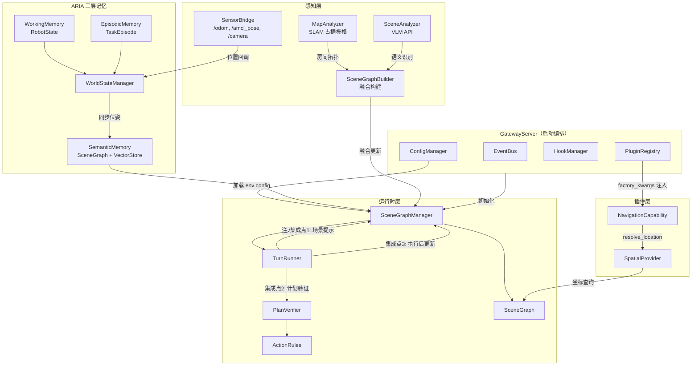
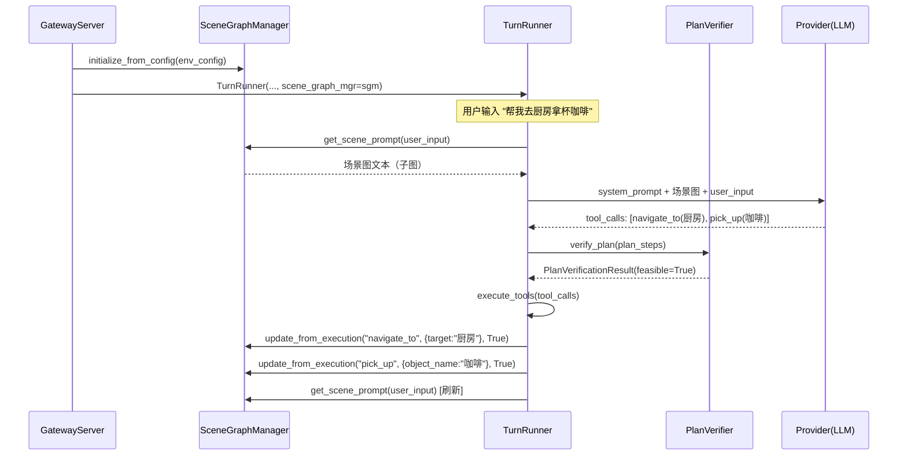
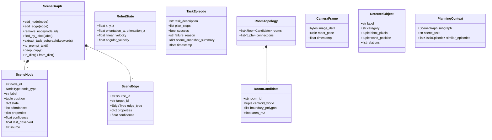

# 设计文档：场景图集成（Scene Graph Integration）

## 概述（Overview）

本设计将已实现但未接入的场景图体系（SceneGraph、SceneGraphManager、PlanVerifier、ActionRules）完整集成到 MOSAIC v2 运行时，同时扩展为 ARIA 三层记忆架构的核心载体，并引入 SLAM 地图分析和 VLM 语义标注流水线实现自动场景图构建。

核心变更分为三个层次：

1. **运行时接入层**（需求 1-6）：GatewayServer 初始化 SceneGraphManager → 注入 TurnRunner → 激活三大集成点（场景提示注入、计划验证、执行后更新）；补齐 SpatialProvider、PluginRegistry 参数注入、SensorBridge 位置同步。
2. **空间感知层**（需求 7）：MapAnalyzer 从 SLAM 占据栅格提取房间拓扑，替代手工 YAML 的房间定义。
3. **认知架构层**（需求 8-9）：ARIA 三层记忆（WorkingMemory + SemanticMemory + EpisodicMemory）统一集成；VLM 语义标注流水线自动构建场景图。

## 架构（Architecture）

### 整体架构图



### 数据流



### 设计决策

| 决策 | 选择 | 理由 |
|------|------|------|
| SceneGraphManager 初始化位置 | GatewayServer.__init__ | 与其他核心组件（EventBus、Registry）同级初始化，保持一致性 |
| SpatialProvider 实现方式 | 独立类，查询 SceneGraph | 解耦导航插件与场景图实现，便于替换为外部地图服务 |
| PluginRegistry 参数注入 | configure_plugin + factory_kwargs | 最小改动，向后兼容无参工厂函数 |
| SensorBridge 同步机制 | 回调函数注册 | 避免 SensorBridge 直接依赖 SceneGraphManager，保持单向依赖 |
| ARIA 记忆架构 | WorldStateManager 作为 Facade | 统一三层记忆的读写入口，对外保持 MemoryPlugin 接口兼容 |
| 地图分析 | 连通域分析 + 凸包 | 标准图像处理方法，无需额外 ML 模型 |
| VLM 后端 | 可配置（GPT-4V / 开源 VLM） | 通过 Provider 抽象支持多后端切换 |


## 组件与接口（Components and Interfaces）

### 1. GatewayServer 场景图初始化（需求 1）

在 `GatewayServer.__init__` 中新增场景图初始化逻辑：

```python
# mosaic/gateway/server.py — 新增部分
class GatewayServer:
    def __init__(self, config_path: str = "config/mosaic.yaml"):
        # ... 现有初始化代码 ...

        # ── 6. 初始化场景图管理器 ──
        self._scene_graph_mgr = self._init_scene_graph()

        # ── 7. 将场景图注入 TurnRunner ──
        self._turn_runner = TurnRunner(
            ...,
            scene_graph_mgr=self._scene_graph_mgr,  # 关键变更
        )

    def _init_scene_graph(self) -> SceneGraphManager | None:
        """初始化场景图管理器，失败时降级为 None"""
        try:
            env_path = self._config.get(
                "scene_graph.environment_config",
                "config/environments/home.yaml"
            )
            with open(env_path) as f:
                env_config = yaml.safe_load(f)
            sgm = SceneGraphManager(hooks=self._hooks)
            sgm.initialize_from_config(env_config)
            logger.info("场景图初始化完成: %s", env_path)
            return sgm
        except Exception as e:
            logger.error("场景图初始化失败，降级为无场景图模式: %s", e)
            return None
```

### 2. SpatialProvider（需求 2）

新增文件 `mosaic/runtime/spatial_provider.py`：

```python
class LocationNotFoundError(Exception):
    """语义地名无法解析为坐标"""
    def __init__(self, location_name: str, reason: str = ""):
        self.location_name = location_name
        super().__init__(f"无法解析位置 '{location_name}': {reason}")

class SpatialProvider:
    """语义地名到世界坐标的解析器"""

    def __init__(self, scene_graph: SceneGraph) -> None:
        self._graph = scene_graph

    def resolve_location(self, name: str) -> tuple[float, float]:
        """将语义地名解析为 (x, y) 世界坐标

        查找策略：
        1. 精确匹配 label
        2. 模糊匹配（大小写不敏感）
        3. 取最佳匹配节点的 position
        4. 若无 position，沿 CONTAINS 边向上查找父节点
        """
        nodes = self._graph.find_by_label(name)
        if not nodes:
            raise LocationNotFoundError(name, "场景图中无匹配节点")

        # 按匹配精度排序：精确匹配优先
        exact = [n for n in nodes if n.label.lower() == name.lower()]
        best = exact[0] if exact else nodes[0]

        return self._get_position_with_fallback(best)

    def _get_position_with_fallback(self, node: SceneNode) -> tuple[float, float]:
        """获取节点坐标，无坐标时沿层次向上回退"""
        if node.position:
            return node.position

        # 沿 CONTAINS 边向上查找父节点
        parent = self._graph.get_parent(node.node_id, EdgeType.CONTAINS)
        if parent:
            return self._get_position_with_fallback(parent)

        raise LocationNotFoundError(
            node.label, "节点及其所有祖先均无 position 属性"
        )
```

### 3. PluginRegistry 参数注入（需求 3）

对 `mosaic/plugin_sdk/registry.py` 的最小改动：

```python
class PluginRegistry:
    def __init__(self):
        # ... 现有字段 ...
        self._factory_kwargs: dict[str, dict[str, Any]] = {}  # 新增

    def register(self, plugin_id: str, factory: PluginFactory, kind: str,
                 factory_kwargs: dict[str, Any] | None = None):
        """注册插件工厂函数，可选附带工厂参数"""
        self._factories[plugin_id] = factory
        self._kind_index.setdefault(kind, []).append(plugin_id)
        if factory_kwargs:
            self._factory_kwargs[plugin_id] = factory_kwargs

    def configure_plugin(self, plugin_id: str, **kwargs) -> None:
        """在插件发现后、实例化前注入额外工厂参数"""
        self._factory_kwargs.setdefault(plugin_id, {}).update(kwargs)

    def resolve(self, plugin_id: str) -> Any:
        """解析并实例化插件（带参数注入）"""
        if plugin_id not in self._instances:
            factory = self._factories.get(plugin_id)
            if not factory:
                raise KeyError(f"插件未注册: {plugin_id}")
            kwargs = self._factory_kwargs.get(plugin_id, {})
            self._instances[plugin_id] = factory(**kwargs)  # 关键变更
        return self._instances[plugin_id]
```

### 4. SensorBridge 位置同步（需求 4）

对 `mosaic/nodes/sensor_bridge.py` 新增回调机制：

```python
class SensorBridge(Node):
    def __init__(self, ...):
        # ... 现有代码 ...
        self._position_callbacks: list[Callable[[float, float], None]] = []

    def on_position_update(self, callback: Callable[[float, float], None]) -> None:
        """注册位置更新回调"""
        self._position_callbacks.append(callback)

    def _pose_callback(self, msg: PoseWithCovarianceStamped) -> None:
        """AMCL 定位回调 — 更新位置并通知订阅者"""
        pos = msg.pose.pose.position
        self.state.x = pos.x
        self.state.y = pos.y
        # ... 现有更新 ...

        # 通知所有回调
        for cb in self._position_callbacks:
            cb(pos.x, pos.y)
```

SceneGraphManager 新增位置同步方法：

```python
class SceneGraphManager:
    def update_agent_position(self, x: float, y: float) -> None:
        """更新 agent 位置并重新计算所在房间"""
        agent = self._graph.get_agent_node()
        if not agent:
            return
        agent.position = (x, y)

        # 最近邻匹配确定所在房间（优先使用 boundary_polygon）
        new_room = self._find_room_for_position(x, y)
        if not new_room:
            return

        old_room = self._graph.get_agent_location()
        if old_room and old_room.node_id != new_room.node_id:
            self._graph.remove_edges(source_id=agent.node_id, edge_type=EdgeType.AT)
            self._graph.add_edge(SceneEdge(
                source_id=agent.node_id,
                target_id=new_room.node_id,
                edge_type=EdgeType.AT,
            ))
            if self._hooks:
                import asyncio
                asyncio.get_event_loop().create_task(
                    self._hooks.emit("scene.agent_moved", {
                        "old_room": old_room.node_id,
                        "new_room": new_room.node_id,
                    })
                )

    def _find_room_for_position(self, x: float, y: float) -> SceneNode | None:
        """根据坐标确定所在房间

        优先使用 boundary_polygon 点包含测试，
        回退到质心最近邻匹配。
        """
        rooms = self._graph.find_by_type(NodeType.ROOM)

        # 优先：boundary_polygon 点包含测试
        for room in rooms:
            polygon = room.properties.get("boundary_polygon")
            if polygon and self._point_in_polygon(x, y, polygon):
                return room

        # 回退：质心最近邻
        best_room, best_dist = None, float("inf")
        for room in rooms:
            if room.position:
                dx = x - room.position[0]
                dy = y - room.position[1]
                dist = (dx * dx + dy * dy) ** 0.5
                if dist < best_dist:
                    best_dist = dist
                    best_room = room
        return best_room

    @staticmethod
    def _point_in_polygon(x: float, y: float, polygon: list[list[float]]) -> bool:
        """射线法判断点是否在多边形内"""
        n = len(polygon)
        inside = False
        j = n - 1
        for i in range(n):
            xi, yi = polygon[i]
            xj, yj = polygon[j]
            if ((yi > y) != (yj > y)) and (x < (xj - xi) * (y - yi) / (yj - yi) + xi):
                inside = not inside
            j = i
        return inside
```

### 5. MapAnalyzer（需求 7）

新增文件 `mosaic/runtime/map_analyzer.py`：

```python
@dataclass
class RoomCandidate:
    """房间候选区"""
    room_id: str
    centroid_world: tuple[float, float]     # 质心世界坐标
    boundary_polygon: list[list[float]]     # 边界多边形（世界坐标）
    area_m2: float                          # 面积（平方米）
    pixel_mask: Any = None                  # 像素掩码（内部使用）

@dataclass
class RoomTopology:
    """房间拓扑"""
    rooms: list[RoomCandidate]
    connections: list[tuple[str, str]]      # 相邻房间对

class MapAnalyzer:
    """SLAM 占据栅格地图分析器"""

    def __init__(self) -> None:
        self._resolution: float = 0.0       # 米/像素
        self._origin: tuple[float, float, float] = (0, 0, 0)
        self._grid: Any = None              # numpy 2D array

    def load_map(self, yaml_path: str) -> None:
        """加载 SLAM 地图（.yaml + .pgm）"""

    def pixel_to_world(self, px: int, py: int) -> tuple[float, float]:
        """像素坐标 → 世界坐标"""
        wx = self._origin[0] + px * self._resolution
        wy = self._origin[1] + (self._grid.shape[0] - 1 - py) * self._resolution
        return (wx, wy)

    def world_to_pixel(self, wx: float, wy: float) -> tuple[int, int]:
        """世界坐标 → 像素坐标"""
        px = round((wx - self._origin[0]) / self._resolution)
        py = round(self._grid.shape[0] - 1 - (wy - self._origin[1]) / self._resolution)
        return (px, py)

    def extract_room_topology(self) -> RoomTopology:
        """提取房间拓扑：连通域分析 → 边界多边形 → 相邻关系"""
```

### 6. ARIA 三层记忆（需求 8）

新增文件 `mosaic/runtime/world_state_manager.py`：

```python
class WorkingMemory:
    """工作记忆 — RobotState 实时覆写"""
    def get_robot_state(self) -> RobotState: ...
    def update_robot_state(self, **kwargs) -> None: ...

class SemanticMemory:
    """语义记忆 — SceneGraph + VectorStore"""
    def __init__(self, scene_graph_mgr: SceneGraphManager): ...
    def retrieve_context(self, task_description: str) -> PlanningContext: ...

class EpisodicMemory:
    """情景记忆 — 任务执行历史"""
    def record_episode(self, episode: TaskEpisode) -> None: ...
    def recall_similar(self, task_description: str, top_k: int = 3) -> list[TaskEpisode]: ...

class WorldStateManager:
    """ARIA 三层记忆统一门面"""
    def __init__(self, working: WorkingMemory, semantic: SemanticMemory,
                 episodic: EpisodicMemory): ...

    # MemoryPlugin 兼容接口
    async def store(self, key: str, content: str, metadata: dict) -> None: ...
    async def search(self, query: str, top_k: int = 5) -> list[MemoryEntry]: ...
    async def get(self, key: str) -> MemoryEntry | None: ...
    async def delete(self, key: str) -> bool: ...
```

### 7. VLM 语义标注流水线（需求 9）

新增文件 `mosaic/runtime/scene_analyzer.py` 和 `mosaic/runtime/scene_graph_builder.py`：

```python
@dataclass
class CameraFrame:
    """相机帧数据"""
    image_data: bytes
    robot_pose: tuple[float, float, float]  # (x, y, theta)
    timestamp: float

@dataclass
class DetectedObject:
    """VLM 识别的物体"""
    label: str
    category: str                           # object / furniture / appliance
    bbox_pixels: tuple[int, int, int, int]  # (x1, y1, x2, y2)
    world_position: tuple[float, float] | None = None
    relations: list[dict] = field(default_factory=list)

class SceneAnalyzer:
    """VLM 语义分析器"""
    async def analyze_frame(self, frame: CameraFrame,
                            scene_context: str = "") -> list[DetectedObject]: ...

class SceneGraphBuilder:
    """场景图融合构建器"""
    def __init__(self, scene_graph_mgr: SceneGraphManager, hooks=None): ...
    def merge_room_topology(self, topology: RoomTopology) -> None: ...
    def merge_detections(self, detections: list[DetectedObject]) -> dict: ...
```

## 数据模型（Data Models）

### 核心数据结构



### 配置扩展

`config/mosaic.yaml` 新增配置项：

```yaml
# ── 场景图配置 ──
scene_graph:
  environment_config: "config/environments/home.yaml"
  slam_map: "~/mosaic_house_map.yaml"       # SLAM 地图路径
  auto_build: false                          # 是否启用 VLM 自动构建

# ── VLM 配置 ──
vlm:
  backend: "gpt-4v"                          # gpt-4v | open-vlm
  api_key: "${VLM_API_KEY}"
  base_url: "https://api.openai.com/v1"
  sample_interval_s: 2.0                     # 图像采样间隔
  merge_distance_m: 0.5                      # 节点去重距离阈值

# ── ARIA 记忆配置 ──
aria:
  episodic:
    max_episodes: 1000                       # 最大情景记忆条数
    time_decay_factor: 0.95                  # 时间衰减因子
  semantic:
    vector_store: "in-memory"                # in-memory | faiss
    embedding_model: "text-embedding-3-small"
```

### 坐标转换公式

MapAnalyzer 的像素↔世界坐标转换基于 SLAM 地图元数据：

```
# 像素 → 世界
world_x = origin_x + pixel_x * resolution
world_y = origin_y + (image_height - 1 - pixel_y) * resolution

# 世界 → 像素
pixel_x = round((world_x - origin_x) / resolution)
pixel_y = round(image_height - 1 - (world_y - origin_y) / resolution)
```

其中 `resolution` 为米/像素，`origin` 为地图左下角的世界坐标。


## 正确性属性（Correctness Properties）

*正确性属性是系统在所有有效执行中都应保持为真的特征或行为——本质上是关于系统应该做什么的形式化陈述。属性是人类可读规范与机器可验证正确性保证之间的桥梁。*

### Property 1: SpatialProvider 坐标解析往返一致性

*For all* 场景图中具有 position 属性的节点，通过 SpatialProvider.resolve_location(node.label) 获取的坐标 SHALL 与直接从 SceneGraph 查询该节点的 position 属性返回相同的值。

**Validates: Requirements 2.1, 2.2, 2.7**

### Property 2: SpatialProvider 模糊匹配返回有效坐标

*For all* 场景图中具有 position 属性的节点，使用该节点 label 的任意非空子串调用 SpatialProvider.resolve_location，SHALL 返回一个有效的 (x, y) 坐标元组（不抛出异常）。

**Validates: Requirements 2.3**

### Property 3: SpatialProvider 层次回退

*For all* 场景图中无 position 属性但有带 position 祖先节点（通过 CONTAINS 边）的节点，SpatialProvider.resolve_location SHALL 返回其最近祖先的 position 坐标。

**Validates: Requirements 2.5**

### Property 4: SpatialProvider 不存在地名抛出异常

*For all* 不在场景图任何节点 label 中出现的字符串，调用 SpatialProvider.resolve_location SHALL 抛出 LocationNotFoundError 异常。

**Validates: Requirements 2.4**

### Property 5: PluginRegistry 工厂参数注入

*For all* 通过 register 或 configure_plugin 注册了 factory_kwargs 的插件，首次调用 resolve 时 SHALL 将这些 kwargs 作为关键字参数传入工厂函数，且工厂函数接收到的参数与注册时的参数一致。

**Validates: Requirements 3.1, 3.2, 3.3**

### Property 6: SensorBridge 位置回调触发

*For all* 已注册到 SensorBridge 的位置更新回调函数，当 SensorBridge 接收到新的定位数据 (x, y) 时，回调函数 SHALL 被调用且传入的坐标与定位数据一致。

**Validates: Requirements 4.2**

### Property 7: SceneGraphManager 位置更新后 agent 坐标一致

*For all* 坐标 (x, y)，调用 SceneGraphManager.update_agent_position(x, y) 后，场景图中 agent 节点的 position 属性 SHALL 等于 (x, y)。

**Validates: Requirements 4.3**

### Property 8: SceneGraphManager 房间切换正确性

*For all* 坐标 (x, y) 和房间布局，当 update_agent_position 确定的最近房间与 agent 当前 AT_Edge 指向的房间不同时，agent 的 AT_Edge SHALL 被更新为指向新房间，且旧的 AT_Edge SHALL 被移除。

**Validates: Requirements 4.4, 4.5**

### Property 9: 场景图子图提取包含关键词匹配节点

*For all* 包含场景图中某节点 label 的任务描述字符串，SceneGraphManager.get_task_subgraph 返回的子图 SHALL 包含该节点。

**Validates: Requirements 5.2**

### Property 10: to_prompt_text 输出结构完整性

*For all* 包含至少一个 ROOM 节点、一个 FURNITURE/OBJECT 节点、一个 AGENT 节点和一条 REACHABLE 边的场景图，to_prompt_text 的输出 SHALL 包含"位置层"、"物体层"、"智能体"和"可达性"四个部分。

**Validates: Requirements 5.3**

### Property 11: navigate_to 执行后 AT_Edge 正确更新

*For all* 场景图中存在的目标位置，成功执行 navigate_to 动作后，agent 的 AT_Edge SHALL 指向目标位置对应的房间节点。

**Validates: Requirements 5.6**

### Property 12: pick_up 执行后 HOLDING 边和原始位置边正确更新

*For all* 场景图中存在的可抓取物品，成功执行 pick_up 动作后，agent 节点 SHALL 存在指向该物品的 HOLDING 边，且该物品的原始 ON_TOP 或 INSIDE 边 SHALL 被移除。

**Validates: Requirements 5.7**

### Property 13: PlanVerifier 不修改原始场景图

*For all* 计划和场景图，调用 PlanVerifier.verify_plan 后，原始场景图的节点数、边数和所有节点状态 SHALL 与调用前完全一致。

**Validates: Requirements 6.2**

### Property 14: PlanVerifier 可行性判定正确性

*For all* 计划步骤列表，PlanVerifier.verify_plan 返回 feasible=True 当且仅当计划中每一步的所有前置条件在模拟场景图上均满足。

**Validates: Requirements 6.3, 6.5**

### Property 15: PlanVerifier 未注册动作跳过验证

*For all* 计划中包含的未在 action_rules 中注册的动作名，PlanVerifier SHALL 将该步骤标记为 passed=True 并继续验证后续步骤。

**Validates: Requirements 6.6**

### Property 16: PlanVerifier 模拟一致性

*For all* 可行的计划，PlanVerifier 返回的 final_graph 的序列化结果 SHALL 与在原始场景图深拷贝上手动逐步调用 apply_effect 后的序列化结果一致。

**Validates: Requirements 6.7**

### Property 17: MapAnalyzer 像素↔世界坐标往返一致性

*For all* 有效的像素坐标 (px, py)（在地图范围内），先调用 pixel_to_world 再调用 world_to_pixel 返回的像素坐标与原始坐标的误差 SHALL 不超过 1 像素。

**Validates: Requirements 7.5**

### Property 18: MapAnalyzer 房间质心在边界内

*For all* MapAnalyzer 提取的房间候选区，其质心世界坐标 SHALL 位于其边界多边形内部。

**Validates: Requirements 7.3**

### Property 19: RoomTopology 到 SceneGraph 的映射完整性

*For all* RoomTopology 中的 RoomCandidate，SceneGraphManager 创建的场景图 SHALL 包含对应的 ROOM 类型节点，且该节点的 position 等于质心世界坐标，properties["boundary_polygon"] 等于边界多边形。

**Validates: Requirements 7.7, 7.8**

### Property 20: 点包含测试确定房间归属

*For all* 位于某房间 boundary_polygon 内部的坐标 (x, y)，SceneGraphManager._find_room_for_position SHALL 返回该房间节点。

**Validates: Requirements 7.9, 9.8**

### Property 21: WorkingMemory 状态往返一致性

*For all* RobotState 字段更新，调用 WorkingMemory.update_robot_state 后再调用 get_robot_state SHALL 返回包含最新更新值的 RobotState。

**Validates: Requirements 8.2**

### Property 22: 工作记忆→语义记忆位姿同步

*For all* 通过 WorldStateManager 更新的位姿 (x, y)，SemanticMemory 中 agent 节点的 position 属性 SHALL 与 WorkingMemory 中的 RobotState.(x, y) 一致。

**Validates: Requirements 8.3**

### Property 23: EpisodicMemory 存储→召回往返

*For all* TaskEpisode，存储到 EpisodicMemory 后，使用相同的 task_description 调用 recall_similar SHALL 在返回结果中包含该 episode。

**Validates: Requirements 8.6**

### Property 24: WorldStateManager MemoryPlugin 接口兼容

*For all* 通过 WorldStateManager.store(key, content, metadata) 存储的数据，调用 get(key) SHALL 返回包含相同 content 的 MemoryEntry；调用 delete(key) 后再调用 get(key) SHALL 返回 None。

**Validates: Requirements 8.10**

### Property 25: SceneGraphBuilder 节点去重

*For all* 已存在于场景图中的节点，当 SceneGraphBuilder 接收到相同语义标签且世界坐标距离小于 0.5 米的检测结果时，场景图的节点总数 SHALL 不增加，且已有节点的 last_observed 时间戳 SHALL 被更新。

**Validates: Requirements 9.9**

### Property 26: SceneGraphBuilder 融合完整性

*For all* SceneAnalyzer 输出的 DetectedObject，经 SceneGraphBuilder 融合后，SceneGraph.to_prompt_text() 的输出 SHALL 包含该物体的语义标签（label）和所属房间信息。

**Validates: Requirements 9.12**


## 错误处理（Error Handling）

### 降级策略

| 组件 | 错误场景 | 处理方式 |
|------|----------|----------|
| GatewayServer | 环境配置文件不存在/格式错误 | 记录 ERROR 日志，scene_graph_mgr=None，系统以无场景图模式继续运行 |
| TurnRunner | scene_graph_mgr=None | 跳过三个集成点（场景注入、计划验证、执行后更新），行为与当前一致 |
| SpatialProvider | 语义地名无匹配 | 抛出 LocationNotFoundError，NavigationCapability 返回 ExecutionResult(success=False) |
| SpatialProvider | 匹配节点无坐标且无祖先坐标 | 抛出 LocationNotFoundError，附带原因说明 |
| SensorBridge | 无 SceneGraphManager 注入 | 仅更新本地 RobotState，不尝试场景图同步 |
| PlanVerifier | 未注册的动作规则 | 跳过验证，标记为 passed，不阻断计划执行 |
| MapAnalyzer | SLAM 地图文件不存在 | 抛出 FileNotFoundError，GatewayServer 回退到 YAML 配置初始化 |
| SceneAnalyzer | VLM API 调用失败/超时 | 记录 ERROR 日志，跳过本帧，不影响系统运行 |
| SceneAnalyzer | VLM 返回非法 JSON | 记录 WARNING 日志，丢弃本帧结果 |
| SceneGraphBuilder | 物体坐标不在任何房间内 | 记录 WARNING 日志，将物体挂载到最近房间 |
| WorldStateManager | VectorStore 索引失败 | 记录 ERROR 日志，回退到关键词匹配检索 |

### 异常类型

```python
class LocationNotFoundError(Exception):
    """语义地名无法解析为坐标"""

class SceneGraphInitError(Exception):
    """场景图初始化失败"""

class MapAnalyzerError(Exception):
    """地图分析失败"""

class VLMAnalysisError(Exception):
    """VLM 分析失败"""
```

### 关键原则

1. **场景图是增强而非必需**：所有场景图相关功能失败时，系统必须能降级到无场景图模式继续运行
2. **单帧失败不影响全局**：VLM 流水线中单帧处理失败不应影响后续帧或其他系统功能
3. **日志分级**：配置错误用 ERROR，数据质量问题用 WARNING，正常降级用 INFO

## 测试策略（Testing Strategy）

### 测试框架

- **单元测试**：`pytest` + `pytest-asyncio`
- **属性基测试**：`hypothesis`（Python PBT 库）
- 测试文件统一放在 `test/mosaic_v2/` 目录下

### 双轨测试方法

本特性采用单元测试 + 属性基测试的双轨策略：

- **单元测试**：验证具体示例、边界情况和错误条件
- **属性基测试**：验证跨所有输入的通用属性

两者互补：单元测试捕获具体 bug，属性测试验证通用正确性。

### 属性基测试配置

- 使用 `hypothesis` 库，每个属性测试最少运行 **100 次迭代**
- 每个属性测试必须通过注释引用设计文档中的属性编号
- 标签格式：`# Feature: scene-graph-integration, Property {N}: {property_text}`
- 每个正确性属性由**单个**属性基测试实现

### 单元测试覆盖

| 测试文件 | 覆盖范围 |
|----------|----------|
| `test_gateway_scene_init.py` | GatewayServer 场景图初始化、降级行为（需求 1） |
| `test_spatial_provider.py` | SpatialProvider 坐标解析、模糊匹配、层次回退（需求 2） |
| `test_plugin_registry_kwargs.py` | PluginRegistry 参数注入、configure_plugin（需求 3） |
| `test_sensor_bridge_sync.py` | SensorBridge 回调注册、位置同步（需求 4） |
| `test_scene_prompt_injection.py` | 场景图注入 LLM 上下文、执行后更新（需求 5） |
| `test_plan_verifier.py` | 计划验证、深拷贝不变量、模拟一致性（需求 6） |
| `test_map_analyzer.py` | 地图加载、连通域分析、坐标转换（需求 7） |
| `test_world_state_manager.py` | ARIA 三层记忆、接口兼容性（需求 8） |
| `test_scene_graph_builder.py` | VLM 融合、节点去重、融合完整性（需求 9） |

### 属性基测试覆盖

| 属性编号 | 测试描述 | Hypothesis 策略 |
|----------|----------|-----------------|
| Property 1 | SpatialProvider 往返一致性 | 生成随机 SceneGraph + 随机选择有 position 的节点 |
| Property 2 | 模糊匹配返回有效坐标 | 生成随机节点 label 的子串 |
| Property 3 | 层次回退 | 生成无 position 但有带 position 祖先的节点树 |
| Property 4 | 不存在地名抛异常 | 生成不在场景图中的随机字符串 |
| Property 5 | 工厂参数注入 | 生成随机 kwargs 字典和 mock 工厂函数 |
| Property 6 | 位置回调触发 | 生成随机 (x, y) 坐标 |
| Property 7 | agent 坐标更新 | 生成随机 (x, y) 坐标 |
| Property 8 | 房间切换正确性 | 生成随机房间布局和坐标序列 |
| Property 9 | 子图包含关键词节点 | 生成随机场景图和包含节点 label 的任务描述 |
| Property 10 | prompt 输出结构完整 | 生成包含必要节点类型的随机场景图 |
| Property 11 | navigate_to 后 AT_Edge | 生成随机场景图和有效目标 |
| Property 12 | pick_up 后 HOLDING 边 | 生成随机场景图和可抓取物品 |
| Property 13 | PlanVerifier 不修改原图 | 生成随机计划和场景图 |
| Property 14 | 可行性判定正确性 | 生成随机计划（可行/不可行混合） |
| Property 15 | 未注册动作跳过 | 生成包含随机未注册动作名的计划 |
| Property 16 | 模拟一致性 | 生成随机可行计划 |
| Property 17 | 像素↔世界往返 | 生成随机像素坐标和地图参数 |
| Property 18 | 质心在边界内 | 生成随机连通像素区域 |
| Property 19 | RoomTopology→SceneGraph 映射 | 生成随机 RoomTopology |
| Property 20 | 点包含测试 | 生成随机多边形和内部点 |
| Property 21 | WorkingMemory 往返 | 生成随机 RobotState 字段 |
| Property 22 | 位姿跨层同步 | 生成随机位姿序列 |
| Property 23 | EpisodicMemory 往返 | 生成随机 TaskEpisode |
| Property 24 | MemoryPlugin 接口兼容 | 生成随机 key/content/metadata |
| Property 25 | 节点去重 | 生成随机场景图和距离 < 0.5m 的同名检测结果 |
| Property 26 | 融合完整性 | 生成随机 DetectedObject 列表 |

### Hypothesis 策略示例

```python
from hypothesis import given, settings, strategies as st

# 生成随机场景图节点
scene_node_strategy = st.builds(
    SceneNode,
    node_id=st.text(min_size=1, max_size=20),
    node_type=st.sampled_from(list(NodeType)),
    label=st.text(min_size=1, max_size=30),
    position=st.one_of(
        st.none(),
        st.tuples(st.floats(-50, 50), st.floats(-50, 50)),
    ),
)

# Property 17 示例
@settings(max_examples=100)
@given(
    px=st.integers(0, 999),
    py=st.integers(0, 999),
    resolution=st.floats(0.01, 1.0),
    origin_x=st.floats(-100, 100),
    origin_y=st.floats(-100, 100),
)
def test_pixel_world_roundtrip(px, py, resolution, origin_x, origin_y):
    """Feature: scene-graph-integration, Property 17: 像素↔世界坐标往返一致性"""
    # ... 测试实现 ...
```
