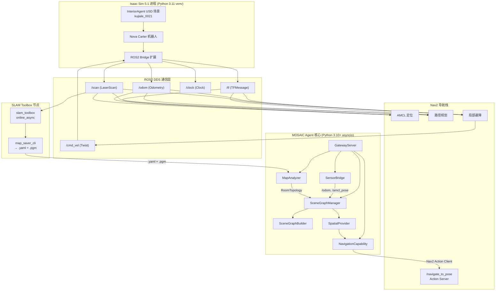
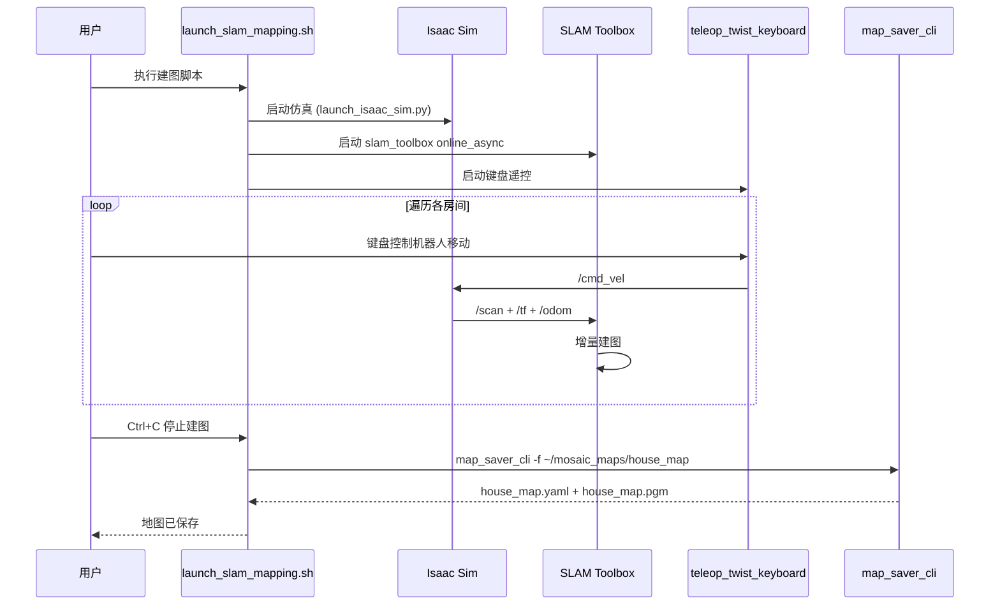
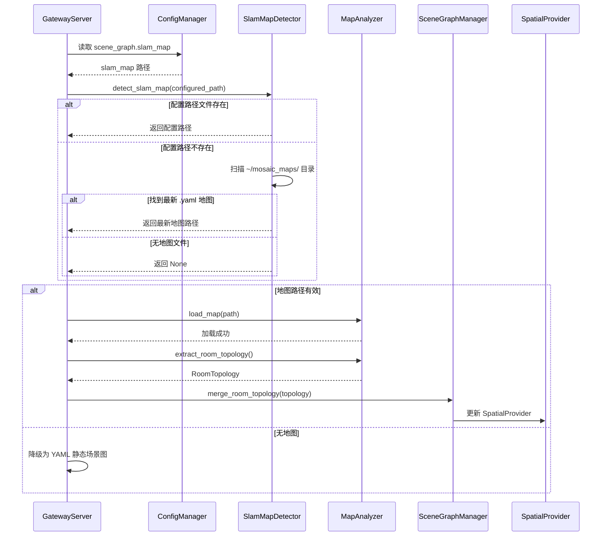
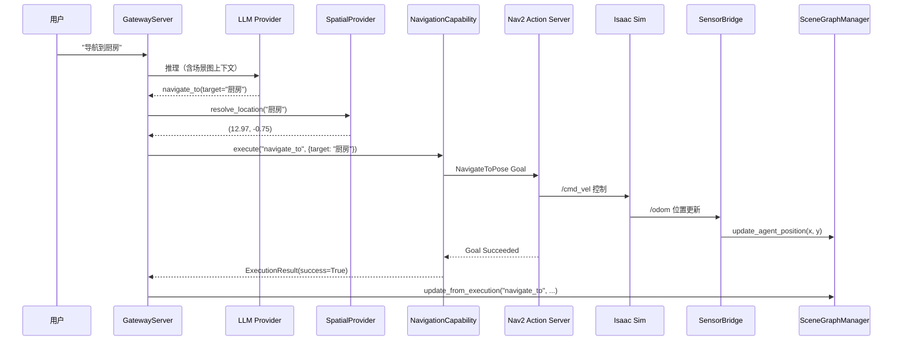

# Design Document: SLAM Simulation Pipeline

## Overview

本特性搭建 Isaac Sim + SLAM 建图仿真全链路，打通 Isaac Sim → SLAM Toolbox 建图 → 地图文件(.yaml+.pgm) → MapAnalyzer → SceneGraphManager.merge_room_topology() → 场景图融合 的完整数据流。

核心目标：让 MOSAIC 的 GatewayServer 在启动时能自动检测并加载真实 SLAM 输出的地图文件，将房间拓扑融合到场景图中，为后续 Nav2 导航提供精确的空间骨架。同时提供一键式多终端启动脚本，将 Isaac Sim + Nav2 + SLAM + MOSAIC 的多终端启动流程自动化。

当前痛点：`config/mosaic.yaml` 中 `scene_graph.slam_map` 指向 `~/mosaic_house_map.yaml`，但该文件不存在（从未执行过 SLAM 建图），导致 GatewayServer 启动时 SLAM 地图加载失败，只能回退到纯 YAML 配置的静态场景图。

## Architecture



## Sequence Diagrams

### SLAM 建图流程



### GatewayServer 启动时地图加载流程



### 完整导航验证流程



## Components and Interfaces

### Component 1: SlamMapDetector

**Purpose**: 自动检测可用的 SLAM 地图文件，支持配置路径优先 + 目录扫描回退

**Interface**:
```python
class SlamMapDetector:
    """SLAM 地图文件自动检测器"""

    def __init__(
        self,
        default_map_dir: str = "~/mosaic_maps",
    ) -> None: ...

    def detect(self, configured_path: str = "") -> str | None:
        """检测可用的 SLAM 地图文件

        优先级：
        1. configured_path 指定的文件（如果存在）
        2. default_map_dir 中最新的 .yaml 文件
        3. 返回 None（无可用地图）
        """
        ...

    def validate_map_files(self, yaml_path: str) -> bool:
        """验证地图文件完整性（.yaml + 对应 .pgm 均存在）"""
        ...
```

**Responsibilities**:
- 解析配置路径（支持 ~ 展开）
- 扫描默认地图目录，按修改时间排序
- 验证 .yaml + .pgm 文件对完整性

### Component 2: Nav2LaunchConfig

**Purpose**: 生成适配 Isaac Sim 仿真环境的 Nav2 launch 参数配置

**Interface**:
```python
class Nav2LaunchConfig:
    """Nav2 导航栈 launch 配置生成器"""

    def __init__(self, mosaic_config: dict) -> None: ...

    def generate_nav2_params(self, output_path: str) -> str:
        """生成 Nav2 参数 YAML 文件，返回文件路径"""
        ...

    def get_launch_command(self, map_path: str) -> str:
        """生成 Nav2 bringup launch 命令"""
        ...

    def generate_slam_params(self, output_path: str) -> str:
        """生成 SLAM Toolbox 参数 YAML 文件"""
        ...
```

**Responsibilities**:
- 生成 Nav2 参数文件（use_sim_time、costmap 配置、AMCL 参数）
- 生成 SLAM Toolbox 参数文件（适配 Isaac Sim 传感器话题）
- 提供 launch 命令字符串

### Component 3: SlamMappingOrchestrator

**Purpose**: 编排 SLAM 建图流程，管理建图状态和地图保存

**Interface**:
```python
class SlamMappingOrchestrator:
    """SLAM 建图流程编排器"""

    def __init__(
        self,
        map_output_dir: str = "~/mosaic_maps",
        map_name: str = "house_map",
    ) -> None: ...

    def get_mapping_commands(self) -> dict[str, str]:
        """返回各终端需要执行的命令

        Returns:
            {
                "isaac_sim": "python scripts/launch_isaac_sim.py",
                "slam": "ros2 launch slam_toolbox ...",
                "teleop": "ros2 run teleop_twist_keyboard ...",
                "rviz": "rviz2 -d config/slam_rviz.rviz",
            }
        """
        ...

    def save_map(self, map_name: str | None = None) -> str:
        """保存当前 SLAM 地图，返回保存路径"""
        ...

    def get_save_command(self, map_name: str | None = None) -> str:
        """返回地图保存命令字符串"""
        ...
```

**Responsibilities**:
- 生成多终端启动命令
- 管理地图输出目录和命名
- 提供地图保存命令

## Data Models

### Nav2 参数配置模型

```python
@dataclass
class Nav2SimParams:
    """Nav2 仿真环境参数"""
    use_sim_time: bool = True
    robot_model_type: str = "differential"  # Nova Carter 差速驱动
    robot_radius: float = 0.22              # Nova Carter 半径（米）
    scan_topic: str = "/scan"
    odom_topic: str = "/odom"
    cmd_vel_topic: str = "/cmd_vel"
    map_topic: str = "/map"
    # AMCL 参数
    amcl_max_particles: int = 2000
    amcl_min_particles: int = 500
    # Costmap 参数
    inflation_radius: float = 0.55
    cost_scaling_factor: float = 2.0
    # 控制器参数
    max_vel_x: float = 0.5
    max_vel_theta: float = 1.0
```

**Validation Rules**:
- `robot_radius` > 0
- `inflation_radius` > `robot_radius`
- `amcl_max_particles` > `amcl_min_particles`
- `max_vel_x` > 0, `max_vel_theta` > 0

### SLAM Toolbox 参数模型

```python
@dataclass
class SlamToolboxParams:
    """SLAM Toolbox 仿真参数"""
    use_sim_time: bool = True
    mode: str = "mapping"                   # mapping | localization
    scan_topic: str = "/scan"
    odom_frame: str = "odom"
    map_frame: str = "map"
    base_frame: str = "base_link"
    resolution: float = 0.05               # 地图分辨率（米/像素）
    max_laser_range: float = 12.0          # 最大激光距离
    minimum_travel_distance: float = 0.5   # 最小移动距离触发建图
    minimum_travel_heading: float = 0.5    # 最小旋转角度触发建图
    map_update_interval: float = 5.0       # 地图更新间隔（秒）
```

### 地图文件元数据

```python
@dataclass
class SlamMapMeta:
    """SLAM 地图文件元数据"""
    yaml_path: str                          # .yaml 文件路径
    pgm_path: str                           # .pgm 文件路径
    resolution: float                       # 米/像素
    origin: tuple[float, float, float]      # 地图原点 (x, y, theta)
    width_pixels: int                       # 图像宽度
    height_pixels: int                      # 图像高度
    created_at: float                       # 创建时间戳
    map_name: str                           # 地图名称
```

## Algorithmic Pseudocode

### SLAM 地图自动检测算法

```python
def detect_slam_map(configured_path: str, default_dir: str) -> str | None:
    """检测可用的 SLAM 地图文件

    前置条件:
    - configured_path 为字符串（可为空）
    - default_dir 为有效目录路径

    后置条件:
    - 返回有效的 .yaml 地图路径，或 None
    - 返回的路径对应的 .yaml 和 .pgm 文件均存在
    """
    # 步骤 1：尝试配置路径
    if configured_path:
        expanded = os.path.expanduser(configured_path)
        if validate_map_pair(expanded):
            return expanded

    # 步骤 2：扫描默认目录
    map_dir = os.path.expanduser(default_dir)
    if not os.path.isdir(map_dir):
        return None

    # 收集所有 .yaml 文件，按修改时间降序排列
    candidates = []
    for f in os.listdir(map_dir):
        if f.endswith(".yaml"):
            full_path = os.path.join(map_dir, f)
            if validate_map_pair(full_path):
                mtime = os.path.getmtime(full_path)
                candidates.append((mtime, full_path))

    candidates.sort(reverse=True)  # 最新的排前面

    if candidates:
        return candidates[0][1]

    return None


def validate_map_pair(yaml_path: str) -> bool:
    """验证 .yaml + .pgm 文件对完整性

    前置条件: yaml_path 为字符串
    后置条件: 返回 True 当且仅当 .yaml 存在且其引用的 .pgm 也存在
    """
    if not os.path.exists(yaml_path):
        return False

    with open(yaml_path) as f:
        meta = yaml.safe_load(f)

    image_path = meta.get("image", "")
    if not os.path.isabs(image_path):
        image_path = os.path.join(os.path.dirname(yaml_path), image_path)

    return os.path.exists(image_path)
```

### GatewayServer 增强的地图加载算法

```python
def init_map_and_vlm_pipeline_enhanced(self) -> None:
    """增强版地图加载流程

    前置条件:
    - self._scene_graph_mgr 已初始化
    - self._config 已加载

    后置条件:
    - 如果找到有效地图：RoomTopology 已合并到场景图
    - 如果无地图：保持 YAML 静态场景图（降级）
    - SpatialProvider 已更新（如果场景图有变化）

    循环不变量: 无循环
    """
    slam_map_path = self._config.get("scene_graph.slam_map", "")
    default_map_dir = self._config.get(
        "scene_graph.slam_map_dir", "~/mosaic_maps"
    )

    # 自动检测地图
    detector = SlamMapDetector(default_map_dir=default_map_dir)
    detected_path = detector.detect(configured_path=slam_map_path)

    if detected_path:
        try:
            analyzer = MapAnalyzer()
            analyzer.load_map(detected_path)
            topology = analyzer.extract_room_topology()
            self._scene_graph_mgr.merge_room_topology(topology)
            logger.info(
                "SLAM 地图已加载: %s（%d 房间, %d 连接）",
                detected_path,
                len(topology.rooms),
                len(topology.connections),
            )
        except Exception as e:
            logger.error("SLAM 地图加载失败: %s", e)
    else:
        logger.info("未检测到 SLAM 地图，使用 YAML 静态场景图")
```

## Key Functions with Formal Specifications

### Function 1: SlamMapDetector.detect()

```python
def detect(self, configured_path: str = "") -> str | None:
    """检测可用的 SLAM 地图文件"""
```

**Preconditions:**
- `configured_path` 为字符串类型（可为空字符串）
- `self._default_map_dir` 已设置

**Postconditions:**
- 返回 `str` 时：该路径对应的 .yaml 文件存在，且其引用的 .pgm 文件也存在
- 返回 `None` 时：配置路径无效且默认目录中无有效地图文件
- 不修改任何文件系统状态

**Loop Invariants:**
- 目录扫描循环中：`candidates` 列表中所有元素均已通过 `validate_map_pair` 验证

### Function 2: Nav2LaunchConfig.generate_nav2_params()

```python
def generate_nav2_params(self, output_path: str) -> str:
    """生成 Nav2 参数 YAML 文件"""
```

**Preconditions:**
- `output_path` 为有效的文件系统路径
- `self._params` 中所有数值参数为正数

**Postconditions:**
- 在 `output_path` 生成有效的 Nav2 参数 YAML 文件
- 文件包含 amcl、controller_server、planner_server、costmap 配置
- `use_sim_time: true` 已设置
- 返回生成的文件路径

### Function 3: GatewayServer._init_map_and_vlm_pipeline() (增强)

```python
def _init_map_and_vlm_pipeline(self) -> None:
    """增强版：自动检测 + 加载 SLAM 地图"""
```

**Preconditions:**
- `self._scene_graph_mgr` 不为 None
- `self._config` 已加载

**Postconditions:**
- 成功时：`self._scene_graph_mgr` 的场景图包含 SLAM 拓扑房间节点
- 失败时：场景图保持 YAML 配置初始化状态（降级）
- 不抛出异常（内部 try-except 处理）

## Example Usage

### 1. SLAM 建图完整流程

```python
# 使用一键启动脚本
# bash scripts/launch_slam_mapping.sh

# 脚本内部执行：
# 终端 1: python scripts/launch_isaac_sim.py
# 终端 2: ros2 launch slam_toolbox online_async_launch.py \
#          params_file:=config/nav2/slam_toolbox_params.yaml
# 终端 3: rviz2 -d config/nav2/slam_rviz.rviz
# 终端 4: ros2 run teleop_twist_keyboard teleop_twist_keyboard

# 建图完成后保存：
# ros2 run nav2_map_server map_saver_cli -f ~/mosaic_maps/house_map
```

### 2. 地图自动检测

```python
from mosaic.runtime.slam_map_detector import SlamMapDetector

detector = SlamMapDetector(default_map_dir="~/mosaic_maps")

# 优先使用配置路径
path = detector.detect(configured_path="~/mosaic_house_map.yaml")
# 如果配置路径不存在，自动扫描 ~/mosaic_maps/ 目录

if path:
    print(f"检测到地图: {path}")
else:
    print("未找到 SLAM 地图")
```

### 3. GatewayServer 启动自动加载

```python
# GatewayServer.__init__ 中自动执行：
# 1. 读取 scene_graph.slam_map 配置
# 2. SlamMapDetector 自动检测
# 3. MapAnalyzer 加载并提取拓扑
# 4. SceneGraphManager 合并拓扑
# 5. SpatialProvider 获得精确坐标

# 用户无需手动操作，启动 MOSAIC 即可
python3 -c "from mosaic.gateway.server import main; main()"
```

### 4. Nav2 导航模式启动

```python
# 使用一键启动脚本
# bash scripts/launch_nav2_sim.sh

# 脚本内部执行：
# 终端 1: python scripts/launch_isaac_sim.py
# 终端 2: ros2 launch nav2_bringup bringup_launch.py \
#          use_sim_time:=True \
#          map:=$HOME/mosaic_maps/house_map.yaml \
#          params_file:=config/nav2/nav2_params.yaml
# 终端 3: MOSAIC Gateway
```


## Correctness Properties

以下属性以全称量化形式表达，确保系统在所有有效输入下行为正确：

1. **地图文件完整性**: ∀ yaml_path ∈ DetectedMaps: validate_map_pair(yaml_path) = True ⟹ ∃ pgm_path: os.path.exists(pgm_path) ∧ pgm_path = resolve_image_path(yaml_path)

2. **检测优先级**: ∀ configured_path ≠ "" ∧ validate_map_pair(configured_path): detect(configured_path) = configured_path（配置路径优先于目录扫描）

3. **降级安全性**: ∀ detect() = None: GatewayServer 场景图 = YAML 静态初始化结果（不因缺少地图而崩溃）

4. **拓扑合并幂等性**: ∀ topology: merge_room_topology(topology) 后场景图包含 topology.rooms 中所有房间节点

5. **坐标一致性**: ∀ room ∈ merged_topology: room.position = pixel_to_world(centroid_pixel) 且坐标系与 Nav2 map frame 一致

6. **Nav2 参数有效性**: ∀ generated_params: use_sim_time = True ∧ inflation_radius > robot_radius ∧ max_particles > min_particles

7. **启动脚本原子性**: launch_slam_mapping.sh 中任一子进程启动失败时，已启动的子进程应被清理

## Error Handling

### Error Scenario 1: SLAM 地图文件不存在

**Condition**: `scene_graph.slam_map` 配置的路径不存在，且 `~/mosaic_maps/` 目录为空或不存在
**Response**: SlamMapDetector.detect() 返回 None，GatewayServer 记录 INFO 日志
**Recovery**: 降级为 YAML 静态场景图，系统正常运行（仅缺少 SLAM 精确拓扑）

### Error Scenario 2: .pgm 图像文件损坏或缺失

**Condition**: .yaml 文件存在但引用的 .pgm 文件不存在或无法解析
**Response**: validate_map_pair() 返回 False，跳过该地图文件
**Recovery**: 继续扫描其他候选地图，或降级为 YAML 配置

### Error Scenario 3: MapAnalyzer 拓扑提取失败

**Condition**: 地图质量差（噪声过多、连通域过小）导致无法提取有效房间
**Response**: extract_room_topology() 返回空 RoomTopology（rooms=[], connections=[]）
**Recovery**: merge_room_topology 不添加任何节点，保持 YAML 配置的房间结构

### Error Scenario 4: Nav2 参数文件生成失败

**Condition**: 输出目录不存在或无写入权限
**Response**: generate_nav2_params() 抛出 OSError
**Recovery**: 使用 Nav2 默认参数启动（可能不适配 Isaac Sim 仿真时间）

### Error Scenario 5: Isaac Sim 进程异常退出

**Condition**: GPU 内存不足、场景文件损坏等导致 Isaac Sim 崩溃
**Response**: 启动脚本检测子进程退出码，输出错误信息
**Recovery**: 清理所有已启动的 ROS2 节点，提示用户检查 GPU 和场景文件

## Testing Strategy

### Unit Testing Approach

- `SlamMapDetector`: 使用 tmp_path fixture 创建临时 .yaml + .pgm 文件对，测试检测优先级和验证逻辑
- `Nav2LaunchConfig`: 验证生成的 YAML 参数文件结构和关键字段
- `SlamMappingOrchestrator`: 验证生成的命令字符串格式正确

### Property-Based Testing Approach

**Property Test Library**: hypothesis

- 对 `SlamMapDetector.detect()` 进行属性测试：随机生成目录结构和文件名，验证检测结果始终满足完整性约束
- 对 `Nav2SimParams` 进行属性测试：随机生成参数值，验证 validation rules 始终被正确检查

### Integration Testing Approach

- 端到端测试：创建模拟的 SLAM 地图文件 → GatewayServer 初始化 → 验证场景图包含 SLAM 拓扑节点
- 配置集成测试：修改 mosaic.yaml 中 slam_map 路径 → 重启 → 验证自动检测行为

## Performance Considerations

- SLAM 地图加载（MapAnalyzer.load_map + extract_room_topology）在 GatewayServer 初始化时同步执行，典型耗时 < 1s
- 目录扫描（SlamMapDetector）仅在启动时执行一次，不影响运行时性能
- Nav2 参数文件生成为一次性操作，不影响运行时

## Security Considerations

- 地图文件路径支持 `~` 展开，但不支持任意路径遍历（限制在 home 目录和项目目录内）
- Nav2 参数文件生成在项目 config/ 目录内，不写入系统目录
- 启动脚本不包含硬编码密钥或敏感信息

## Dependencies

| 依赖 | 版本 | 用途 |
|------|------|------|
| Isaac Sim | 5.1.0 | 物理仿真 + RTX 渲染 + ROS2 Bridge |
| ROS2 Jazzy | Jazzy Jalisco | 通信中间件 |
| Nav2 (navigation2) | Jazzy 版本 | 导航栈（AMCL + 路径规划 + 避障） |
| slam_toolbox | Jazzy 版本 | SLAM 建图 |
| teleop_twist_keyboard | Jazzy 版本 | 键盘遥控（建图时使用） |
| numpy | ≥1.24 | 栅格地图处理 |
| scipy | ≥1.10 | 连通域分析、凸包计算 |
| Pillow | ≥9.0 | .pgm 图像加载 |
| PyYAML | ≥6.0 | YAML 配置解析 |
