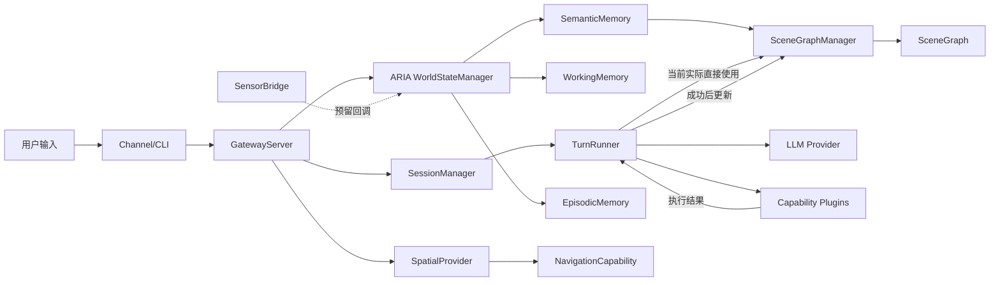
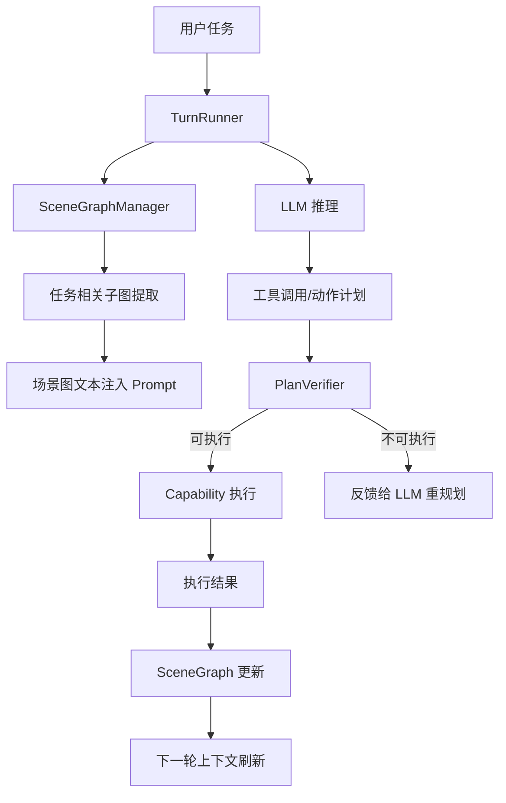
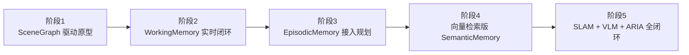

# 以 ARIA 为核心的 MOSAIC 系统架构阶段性报告

- title: 以 ARIA 为核心的 MOSAIC 系统架构阶段性报告
- status: active
- owner: repository-maintainers
- updated: 2026-04-15
- tags: docs, dev, architecture, aria, scene-graph, status-report

## 1. 目的

本文以 ARIA 为中心，梳理 MOSAIC 当前阶段的实际架构完成度，并对未来预期架构进行对照说明。重点回答三个问题：

1. ARIA 在系统中的定位是什么。
2. 当前实现中，ARIA 哪些能力已经落地，哪些仍处于骨架或预留状态。
3. 系统未来如何从“场景图驱动原型”演进为“ARIA 驱动闭环 embodied agent”。

## 2. ARIA 的系统定位

ARIA（Agent with Retrieval-augmented Intelligence Architecture）是 MOSAIC 的全局状态与记忆中枢。它不是单一功能模块，而是为 LLM 规划、能力执行和环境感知提供统一世界模型的基础设施。

ARIA 的三层记忆包括：

- `WorkingMemory`：保存机器人实时状态，如位姿、速度等。
- `SemanticMemory`：保存结构化环境知识，当前主要由 `SceneGraph` 承载。
- `EpisodicMemory`：保存任务执行历史，用于召回相似经验。

在目标设计上，ARIA 应承担以下职责：

- 为规划阶段提供任务相关、精简且可 grounding 的上下文。
- 为执行阶段维护最新世界状态。
- 为多轮任务提供经验记忆与长期积累。
- 为导航、操作等能力模块提供统一空间查询接口。

## 3. 当前系统实际架构

### 3.1 当前运行形态概述

从当前仓库实现来看，系统已经进入“ARIA 骨架落地期”，其中最成熟的是 ARIA 的语义记忆部分，也就是 `SceneGraph` 驱动的环境表征与规划支撑链路。

当前实际主链路如下：



这个图反映了一个关键事实：

当前主流程虽然已经初始化了完整的 ARIA，但 `TurnRunner` 真正直接消费的还是 `SceneGraphManager`，而不是完整的 `WorldStateManager`。

也就是说，ARIA 已经存在，但它在运行时主要通过 `SemanticMemory` 的载体发挥作用。

## 4. 现阶段完成度分析

### 4.1 总体判断

如果以 ARIA 为中心评估系统完成度，当前阶段可以概括为：

**ARIA 的结构已经建立，语义记忆链路已进入主流程，工作记忆和情景记忆具备实现原型，但尚未形成完整闭环。**

换句话说，系统当前更接近：

**“以 SceneGraph 为核心的 ARIA 第一阶段原型”**

而不是：

**“完整由 ARIA 三层记忆驱动的 embodied agent 架构”**

### 4.2 各部分完成度

#### 4.2.1 ARIA 统一门面

已完成：

- `WorldStateManager` 已实现。
- 已整合 `WorkingMemory`、`SemanticMemory`、`EpisodicMemory`。
- 已注册为 `memory` slot 的 provider。
- 保持对旧 `MemoryPlugin` 接口兼容。

评价：

- 完成度高。
- 已具备系统级“统一记忆入口”的形态。
- 但尚未成为规划主链路的唯一入口。

#### 4.2.2 SemanticMemory / SceneGraph

已完成：

- `SceneGraph` 数据结构已实现。
- `SceneGraphManager` 已实现初始化、查询、验证、执行后更新。
- `TurnRunner` 已完成三点集成：
  - 上下文注入
  - 计划验证
  - 执行后更新
- `SpatialProvider` 已可基于场景图做语义地名解析。

评价：

- 完成度最高。
- 是当前系统最成熟、最实际工作的 ARIA 子系统。
- 当前可以视为 ARIA 的“有效核心”。

当前链路如下：



这条链路已经构成了当前 MOSAIC 的核心智能回路。

#### 4.2.3 WorkingMemory

已完成：

- `RobotState` 数据结构已定义。
- `WorkingMemory` 已支持实时覆写更新。
- `WorldStateManager.update_position()` 已能同步更新：
  - `WorkingMemory` 状态
  - 场景图中的 `agent` 节点位置

已实现但未完全接通：

- `SensorBridge` 已支持位置更新回调注册。
- `GatewayServer` 已预留 `SensorBridge -> WorldStateManager.update_position` 回调引用。
- 但当前未看到完整节点生命周期中实际调用 `on_position_update(...)` 的接线。

评价：

- 逻辑完成度中等偏高。
- 系统集成完成度中等。
- 属于“能力已具备，自动闭环未完全打通”。

#### 4.2.4 EpisodicMemory

已完成：

- `TaskEpisode` 数据结构已定义。
- 支持记录执行经历。
- 支持基于关键词相似度和时间衰减的经验召回。
- `WorldStateManager.assemble_context()` 已支持拼接相似 episode。

未完成：

- 当前 `TurnRunner` 没有直接调用 `assemble_context()`。
- 当前主流程没有形成稳定的 `record_episode()` 写回机制。
- 经验记忆还没有真正参与每轮规划。

评价：

- 原型层完成。
- 系统主链路完成度偏低。
- 属于“设计已实现，业务尚未真正消费”。

#### 4.2.5 EmbodiedRAG 检索机制

当前状态：

- 已实现简化版 EmbodiedRAG。
- 当前实际方案是：
  - 任务文本关键词提取
  - 关键词匹配节点
  - BFS 扩展任务相关子图
  - 子图转文本提供给 LLM

未完成：

- 向量检索
- 真实 embedding 索引
- Self-Query 动态扩检
- 基于 episode 的经验联合检索

评价：

- 当前是“EmbodiedRAG 思路原型”。
- 不是完整意义上的向量检索增强架构。

#### 4.2.6 感知构图链路

已完成：

- `MapAnalyzer`
- `SceneAnalyzer`
- `SceneGraphBuilder`
- `SlamMapDetector`
- Gateway 中的条件初始化逻辑

未完成：

- 真实 SLAM + VLM + `SceneGraphBuilder` 的长期稳定在线闭环。
- 感知结果持续写回 ARIA 并驱动动态规划更新。

评价：

- 架构路径明确。
- 软件骨架已存在。
- 实际集成仍属于下一阶段工作。

### 4.3 当前完成度汇总表

| 模块 | 当前状态 | 完成度判断 | 说明 |
|---|---|---|---|
| ARIA 门面 `WorldStateManager` | 已实现并接入 `memory` slot | 高 | 已具备统一入口形态 |
| WorkingMemory | 已实现，接线未完全闭环 | 中 | 数据结构和同步逻辑已完成 |
| SemanticMemory | 已成为主流程核心 | 高 | 当前最成熟部分 |
| EpisodicMemory | 已实现但未进入主规划链路 | 中低 | 仍偏原型 |
| EmbodiedRAG 检索 | 简化版已实现 | 中 | 当前为关键词 + BFS，而非向量检索 |
| SpatialProvider | 已实现并可注入导航 | 高 | 已形成对外空间接口 |
| SLAM/VLM 构图管线 | 骨架已在，真实闭环不足 | 中低 | 下一阶段重点 |
| SensorBridge -> ARIA 实时同步 | 部分预留 | 中低 | 缺少系统级最终接线 |

### 4.4 2026-04-15 实现更新

在本报告写成之后，仓库已经完成了第一阶段“真人代机 ARIA 记忆验证”主线实现。当前新增并已通过 focused verification 的能力包括：

- 人机代理执行层：
  - `mosaic/runtime/operator_console.py`
  - `plugins/capabilities/human_proxy/__init__.py`
- 四向环视 VLM 观察能力：
  - `plugins/capabilities/vlm_observe/__init__.py`
- 拓扑语义记忆构建：
  - `mosaic/runtime/atomic_action_schema.py`
  - `mosaic/runtime/human_surrogate_models.py`
  - `mosaic/runtime/topology_semantic_mapper.py`
- ARIA 上下文与回访编排：
  - `mosaic/runtime/planning_context_formatter.py`
  - `mosaic/runtime/recall_revisit_orchestrator.py`
  - `mosaic/runtime/turn_runner.py`
  - `mosaic/gateway/server.py`
- 第一阶段 demo 资产：
  - `config/demo/human_surrogate_memory.yaml`
  - `scripts/run_human_surrogate_memory_demo.py`
  - `docs/dev/runbooks/human-surrogate-memory-demo.md`

这意味着当前仓库已经不只是“ARIA 驱动方案的文档与骨架”，而是具备了一个可运行、可验证、可 dry-run 演示的第一阶段实现。更准确地说，MOSAIC 现在处于：

> **ARIA 第一阶段原型已落地，且已具备“真人代机 + 四向环视图 + 真实 VLM + 拓扑语义记忆 + 记忆驱动回访”的可执行闭环。**

但本报告前文关于“未完成项”的判断仍然成立，只是需要加上边界说明：

- 已完成的是第一阶段验证闭环，不是完整产品形态
- 仍未完成：
  - 完整重规划主能力
  - 实时连续感知
  - 真实机器人本体执行
  - 坐标级/SLAM级空间闭环
  - 向量检索版 EmbodiedRAG

## 5. 当前架构的本质特征

当前架构最重要的特征不是“三层记忆都同等成熟”，而是：

**ARIA 已经开始承担系统中枢职责，但目前真正发挥核心作用的是 `SemanticMemory` 所承载的 `SceneGraph`。**

因此，当前系统的准确描述应为：

> MOSAIC 已完成以 ARIA 为理论核心的第一阶段实现，实际运行上由 SceneGraph 驱动 LLM 规划、计划验证和执行后世界更新；WorkingMemory 与 EpisodicMemory 已具备实现骨架，但尚未形成完整运行闭环。

## 6. 未来预期架构

未来目标不是继续让 `TurnRunner` 直接操作 `SceneGraphManager`，而是让整个系统统一围绕 `WorldStateManager / ARIA` 运作，使 ARIA 成为规划、执行、感知、反馈的真正中枢。

### 6.1 未来目标架构图

```mermaid
flowchart TD
    U[用户/多通道输入] --> G[Gateway]
    G --> S[Session / TurnRunner]

    S --> ARIA[ARIA / WorldStateManager]

    ARIA --> WM[WorkingMemory<br/>机器人实时状态]
    ARIA --> SM[SemanticMemory<br/>SceneGraph + VectorStore]
    ARIA --> EM[EpisodicMemory<br/>任务经验记忆]

    WM <-- Sensor[SensorBridge / Odom / AMCL / 状态反馈]
    SM <-- Build[MapAnalyzer / SceneAnalyzer / SceneGraphBuilder]
    EM <-- ExecLog[任务执行结果 / 成败历史]

    ARIA --> PC[PlanningContext]
    PC --> LLM[LLM Planner / ReAct]
    LLM --> PLAN[Execution Plan]
    PLAN --> CAP[Capability Plugins]

    CAP --> FB[执行反馈 / 失败原因 / 进度]
    FB --> ARIA

    ARIA --> SQP[SpatialQueryProvider]
    SQP --> NAV[Navigation / Manipulation / Search]
```

这个目标架构有一个本质变化：

**ARIA 不再只是“被初始化出来的记忆模块”，而是成为所有智能行为的统一上下文源和状态汇聚点。**

### 6.2 未来目标能力

#### 6.2.1 WorkingMemory 成为真实在线状态层

目标：

- 持续接收来自 `/odom`、`/amcl_pose`、能力状态、电量、局部感知等实时输入。
- 与 `SceneGraph` 中 `agent` 节点双向同步。
- 让规划依赖真实当前状态，而非静态初始状态。

#### 6.2.2 SemanticMemory 升级为完整 EmbodiedRAG

目标：

- 用向量检索替代纯关键词匹配。
- 引入 embedding 模型和向量库。
- 基于任务、历史上下文和规划中间推理动态扩展检索范围。
- 在大场景中输出更小、更准的任务相关子图。

#### 6.2.3 EpisodicMemory 真正参与规划

目标：

- 每次执行自动沉淀 episode。
- 记录任务描述、计划摘要、成功/失败结果、环境快照。
- 在新任务规划时召回相似经验。
- 为 LLM 提供“过去怎么做过”的参考，而不是仅依赖当前静态环境。

#### 6.2.4 感知结果统一写回 ARIA

目标：

- SLAM 输出房间拓扑。
- VLM 输出物体语义和空间关系。
- `SceneGraphBuilder` 持续融合更新。
- 所有环境理解最终汇总到 `SemanticMemory`，而不是散落在独立模块中。

#### 6.2.5 ARIA 成为统一上下文装配器

目标：

- `TurnRunner` 在每轮规划前不再直接调用 `SceneGraphManager.get_scene_prompt()`。
- 而是统一调用：

```python
planning_context = world_state_manager.assemble_context(task)
```

这意味着未来的规划输入不再只是“场景图文本”，而是：

- 当前机器人状态
- 精简任务子图
- 相似历史经验
- 失败反馈与环境变化

这才是完整意义上的 ARIA 驱动规划。

## 7. 当前架构与未来架构对比

| 维度 | 当前阶段 | 未来目标 |
|---|---|---|
| ARIA 定位 | 已存在，但主流程主要靠 SceneGraph 子系统发挥作用 | 成为唯一世界模型中枢 |
| 规划输入 | `system_prompt + scene_text` | `PlanningContext = RobotState + Subgraph + Episodes + Feedback` |
| WorkingMemory | 已实现，实时接线未完全闭环 | 持续在线状态同步 |
| SemanticMemory | 已是当前核心 | 升级为向量检索增强语义记忆 |
| EpisodicMemory | 原型实现，未深度接入主流程 | 成为规划的重要经验来源 |
| 空间服务 | 已通过 `SpatialProvider` 对外提供 | 扩展为完整 `SpatialQueryProvider` 生态 |
| 感知融合 | 条件初始化、部分打通 | 持续在线构图与增量更新 |
| 执行反馈 | 主要更新 SceneGraph | 回流 ARIA 驱动重规划与经验沉淀 |

## 8. 推荐的阶段性演进路径



### 阶段 1：已基本完成

- `SceneGraphManager` 接入 `TurnRunner`
- 任务子图注入
- 计划验证
- 执行后场景更新
- `SpatialProvider` 注入导航能力

### 阶段 2：建议优先推进

- 完成 `SensorBridge.on_position_update()` 到 `WorldStateManager.update_position()` 的正式接线
- 让实时位姿真正进入规划状态

### 阶段 3：建议随后推进

- 为执行结果建立标准 episode 写回机制
- 让 `EpisodicMemory` 进入 `TurnRunner` 的上下文装配流程

### 阶段 4：中期关键升级

- 引入向量库与 embedding
- 用真实检索替代关键词匹配
- 形成更完整的 EmbodiedRAG

### 阶段 5：最终目标

- SLAM 拓扑、VLM 语义、执行反馈、历史经验统一汇聚至 ARIA
- 实现真正的 embodied agent 闭环

## 9. 结论

当前 MOSAIC 的实际状态可以概括为：

**ARIA 架构已经建立，且其语义记忆部分已经进入系统主干；系统当前最成熟的能力不是“三层记忆整体”，而是“由 SceneGraph 支撑的 SemanticMemory 规划闭环”。**

因此，现阶段的 MOSAIC 可以被准确描述为：

> 一个以 ARIA 为理论中心、以 SceneGraph 为现实核心的阶段性 embodied agent 原型。

而未来预期架构则应进一步演进为：

> 一个真正由 ARIA 统一驱动的闭环智能体系统，其中 WorkingMemory 提供实时状态，SemanticMemory 提供任务相关世界知识，EpisodicMemory 提供历史经验，三者共同支撑 LLM 规划、执行反馈与动态重规划。
