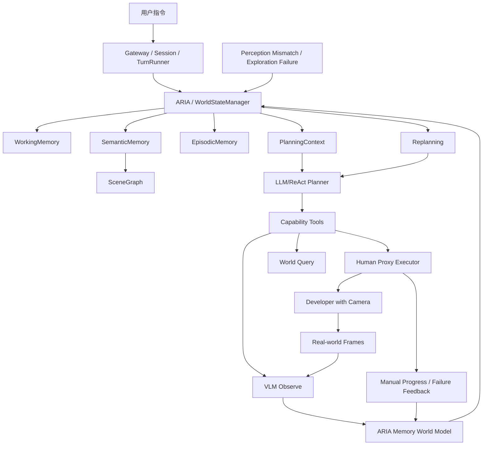

# MOSAIC 具身智能 Demo 大脑建设 CTO 审查稿

- title: MOSAIC 具身智能 Demo 大脑建设 CTO 审查稿
- status: active
- owner: repository-maintainers
- updated: 2026-04-15
- tags: docs, dev, architecture, review, cto, aria, demo

## 1. 审查目的

本文不是工程执行清单，而是面向 CTO 的阶段决策材料。目标是回答：

1. 当前 MOSAIC 是否具备继续向“具身智能决策编排大脑”推进的基础。
2. 下一阶段应优先建设什么，才能在基础设施不完备的情况下做出成熟 demo。
3. 该阶段的投入边界、技术路线、交付标准和主要风险是什么。

对应的工程执行版计划见：

- `docs/superpowers/plans/2026-04-08-embodied-demo-orchestration-brain.md`

## 2. 审查结论摘要

建议立项推进，但路线需要进一步修正为 **`ARIA-centered, human-surrogate-robot, VLM-in-the-loop, atomic-orchestration, replanning-first, demo-driven`**。

原因很明确：

- 当前系统已经具备 ARIA 骨架、SceneGraph、TurnRunner、能力插件和 ReAct 执行回路，说明“大脑框架”已存在。
- 当前真正缺失的不是更多底层连接，而是“把这些已有能力组织成一个可稳定演示、可解释、可重规划的统一智能体”。
- 当前 demo 方案若没有真实信息获取链路，只能证明函数调用编排，不能证明具身智能决策可行性，因此必须引入 VLM 参与任务判断和状态确认。
- 当前如果继续停留在纯 mock 世界中，也无法真正验证 ARIA 的真实世界记忆能力；需要让真实世界图像流和真实探索路径进入系统，只是不依赖真实机器人底盘。
- 如果先走基础设施优先路线，项目会迅速滑向集成泥潭，难以在可控时间内形成可展示成果。
- 如果先完成成熟 demo，则可更早验证架构方向、用户价值和后续基础设施投入是否值得继续。

因此，建议下一阶段的核心目标定义为：

> 在不依赖真实机器人本体的前提下，采用“开发者人工携带摄像头充当机器人”的方式，让 MOSAIC 在真实世界中完成探索、观察、记忆写入、记忆召回、失败反馈和重规划，从而验证 ARIA 的真实世界记忆能力与任务编排能力。

## 3. 当前系统判断

### 3.1 当前真正成熟的部分

当前仓库里最成熟的不是“完整三层记忆”，而是以下这条链路：

- `SceneGraphManager` 已进入主流程
- `TurnRunner` 已支持场景上下文注入
- `PlanVerifier` 已支持执行前验证
- 执行结果已可回写场景图
- `SpatialProvider` 已支持语义位置解析
- `navigation / manipulation / appliance / motion` 已具备 mock 形态

这意味着系统已经具备“任务理解 -> 工具选择 -> 执行 -> 世界更新”的最小大脑回路。

### 3.2 当前不足

当前系统距离“成熟 demo 大脑”还差四个关键能力：

- ARIA 还不是 `TurnRunner` 的统一上下文源，主流程仍偏 `SceneGraphManager` 直连。
- 缺少“真人代机”执行层，系统无法在没有真实机器人时把高层编排转换为真实世界探索过程。
- 缺少 VLM 在环的信息获取链路，系统无法基于真实观察确认物体、房间或任务状态。
- 任务编排粒度没有被显式定义，当前更像粗粒度工具串联，而不是面向未来原子能力的统一编排框架。
- mock 能力是“孤立 stub”，不是“共享世界中的协同行为者”。
- 执行失败尚未形成稳定的反馈闭环和经验沉淀。
- 缺少面向演示的脚本化入口、可视化轨迹和标准场景包。

### 3.3 当前不应优先解决的问题

以下事项重要，但不应作为下一阶段的主阻塞项：

- 真 Nav2 打通
- 实时 SLAM 建图
- 多相机、连续流式、在线 VLM 感知全链路
- 真实机械臂或移动底盘执行
- 向量检索版 EmbodiedRAG
- 多进程分布式 agent 协同

这些事项都应保留接口和空位，但不作为 demo 成败前提。

需要特别说明的是：

- **VLM 参与本身不再是可选项**
- **真实世界探索本身不再停留在纯 mock 中**
- **当前阶段的“机器人”由开发者人工携带摄像头来代理**
- **完整实时 VLM 基础设施仍不是当前阶段阻塞项**

也就是说，本阶段应采用“真人代机 + VLM 在环 + 基础设施降配”的方式推进。

## 4. 建议的阶段目标

### 4.1 目标定义

下一阶段不是“补基础设施”，而是“收敛成一个能让外部看到大脑能力的 demo 产品”。

建议交付目标如下：

- 单进程运行，无 ROS2 硬依赖
- MOSAIC 可以输出对“代理机器人”的探索与观察指令
- 开发者可以按系统指令手持摄像头在真实环境中移动，模拟机器人探索过程
- VLM 至少参与 1 条关键任务链路中的“观察/确认/发现”步骤
- ARIA 成为规划上下文的主入口
- 任务编排以细粒度原子动作展开，而不是粗粒度宏工具
- 能完成至少 3 个标准“探索-记忆-召回-重规划”任务
- 至少 1 个任务展示运行中失败后重规划恢复
- 至少 1 个任务展示基于感知反馈的任务调整或重规划
- 能输出清晰的决策轨迹和世界状态变化
- 对未来真实能力和感知链路保留标准接口

### 4.2 标准演示任务

建议把 demo 聚焦到以下三条高可解释、高稳定性的任务：

1. `guided_exploration_memory_build`
说明：MOSAIC 指挥开发者手持摄像头依次探索多个房间，VLM 对真实画面进行识别，ARIA 写入房间、物体和关系记忆，形成可查询场景记忆。

2. `object_revisit_by_memory`
说明：开发者先按系统指令探索环境并完成记忆构建，随后用户询问“某物体在哪”或要求“带我找到某物体”，系统基于 ARIA 的已有记忆指挥开发者再次前往目标位置并完成验证。

3. `perception_failure_replan`
说明：在探索或回访过程中，VLM 观察结果与预期记忆不一致，或开发者反馈“该路径不可达/该目标不在此处”，系统识别失败、更新上下文、重新规划替代探索路径或候选位置并完成任务。

这三条任务覆盖了：

- 真人代机探索
- VLM 驱动的信息获取
- ARIA 记忆写入
- ARIA 记忆召回
- 多步编排
- 细粒度动作拆解
- 空间 grounding
- 失败反馈
- 重规划
- 最终交付

### 4.3 编排粒度原则

下一阶段必须明确采用“面向未来基础能力原子化”的编排方式。建议原子动作集合至少包括：

- `request_human_move`
- `capture_frame`
- `observe_scene`
- `confirm_object`
- `locate_target`
- `navigate_to`
- `rotate`
- `report_checkpoint`
- `update_memory`
- `recall_memory`
- `verify_goal`

原则如下：

- LLM 看到和选择的是可解释的原子动作，而不是高层黑盒宏动作。
- 所有 demo 任务都必须能展开成可观察、可验证、可失败、可重规划的原子步骤序列。
- 当前阶段原子动作由“开发者人工代理机器人”执行，后续接入真实 Nav2、机械臂、VLM、IoT 设备时，只替换原子能力实现，不重写编排逻辑。

## 5. 建议技术路线

### 5.1 推荐路线

推荐采用五层推进：

1. **原子动作契约先行**
先定义大脑面向什么粒度的能力进行编排，避免 demo 阶段继续沿粗粒度宏能力扩张。

2. **真人代机执行层**
引入“开发者手持摄像头充当机器人”的代理执行层，使系统在没有真实机器人时仍可验证真实世界探索和记忆流程。

3. **VLM 在环的信息获取**
引入 VLM 观察/确认能力，使系统在关键节点基于真实观察而不是静态先验推进任务。

4. **ARIA 统一上下文化**
把 `WorldStateManager` 变成 `TurnRunner` 的主上下文入口，让观察结果、执行反馈和历史经验都回到 ARIA。

5. **以重规划为核心的 demo 产品化**
把失败反馈 -> 上下文刷新 -> 重新决策做成主卖点，再补齐 scripted scenario、demo runner、operator runbook 和观测输出。

### 5.2 不推荐路线

不建议采用“基础设施优先”的路线：

- 先打通传感器
- 再打通 Nav2
- 再打通 SLAM
- 再补全在线 VLM 感知基础设施
- 最后再做 demo

这条路线的问题是：

- 依赖链太长
- 外部变量太多
- 演示失败很难判断是“大脑问题”还是“基础设施问题”
- 研发成果难以阶段性复用

## 6. 目标阶段架构

这个阶段架构的本质不是“模拟硬件”，而是“用真人代机的方式，让系统在真实世界中完成可推理、可更新、可失败、可恢复的具身记忆与编排验证”。

## 7. 分阶段交付建议

### Phase A：原子编排契约

目标：

- 定义面向未来基础能力的原子动作集合
- 明确计划步骤结构、失败语义和可观测输出格式
- 让 demo 编排粒度与未来真实能力接入保持一致

交付价值：

- 防止 demo 架构与未来产品架构分叉

### Phase B：真人代机执行层

目标：

- 定义系统如何向开发者下达探索与观察指令
- 定义开发者如何回传位置、探索进度、失败反馈和图像帧
- 让“无真实机器人”的情况下也能形成真实世界探索闭环

交付价值：

- 让 ARIA 记忆能力在真实世界里可验证，而不是停留在 mock 世界

### Phase C：VLM 在环

目标：

- 引入至少一个 VLM 观察/确认能力
- 让系统能基于观察结果确认房间、目标物体或目标状态
- 允许“感知结果与预期不一致”成为重规划触发源

交付价值：

- 证明系统不是静态世界知识回放，而是具备真实信息获取能力

### Phase D：大脑收口

目标：

- `TurnRunner` 正式使用 ARIA 组装规划上下文
- prompt 中出现机器人状态、场景上下文、相似经验
- 保持与现有 `SceneGraphManager` 兼容降级

交付价值：

- ARIA 从“概念中枢”变成“运行中枢”

### Phase E：共享记忆世界模型

目标：

- 真实观察结果、人工反馈和场景记忆进入同一 ARIA 世界模型
- 各类代理执行结果必须受到共享记忆状态约束
- 增加可控失败注入器，用于演示重规划

交付价值：

- 系统开始表现出真实世界记忆与编排能力，而不是简单工具调用

### Phase F：ARIA 可查询化

目标：

- 增加 world query 能力
- 允许 LLM 主动查询“物品在哪”“我现在在哪”“目标是否已满足”

交付价值：

- 提升“看起来像大脑”的程度
- 让系统具备更强解释性和弹性

### Phase G：反馈闭环与重规划主卖点

目标：

- 执行失败带结构化反馈回流 prompt
- 感知失败带结构化反馈回流 prompt
- turn 结束写入 episodic memory
- 相似任务可被后续召回
- 将“失败后恢复完成任务”作为主演示链路，而不是边缘异常处理

交付价值：

- 系统开始具备“会吸取经验、会在失败后自我调整”的产品差异化特征

### Phase H：产品化演示面

目标：

- 提供标准真人代机场景脚本
- 提供 scenario 包
- 提供脚本化 demo runner
- 提供开发者探索与拍摄 runbook

交付价值：

- 从研发原型变成可稳定复现实验和演示的产品级 demo

## 8. 资源与周期判断

在不引入额外基础设施复杂度的前提下，这一阶段工作量仍然可控，主要集中在现有 Python 核心内，但相较原方案会新增一块 VLM-in-the-loop 能力建设。

建议资源假设：

- 1 名主程负责 runtime / gateway / ARIA 主链路
- 1 名工程支持负责 human-proxy loop、demo config、runbook 与测试

如果由单人推进，也可以完成，但节奏上应优先保证：

1. ARIA 上下文接管
2. 原子动作契约
3. 真人代机执行层
4. VLM 观察能力
5. 共享记忆世界模型
6. 演示脚本与标准场景

后续功能如 episodic 闭环和 world query 可以紧跟其后。

## 9. 风险与缓解

### 风险 1：Demo 看起来仍像“函数调用套壳”

原因：

- 如果能力仍然是无条件成功的 stub，系统无法表现真实决策感。

缓解：

- 所有 mock capability 必须受 SceneGraph/ARIA 约束
- 至少引入 1 个结构化失败和 1 次自动恢复
- 至少引入 1 个 VLM 观察步骤，证明系统确实获取了外部信息

### 风险 2：真人代机流程不规范，导致数据和记忆污染

原因：

- 若开发者探索路径、拍摄角度和反馈格式不一致，会导致 ARIA 记忆不可复现

缓解：

- 明确 human-proxy operator protocol
- 统一 checkpoint、图像命名、反馈模板和探索脚本
- 演示场景必须按固定 runbook 执行

### 风险 3：VLM 参与流于形式

原因：

- 如果 VLM 只在日志中出现、却不影响决策，仍无法证明可行性

缓解：

- 至少 1 条任务必须以 VLM 观察结果作为后续动作前提
- 至少 1 条任务必须因 VLM 反馈触发任务调整或重规划

### 风险 4：工程边界再次失控，滑回基础设施优先

原因：

- 团队可能自然倾向去补 ROS2、SLAM、VLM 真集成

缓解：

- 明确阶段 Go/No-Go 标准只考核 demo 能力，不考核真基础设施
- 所有真实集成仅保留空位，不做阶段阻塞

### 风险 5：ARIA 概念过大，阶段成果不聚焦

原因：

- 试图一次完成三层记忆、向量检索、感知融合、执行闭环

缓解：

- 本阶段只把 ARIA 收敛成“足够驱动 demo 的上下文中枢”
- 向量检索与实时感知统一列为后续增强项

### 风险 6：演示结果不可重复

原因：

- 若失败和环境变化不可控，演示稳定性不足

缓解：

- 引入 deterministic scenario pack 与 directed failure 机制
- 所有演示任务必须可脚本重复运行

## 10. Go / No-Go 决策建议

建议 **Go**，条件如下：

- 接受本阶段目标是“成熟 demo 大脑”，不是“完整真实机器人系统”
- 接受当前阶段通过“开发者人工携带摄像头”来代理机器人执行
- 接受采用基础设施 `mock-first` 路线
- 接受 **VLM 必须在环参与信息获取**
- 接受任务编排必须按未来原子能力方向定义
- 接受将真实 ROS2 / SLAM / VLM 全链路作为后续接入层，而非当前验收前提

如果上述三点不能接受，则应 **No-Go**，因为一旦将阶段目标改成“先补齐所有真实基础设施”，当前项目将显著增加周期风险和失败概率。

## 11. CTO 审查关注点

审查时建议重点看以下五项：

1. 本阶段目标是否足够聚焦，避免过度承诺
2. 真人代机执行层是否足以代表“机器人探索”进行有效验证
3. VLM 是否真正参与了任务判断，而不是装饰性存在
4. 任务编排粒度是否已经收敛到未来原子能力方向
5. `mock-first` 路线是否符合当前资源和时间约束
6. ARIA 是否真正成为“中枢”，而不是概念包装
7. 重规划能力是否足以成为产品化差异点
8. 当前阶段交付是否能自然承接后续真实基础设施接入

## 12. 建议审查结论模板

可直接采用以下审查结论：

> 同意进入下一阶段开发，目标限定为“ARIA 驱动、真人代机、VLM 在环、支持细粒度原子编排和失败后重规划的具身智能记忆与编排 demo”。本阶段不以真实机器人本体或 ROS2 / SLAM / VLM 全链路为完成标准，而是通过开发者人工携带摄像头模拟机器人探索过程，优先验证 ARIA 在真实世界中的记忆能力、编排能力和失败后恢复能力。真实基础设施集成作为后续阶段接口化接入。

## 13. 已落地事项

截至 2026-04-15，本审查稿对应的第一阶段实现已经落地，主要包括：

- 人机代理执行层：
  - `HumanProxyCapability`
  - `OperatorConsoleServer / OperatorConsoleState`
- VLM 在环观察：
  - `VLMObserveCapability`
  - 真实 Minimax VLM 接口包装
- 语义记忆基础设施：
  - 原子动作 schema
  - human surrogate 数据模型
  - 拓扑语义 mapper
  - ARIA KV 写入辅助方法
- 主链路接线：
  - `TurnRunner` 使用 ARIA 上下文
  - `GatewayServer` 管理 human_proxy 生命周期
  - demo runner 自动启用 `human_proxy`
- 演示资产：
  - 第一阶段 demo 配置
  - 运行脚本
  - 操作员 runbook
  - focused test suite

从管理视角看，这意味着第一阶段“是否能做出具备真实世界记忆能力的可运行 demo”这个问题，已经得到了正向验证。

## 14. 下一阶段建议

在当前实现已经落地的基础上，下一阶段建议聚焦于真正体现产品差异化的部分，而不是继续横向铺更多基础设施：

1. **把“回访验证”提升为“失败后恢复完成任务”**
当前已经具备最小纠偏和记忆驱动回访，下一阶段应把它升级为更明确的重规划能力，包括：
  - perception mismatch 后切换候选 checkpoint
  - 失败后重新探索局部区域
  - 失败记录进入 EpisodicMemory 并影响后续决策

2. **让记忆从“能回访”升级到“能解释”**
当前已经有 ARIA context 与 evidence summary，下一阶段应增强：
  - 为什么系统认为目标在某房间
  - 哪些 checkpoint / landmark 支撑这个判断
  - 当前为什么发生回访切换或重规划

3. **把 operator workflow 进一步产品化**
当前 runbook 和 console 已够用，下一阶段可进一步优化：
  - step queue / 单步确认流程
  - 更清晰的 operator 状态显示
  - 对上传路径和图片质量的前置校验

4. **在不破坏第一阶段闭环的前提下，为真实机器人接入留接口**
应继续坚持当前原则：
  - 不推倒 human-surrogate 路线
  - 让真实机器人底盘成为 `HumanProxyCapability` 的替换实现，而不是重写整套编排逻辑
