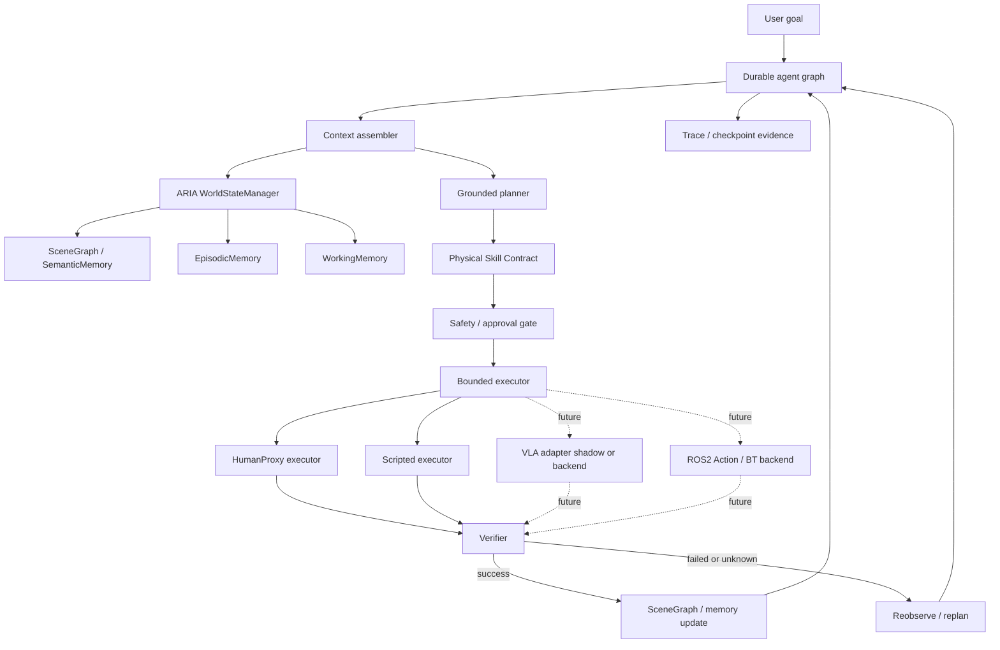

# MOSAIC v3 Research Demo Architecture Spec

- title: MOSAIC v3 Research Demo Architecture Spec
- status: proposed
- owner: repository-maintainers
- updated: 2026-05-03
- tags: docs, dev, architecture, mosaic-v3, embodied-agent, runtime, scene-graph, skill-contract, demo

## 1. Purpose

This spec defines the scoped MOSAIC v3 architecture for a thesis-defensible and demo-verifiable embodied agent system.

The goal is not to build a general-purpose robot foundation model, train a VLA, or ship a production robot runtime. The goal is to prove a narrower systems claim:

**A software-level agent can be upgraded from tool use to embodied skill use when its actions are grounded by a world model, constrained by physical skill contracts, executed through bounded executors, and verified through scene updates and replanning.**

MOSAIC v3 should therefore prioritize:

- thesis clarity
- a runnable baseline demo
- low engineering risk
- explicit capability boundaries
- compatibility with future VLA and ROS2 execution backends

## 2. Core Thesis Claim

MOSAIC v3 makes the following claim:

> A reliability-oriented embodied agent architecture can transform software-level tool calls into verifiable embodied skill execution through world-state grounding, physical skill contracts, verification-driven replanning, and a mature durable agent runtime.

This claim is intentionally smaller than general embodied intelligence. It is still meaningful because it addresses the central gap between current software agents and physical agents:

- software tools are usually stateless, instantaneous, and schema-bound;
- physical skills are stateful, long-running, uncertain, interruptible, and safety-sensitive.

MOSAIC v3 treats this gap as a systems architecture problem rather than a model-training problem.

## 3. Design Decision

MOSAIC v3 keeps MOSAIC's embodied research kernel and replaces self-authored orchestration assumptions with a mature runtime boundary.

```text
Keep in MOSAIC:
  ARIA / WorldStateManager
  SceneGraph / semantic memory
  physical skill contracts
  verifier and replanning semantics
  human-surrogate and scripted embodied demo path

Use mature runtime patterns for:
  checkpoint
  interrupt / human approval
  resume
  trace
  failure state
  graph-level execution

Keep out of P0:
  VLA training
  real robot manipulation
  full ROS2 Action integration
  MoveIt / Nav2 / BehaviorTree deep integration
  distributed platform / Bundle runtime
  production safety certification
```

LangGraph is the preferred runtime reference because its persistence layer saves graph state as checkpoints and supports human-in-the-loop, time travel, fault-tolerant recovery, and pending writes. This maps directly to long-running embodied task execution, where restarting from scratch can repeat side effects.

References:

- [LangGraph persistence](https://docs.langchain.com/oss/python/langgraph/persistence)
- [LangGraph human-in-the-loop](https://docs.langchain.com/oss/python/langgraph/human-in-the-loop)

## 4. Capability Boundary

### 4.1 In Scope for v3 P0

P0 must prove the smallest closed loop:

1. A user gives an embodied task.
2. MOSAIC extracts task-relevant world context from ARIA / SceneGraph.
3. The planner proposes a physical skill rather than a raw tool call.
4. The skill contract checks preconditions and expected effects.
5. A human-surrogate or scripted executor performs the bounded action.
6. A verifier checks whether the expected scene delta happened.
7. The system updates memory on success or replans on failure.
8. The run emits trace/checkpoint-style evidence for the thesis and demo.

### 4.2 Out of Scope for v3 P0

The following are explicitly excluded:

- training or fine-tuning OpenVLA, SmolVLA, pi0, pi0.5, GR00T, or similar VLA models
- controlling a real manipulator as the required success path
- building a production ROS2 Action / BehaviorTree / MoveIt stack
- large-scale physical benchmark collection
- multi-robot coordination
- distributed runtime or EAGOS-style Bundle loading
- production-grade physical safety certification
- claiming open-world household robot generality

### 4.3 VLA Boundary

Open-source VLA systems are treated as future `SkillExecutor` backends, not as the P0 mission controller.

This is a deliberate engineering boundary. Current open-source VLA projects are valuable but still require task, embodiment, hardware, data, and evaluation alignment:

- OpenVLA is an open-source 7B VLA for robot manipulation and supports fine-tuning, but practical adaptation may require LoRA/OFT, robot-specific data, and substantial GPU resources.
- SmolVLA is lighter and more accessible, but its documentation still recommends task data collection and fine-tuning for a target setup.
- openpi provides pi0, pi0-FAST, and pi0.5 models, but its repository explicitly warns that adaptation to arbitrary platforms may or may not work.

References:

- [OpenVLA project](https://openvla.github.io/)
- [OpenVLA repository](https://github.com/openvla/openvla)
- [SmolVLA documentation](https://huggingface.co/docs/lerobot/v0.4.3/en/smolvla)
- [openpi repository](https://github.com/Physical-Intelligence/openpi)

Therefore, P0 may include a VLA-shaped adapter interface or shadow-mode policy output, but P0 must not depend on live VLA inference for demo success.

## 5. Architecture



The key architectural move is the insertion of `Physical Skill Contract` between planning and execution.

Software agent tool call:

```text
tool(name, args) -> result
```

MOSAIC v3 physical skill call:

```text
skill(name, args)
  -> validate preconditions against world state
  -> request approval when needed
  -> execute with a bounded executor
  -> verify expected effects against observation / scene delta
  -> update memory or replan
```

## 6. Core Components

### 6.1 Durable Agent Graph

The graph is the outer execution controller. P0 can implement a lightweight compatibility layer first, but the architecture must be shaped so it can migrate to LangGraph without changing the embodied domain model.

Required graph nodes:

- `assemble_context`
- `propose_skill`
- `validate_skill_contract`
- `execute_skill`
- `verify_effects`
- `update_world`
- `replan_or_finish`

Required graph evidence:

- run id
- task id
- selected skill
- contract validation result
- executor result
- verifier result
- world-state delta
- final status

### 6.2 ARIA / World Model

ARIA remains the system's world-state and memory center. For v3 P0, ARIA should be used as the planning entrypoint, not just as a side memory provider.

Required context:

- current task
- relevant SceneGraph subgraph
- robot or human-surrogate state when available
- related episode snippets when available
- previous failed attempts in this run

### 6.3 Physical Skill Contract

Every embodied skill must expose a contract:

```text
SkillContract:
  name
  description
  input_schema
  preconditions
  expected_effects
  risk_level
  approval_policy
  timeout_policy
  executor_type
  verifier
```

P0 requires only a small contract set:

- `move_to_checkpoint`
- `observe_surroundings`
- `inspect_object`
- `move_object_surrogate`
- `reobserve_scene`

These can be implemented through HumanProxy or scripted executors.

### 6.4 Bounded Executors

P0 executor types:

- `human_proxy`: operator follows instructions and returns observation artifacts.
- `scripted`: deterministic demo executor mutates a known scene fixture.
- `shadow_vla`: optional non-executing adapter that records what a VLA backend would be asked to do.

Future executor types:

- `ros2_action`
- `behavior_tree`
- `moveit`
- `nav2`
- `openvla`
- `smolvla`
- `openpi`

### 6.5 Verifier

The verifier is the core of the embodied loop. Tool results are not accepted as truth until checked against expected effects.

Verifier outputs:

```text
success
partial_success
failed
unknown
```

Only `success` can commit the expected world-state update. `partial_success`, `failed`, and `unknown` must route to reobserve, replan, operator approval, or safe stop.

## 7. P0 Demo Scenario

The P0 demo should be a low-risk human-surrogate or scripted household scene.

Example task:

> Move the red cup next to the plate and confirm that the table is organized.

Expected demo flow:

1. The system reads the initial SceneGraph fixture or observation result.
2. The user task is converted into a grounded skill proposal.
3. The contract checks that the red cup and plate exist.
4. The executor performs `move_object_surrogate(red_cup, beside_plate)`.
5. The verifier checks the updated scene relation.
6. If the relation is correct, ARIA records the episode.
7. If the relation is missing or contradictory, the system requests re-observation and replans.

The demo can include failure injection:

- missing object
- object moved to the wrong target
- executor returns success but verifier detects no scene delta
- observation is incomplete

The demo succeeds only if the system can demonstrate both success and recovery paths.

## 8. Acceptance Criteria

P0 is complete when the repository can demonstrate:

- A v3 graph run with a stable run id and trace output.
- A user task grounded against a SceneGraph or observation-derived world state.
- At least one physical skill contract passing validation.
- At least one contract being rejected due to missing preconditions.
- At least one successful executor + verifier + memory update path.
- At least one injected failure that routes to reobserve or replan.
- A runbook describing how to reproduce the demo.
- A short thesis-facing explanation of why this validates software-to-embodied skill transition.

## 9. Implementation Phases

### Phase 1: Spec and Demo Contract

- Add this v3 architecture spec.
- Define the P0 demo claim and non-goals.
- Define minimal `SkillContract` data shape.

### Phase 2: Runtime Skeleton

- Add a v3 demo graph around the current MOSAIC runtime.
- Keep the implementation lightweight.
- Emit trace/checkpoint-style records even if the first version uses local JSON instead of a full durable runtime.

### Phase 3: Skill Contract and Verifier

- Implement P0 skills with HumanProxy or scripted execution.
- Add expected-effect verification.
- Add failure injection fixtures.

### Phase 4: Demo Runbook and Thesis Evidence

- Add a runbook for the v3 demo.
- Add expected output examples.
- Add a concise thesis-facing note.

### Phase 5: Optional VLA Adapter Interface

- Add an interface-only or shadow-mode VLA adapter.
- Do not require VLA installation, GPU setup, model download, or robot hardware for P0.

## 10. Risk Controls

| Risk | Control |
|---|---|
| Spec becomes too broad | Keep VLA, real robot, and distributed runtime out of P0. |
| Demo depends on unstable model behavior | Use scripted or human-surrogate execution as the success path. |
| System looks like ordinary tool calling | Require preconditions, expected effects, verifier, and replan path. |
| Runtime migration becomes large | Shape the graph nodes around LangGraph semantics but allow a lightweight local runner first. |
| Thesis claim overreaches | State that v3 proves architecture-level feasibility, not open-world robot generality. |

## 11. Final Scope Statement

MOSAIC v3 is not a universal robot agent.

MOSAIC v3 is a minimal, thesis-defensible embodied-agent architecture demo that proves:

```text
software tool use
  + world-state grounding
  + physical skill contracts
  + bounded execution
  + verification-driven replanning
  + durable runtime semantics
= verifiable embodied skill use
```

This is the narrowest version of MOSAIC v3 that can both stand in a thesis and be validated through a basic demo without requiring heavy VLA training, real robot integration, or production-grade robotics infrastructure.
