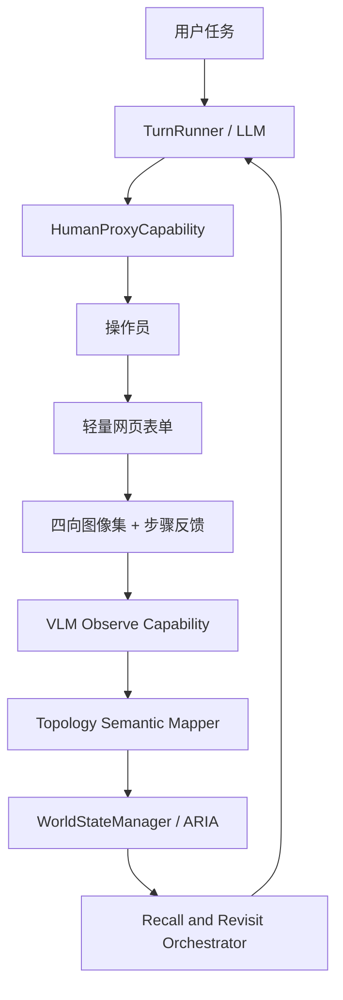

# 真人代机 ARIA 记忆验证设计

- title: 真人代机 ARIA 记忆验证设计
- status: active
- owner: repository-maintainers
- updated: 2026-04-12
- tags: docs, spec, aria, vlm, human-proxy, embodied-demo, memory, zh

## 1. 背景

MOSAIC 当前已经具备具身智能运行时的基础骨架，包括 `TurnRunner`、`SceneGraphManager`、`WorldStateManager / ARIA`、插件化能力层，以及 `SceneAnalyzer` 等 VLM 相关基础模块。但它仍然缺少一种可信的方法，在不等待完整机器人平台接入的情况下，验证 ARIA 在真实世界中的记忆与编排能力。

本阶段 CTO 已明确要求：

- 不等待真实移动机器人本体接入
- 不把 demo 降级为纯 mock 世界
- 必须使用真实世界视觉输入
- 记忆构建和编排逻辑必须由 MOSAIC 主导
- 允许开发者手持摄像头，临时充当“机器人身体”

因此，本设计定义了一个聚焦的首个子项目：在真实世界中验证 ARIA 的语义记忆构建、记忆召回和记忆驱动回访能力，并为后续完整重规划和真实机器人接入打基础。

## 2. 目标

构建一个第一阶段具身智能 demo，使其具备以下能力：

- 用户以自然语言向 MOSAIC 下达任务
- MOSAIC 指挥真人代机操作员在环境中移动
- 每完成一步移动后，操作员回传 `完成/失败` 和四向环视图
- MOSAIC 调用真实 Minimax VLM API 对图像进行理解
- MOSAIC 基于真实观察结果在 ARIA 中构建“拓扑优先”的语义记忆
- MOSAIC 在后续任务中召回这份记忆，并引导操作员回到先前观察到的目标位置进行验证

本阶段需要证明的核心产品命题是：

> 在没有真实机器人本体的情况下，ARIA 依然能够基于真实世界探索构建可用记忆，并在后续任务中驱动基于记忆的回访行为。

## 3. 范围

### 3.1 范围内

- 2-3 个房间的小型家居环境
- 1 名手持摄像头的真人代机操作员
- 轻量本地网页表单交互
- 真实 Minimax VLM 推理
- 以 checkpoint 为锚点的拓扑语义地图
- 基于真实探索数据的 ARIA 记忆构建
- 基于记忆的目标回访与验证
- 回访过程中的最小纠偏能力

### 3.2 范围外

- 真实机器人底盘或机械臂接入
- 把 Nav2 作为阶段阻塞项
- 把 SLAM 作为阶段阻塞项
- 稠密或高精度度量地图
- 连续视频流实时处理
- 完整重规划引擎作为本子项目验收门槛
- 向量检索作为主要记忆实现方式

## 4. 成功标准

满足以下全部条件，则该子项目视为成功：

- MOSAIC 能以单进程运行，不依赖真实机器人本体。
- MOSAIC 能向真人代机操作员下达逐步 egocentric 移动指令。
- 操作员每一步只需要做两件事：
  - 点选 `完成` 或 `失败`
  - 上传四向图片：`front`、`left`、`right`、`back`
- MOSAIC 使用真实 Minimax VLM API 解释这些图像。
- ARIA 的记忆来自真实观察结果，而不是纯 fixture 或纯 mock 世界。
- 在探索完成后，MOSAIC 能响应基于记忆的任务，例如：
  - “带我回到之前看到黄色毛巾的地方”
  - “带我去之前看到咖啡机的房间”
- 至少有一个回访任务能成功依赖 ARIA 记忆重新找到先前观察到的目标。
- 至少有一次回访在出现小幅不确定性或偏差后，通过最小纠偏完成验证。

## 5. 角色与职责边界

### 5.1 用户

用户只负责下达高层自然语言任务，例如：

- “探索这个房子，并记住东西在哪里。”
- “带我回到之前看到黄色毛巾的地方。”

用户不负责探索执行细节。

### 5.2 MOSAIC

MOSAIC 负责：

- 将高层任务分解成原子动作
- 向操作员下达移动指令
- 请求观察采集
- 调用 Minimax VLM
- 更新 ARIA 记忆
- 判断是否已经探索充分
- 在回访任务中召回记忆
- 生成下一步移动指令
- 检测不一致并执行最小纠偏

MOSAIC 必须独占：

- 记忆构建
- 语义解释
- 拓扑地图构建
- 目标回访推理

### 5.3 真人代机操作员

操作员是临时“机器人身体”的代理。

操作员只负责：

- 按 MOSAIC 指令移动
- 反馈 `完成` 或 `失败`
- 在 checkpoint 上传四向图片

操作员不应被要求：

- 手工标注物体
- 手工标注房间
- 以结构化方式描述 landmark
- 自行决定下一步去哪里
- 主动构建或维护地图

允许存在可选备注框，但该备注不能成为主要语义数据源。

## 6. 运行模式

本设计只定义两个明确模式。

### 6.1 探索模式（Explore Mode）

目的：

- 收集真实视觉证据
- 创建 checkpoint 节点
- 推断房间语义、landmark 和目标物
- 写入 ARIA 记忆

输入：

- 用户探索任务
- 操作员的完成/失败反馈
- 四向图片集

输出：

- checkpoint 拓扑图
- 结构化语义观察结果
- 目标记忆索引
- 满足条件后进入 `memory_ready_for_revisit`

### 6.2 回访模式（Revisit Mode）

目的：

- 召回先前观察过的目标
- 基于 ARIA 记忆引导操作员回到候选 checkpoint
- 基于新观察结果完成目标验证

输入：

- 回访任务
- 已有 ARIA 记忆
- 新的操作员反馈和图像集

输出：

- 成功验证目标
- 或明确说明现有记忆不足以确认目标

## 7. 系统架构

第一阶段架构如下：

### 7.1 HumanProxyCapability

职责：

- 向操作员展示移动指令
- 等待 `完成/失败`
- 接收图像集
- 将结果包装成结构化执行结果

它是本阶段的“临时机器人身体适配层”。

### 7.2 VLMObserveCapability

职责：

- 把图像集提交给真实 Minimax VLM API
- 返回结构化语义观察结果
- 保留证据摘要用于后续记忆解释和回访说明

它只产出语义证据，不负责地图结构构建。

### 7.3 TopologySemanticMapper

职责：

- 创建 checkpoint 节点
- 将观察结果挂接到 checkpoint
- 推断 room 级和 landmark 级结构
- 维护已访问 checkpoint 之间的邻接关系

该 mapper 是拓扑优先，而不是坐标优先。

### 7.4 ARIAMemoryAdapter

职责：

- 把当前步骤状态写入 `WorkingMemory`
- 把 checkpoint 图和语义观察结果写入 `SemanticMemory`
- 把探索和回访过程写入 `EpisodicMemory`

### 7.5 RecallAndRevisitOrchestrator

职责：

- 将目标解析为 room 级和 checkpoint 级候选
- 在 checkpoint 图上生成回访路径
- 当当前观察结果与记忆冲突时执行最小纠偏

## 8. 数据模型

本设计采用 6 个最小数据对象。

### 8.1 ObservationFrameSet

表示一个 checkpoint 的原始视觉证据。

建议字段：

- `checkpoint_id`
- `step_id`
- `issued_motion`
- `operator_result`
- `images.front`
- `images.left`
- `images.right`
- `images.back`
- `timestamp`

### 8.2 SemanticObservation

表示 VLM 对一个 checkpoint 的语义理解结果。

建议字段：

- `checkpoint_id`
- `predicted_room`
- `room_confidence`
- `landmarks`
- `objects`
- `relations`
- `evidence_summary`

第一版只保留真正对回访有用的关系：

- `in_room`
- `near_landmark`
- `on_top_of`
- `next_to`

### 8.3 CheckpointNode

表示拓扑语义地图中的一个观察锚点。

建议字段：

- `checkpoint_id`
- `parent_checkpoint_id`
- `motion_from_parent`
- `depth_from_start`
- `semantic_observation_id`
- `resolved_room_label`
- `known_landmarks`
- `known_objects`

checkpoint 是主地图节点，room 只是附着在 checkpoint 上的语义标签，不是地图主身份。

### 8.4 MemoryTargetIndex

用于回访任务的轻量目标索引。

建议字段：

- `target_label`
- `candidate_room_labels`
- `candidate_checkpoint_ids`
- `supporting_landmarks`
- `last_seen_timestamp`
- `confidence`

### 8.5 ExplorationEpisode

存入 `EpisodicMemory` 的一次探索过程记录。

建议字段：

- `task_description`
- `visited_checkpoints`
- `stable_rooms`
- `observed_targets`
- `completion_reason`

### 8.6 RevisitEpisode

存入 `EpisodicMemory` 的一次回访过程记录。

建议字段：

- `task_description`
- `target_label`
- `selected_candidates`
- `verification_result`
- `corrections_applied`
- `failure_reason`

## 9. ARIA 记忆映射

### 9.1 WorkingMemory

存放短期运行状态：

- 当前步骤
- 当前 checkpoint
- 最近一次移动指令
- 最近一次操作员反馈
- 当前待验证目标

### 9.2 SemanticMemory

存放稳定结构化世界知识：

- checkpoint 图
- 语义观察结果
- room / landmark / object 的关联关系
- 目标索引

### 9.3 EpisodicMemory

存放过程性经验：

- 探索 session
- 回访 session
- 记忆冲突案例
- 验证成功或失败记录

第一阶段的回访主要依赖 `SemanticMemory`，`EpisodicMemory` 更多承担过程追踪和经验沉淀职责。

## 10. 原子动作契约

第一阶段最小原子动作集合为：

- `request_human_move`
- `capture_frame`
- `observe_scene`
- `confirm_object`
- `locate_target`
- `report_checkpoint`
- `update_memory`
- `recall_memory`
- `verify_goal`

规则如下：

- 规划器必须在原子动作级别思考，而不是直接输出黑盒宏动作。
- 对操作员可见的动作仅限移动与采集。
- 记忆更新与观察理解是 MOSAIC 内部动作，不交给操作员决策。
- 将来替换成真实机器人本体时，保留这套动作契约不变。

## 11. 移动指令模型

操作员接收的是 egocentric 自由距离/角度指令，而不是固定网格步长。

示例：

- “前进 1.3 米”
- “右转 70 度”
- “左移 0.5 米”

这样设计是为了让 MOSAIC 真正负责导航表达，而不是把操作员简化为格子世界脚本执行器。

操作员每步只返回：

- `completed`
- 或 `failed`
- 再加四向图像集

操作员不返回房间标签、物体标签等语义字段。

## 12. 轻量网页表单

第一版操作员控制台必须足够克制。

必要区域：

1. `Current Instruction`
显示当前移动或观察指令

2. `Step Status`
按钮：
- `Completed`
- `Failed`

3. `Image Upload`
四个固定上传位：
- Front
- Left
- Right
- Back

4. `System Context`
只读摘要：
- 当前模式：Explore / Revisit
- 当前 checkpoint id
- 当前目标
- 最近一次系统判断摘要

网页表单不要求操作员填写语义标签。

## 13. 探索结束条件

探索结束必须满足三层判据。

### 13.1 预算护栏

为了确保 demo 可控，需要设置硬上限：

- 最大 step 数
- 最大 checkpoint 数
- 最大探索时长

### 13.2 语义覆盖达标

当满足以下条件时，认为已经形成足够可用的探索记忆：

- 至少 2 个稳定 room 语义
- 每个稳定 room 至少 1 个稳定 landmark
- 至少 1 个任务相关目标被稳定索引

### 13.3 记忆稳定性达标

room、landmark、object 被认为稳定的条件是：

- 至少被两次一致观察支持
- 或一次高置信观察，且后续无冲突

满足后系统进入：

- `memory_ready_for_revisit`

## 14. 回访召回与路径生成

回访采用“两段式召回”。

### 14.1 语义粗召回

对目标先召回：

- 候选 room
- 支撑 landmark
- 候选 checkpoint

### 14.2 拓扑路径生成

从当前 checkpoint 出发，在已知 checkpoint 图上生成到候选点的路径，并将其翻译为 egocentric 指令序列。

回访时主依赖：

- room 语义
- supporting landmarks
- candidate checkpoints

不能只依赖“最后一次看到的位置回放”。

## 15. 回访阶段的最小纠偏

第一阶段不实现完整重规划，仅实现最小纠偏。

允许的恢复动作：

- `retry_same_step`
- `request_small_adjustment`
- `switch_candidate_checkpoint`
- `abort_to_reexplore`

示例：

- 如果 VLM 无法稳定判断房间，则请求小角度转动并重新采集
- 如果预期 landmark 不出现，则切换到同 room 下一个候选 checkpoint
- 如果所有候选点都失败，则回退到探索模式

## 16. 失败模型

第一阶段必须支持三类失败：

- `motion_failed`
- `perception_uncertain`
- `memory_mismatch`

每次失败都必须结构化记录，而不是只记一段文本。

建议字段：

- `failure_type`
- `failed_step_id`
- `current_checkpoint_id`
- `expected_room`
- `observed_room`
- `expected_target`
- `observed_targets`
- `recommended_recovery`

这样可以为后续完整重规划系统保留兼容接口。

## 17. 演示场景

第一子项目建议围绕以下三个场景构建：

### 17.1 guided_exploration_memory_build

MOSAIC 指挥操作员在小型家居环境中探索，采集真实图像并构建 ARIA 记忆。

### 17.2 object_revisit_by_memory

在探索结束后，MOSAIC 接到任务，例如“带我回到之前看到黄色毛巾的地方”，并基于 ARIA 记忆引导回访。

### 17.3 revisit_with_minor_correction

在回访过程中，第一次候选点不正确或观察不确定，MOSAIC 进行最小纠偏后仍完成目标确认。

## 18. 验收标准

只有满足以下全部条件，才算按本 spec 实现正确：

- 探索过程基于真实图像建立至少 2 个稳定房间记忆
- 至少 1 个目标物写入 `MemoryTargetIndex`
- 后续回访任务能从 ARIA 记忆中选出候选 checkpoint
- 操作员能在系统引导下返回目标区域
- 新一轮 VLM 观察能确认目标存在
- 至少 1 个场景包含一次小幅纠偏后成功完成

## 19. 演进路径

本设计是第一子项目，不是完整终局。

后续可演进方向：

- 加入完整失败后重规划
- 引入更强的伪位姿或粗坐标机制
- 引入更丰富的在线观察管线
- 用真实机器人底盘替换 `HumanProxyCapability`
- 在不改变 ARIA 记忆概念和原子动作契约的前提下接入真实机器人系统

## 20. 设计取舍总结

本设计明确选择了：

- 真实视觉证据，而非纯 mock 记忆验证
- 拓扑优先语义地图，而非伪高精度坐标地图
- 真人代机执行，而非等待真实机器人本体
- 原子动作编排，而非粗粒度宏任务
- 先做最小纠偏，再做完整重规划

这也是当前阶段最小但足够有说服力的方案，因为它能够证明：

> ARIA 可以作为 MOSAIC 的具身记忆核心，在真实世界中构建并使用记忆，驱动后续回访与验证行为。
