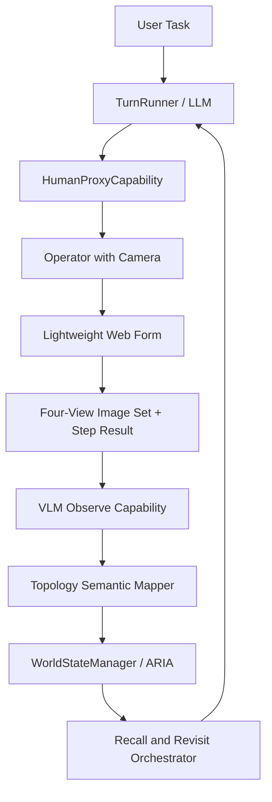

# Human-Surrogate ARIA Memory Validation Design

- title: Human-Surrogate ARIA Memory Validation Design
- status: active
- owner: repository-maintainers
- updated: 2026-04-12
- tags: docs, spec, aria, vlm, human-proxy, embodied-demo, memory

## 1. Background

MOSAIC currently has the skeleton of an embodied-agent runtime: `TurnRunner`, `SceneGraphManager`, `WorldStateManager / ARIA`, a plugin-based capability layer, and VLM-related building blocks such as `SceneAnalyzer`. What it does not yet have is a credible way to validate ARIA's memory and orchestration behavior in the real world without waiting for a fully integrated robot platform.

The CTO direction for this phase is explicit:

- do not wait for a real mobile robot body
- do not reduce the demo to a pure mock world
- use real-world visual input
- let MOSAIC own the memory-building and orchestration logic
- use a developer carrying a camera as a temporary robot surrogate

This design therefore defines a first focused sub-project whose purpose is to validate ARIA's real-world memory and recall capability before moving on to broader replanning and full robot integration.

## 2. Objective

Build a first-stage embodied demo in which:

- a user gives MOSAIC a natural-language task
- MOSAIC instructs a human proxy operator how to move in the environment
- after each instructed move, the operator returns `completed/failed` plus a four-view image set
- MOSAIC calls the real Minimax VLM API on those images
- MOSAIC builds a topology-first semantic memory in ARIA from those real observations
- MOSAIC later recalls that memory and guides the operator back to a previously observed target for verification

The core product claim this stage must prove is:

> ARIA can construct usable semantic memory from real-world exploration and later drive memory-based revisit behavior without depending on a real robot body.

## 3. Scope

### 3.1 In Scope

- Small home-like environment with 2-3 rooms
- One human proxy operator carrying a camera
- A lightweight local web form for operator interaction
- Real Minimax VLM inference for observation understanding
- Topology-first semantic mapping anchored on checkpoints
- ARIA memory construction from real exploration data
- Memory-driven revisit to a previously observed room/object target
- Minimal correction behavior during revisit

### 3.2 Out of Scope

- Real robot base or manipulator integration
- Nav2 as a release blocker
- SLAM as a release blocker
- Dense or metric-accurate mapping
- Continuous live video stream processing
- Full replanning engine as the acceptance gate for this first sub-project
- Vector-store retrieval as the main memory mechanism

## 4. Success Criteria

The sub-project is successful when all of the following are true:

- MOSAIC runs as a single process with no real robot dependency.
- MOSAIC can issue stepwise egocentric motion instructions to a human proxy operator.
- The operator only needs to do two things after each step:
  - mark `completed` or `failed`
  - upload four directional images: `front`, `left`, `right`, `back`
- MOSAIC uses the real Minimax VLM API to interpret those images.
- ARIA builds memory from real observations rather than synthetic fixture-only world state.
- After exploration, MOSAIC can answer a memory-based task such as:
  - "Take me back to the yellow towel we saw earlier"
  - "Guide me to the room where the coffee machine was observed"
- At least one revisit task successfully re-finds a previously observed target using ARIA memory.
- At least one revisit attempt encounters a minor mismatch or uncertainty and recovers through minimal correction.

## 5. Roles And Responsibility Boundaries

### 5.1 User

The user provides high-level tasks in natural language, such as:

- "Explore this apartment and remember where things are."
- "Take me back to the yellow towel you saw earlier."

The user is not responsible for exploration execution details.

### 5.2 MOSAIC

MOSAIC is responsible for:

- decomposing the task into atomic actions
- instructing the operator how to move
- requesting observation capture
- calling Minimax VLM
- updating ARIA memory
- deciding when exploration is sufficient
- recalling memory during revisit
- generating the next movement instructions
- detecting mismatch and applying minimal correction

MOSAIC owns all memory, semantic interpretation, map construction, and revisit reasoning.

### 5.3 Human Proxy Operator

The operator is a temporary surrogate robot body.

The operator is responsible only for:

- following MOSAIC movement instructions
- indicating `completed` or `failed`
- uploading four-view images at checkpoints

The operator must not be asked to:

- annotate objects
- label rooms
- describe landmarks as primary data input
- decide where to go next
- build or maintain the map

Operator text notes may exist as optional support, but are not part of the primary semantic pipeline.

## 6. Operating Model

This design uses two explicit runtime modes.

### 6.1 Explore Mode

Purpose:

- gather real visual evidence
- create checkpoint nodes
- infer room semantics, landmarks, and object observations
- write ARIA memory

Input:

- user exploration task
- operator step completion/failure
- four-view image sets

Output:

- checkpoint graph
- semantic observations
- target memory index
- `memory_ready_for_revisit` state when enough evidence exists

### 6.2 Revisit Mode

Purpose:

- recall a previously observed target
- use ARIA memory to guide the operator back to candidate checkpoints
- verify the target through new observation

Input:

- revisit task
- existing ARIA memory
- new operator feedback and image sets

Output:

- successful target verification
- or explicit inability to confirm with current memory

## 7. System Architecture

The first-stage architecture is:

### 7.1 HumanProxyCapability

Responsibilities:

- present movement instructions to the operator
- wait for `completed/failed`
- receive the image set
- package the result as a structured execution artifact

This is the temporary body adapter replacing a real robot base.

### 7.2 VLMObserveCapability

Responsibilities:

- submit the image set to the real Minimax VLM API
- return structured semantic observations
- preserve evidence summaries for later memory explanation

It must not build map structure by itself; it only produces semantic evidence.

### 7.3 TopologySemanticMapper

Responsibilities:

- create checkpoint nodes
- attach observations to checkpoints
- infer room-level and landmark-level structure
- maintain adjacency between visited checkpoints

This mapper is topology-first, not coordinate-first.

### 7.4 ARIAMemoryAdapter

Responsibilities:

- write current step state to `WorkingMemory`
- write checkpoint graph and semantic observations to `SemanticMemory`
- record exploration/revisit episodes into `EpisodicMemory`

### 7.5 RecallAndRevisitOrchestrator

Responsibilities:

- resolve the target into room-level and checkpoint-level candidates
- generate revisit paths over the checkpoint graph
- apply minimal correction when current observation conflicts with memory

## 8. Data Model

This design uses six minimal data objects.

### 8.1 ObservationFrameSet

Represents one checkpoint's raw visual evidence.

Suggested fields:

- `checkpoint_id`
- `step_id`
- `issued_motion`
- `operator_result`
- `images.front`
- `images.left`
- `images.right`
- `images.back`
- `timestamp`

### 8.2 SemanticObservation

Represents VLM output for one checkpoint.

Suggested fields:

- `checkpoint_id`
- `predicted_room`
- `room_confidence`
- `landmarks`
- `objects`
- `relations`
- `evidence_summary`

Only relations useful for revisit are required:

- `in_room`
- `near_landmark`
- `on_top_of`
- `next_to`

### 8.3 CheckpointNode

Represents one topology anchor in the semantic memory graph.

Suggested fields:

- `checkpoint_id`
- `parent_checkpoint_id`
- `motion_from_parent`
- `depth_from_start`
- `semantic_observation_id`
- `resolved_room_label`
- `known_landmarks`
- `known_objects`

Checkpoint is the primary map node. Room is a semantic label on checkpoints, not the primary graph identity.

### 8.4 MemoryTargetIndex

Lightweight retrieval structure for revisit tasks.

Suggested fields:

- `target_label`
- `candidate_room_labels`
- `candidate_checkpoint_ids`
- `supporting_landmarks`
- `last_seen_timestamp`
- `confidence`

### 8.5 ExplorationEpisode

Stores one exploration run in `EpisodicMemory`.

Suggested fields:

- `task_description`
- `visited_checkpoints`
- `stable_rooms`
- `observed_targets`
- `completion_reason`

### 8.6 RevisitEpisode

Stores one revisit attempt in `EpisodicMemory`.

Suggested fields:

- `task_description`
- `target_label`
- `selected_candidates`
- `verification_result`
- `corrections_applied`
- `failure_reason`

## 9. ARIA Memory Mapping

### 9.1 WorkingMemory

Stores short-lived runtime state:

- current step
- current checkpoint
- latest issued motion
- latest operator result
- current target under verification

### 9.2 SemanticMemory

Stores durable structured world knowledge:

- checkpoint graph
- semantic observations
- room/landmark/object associations
- target recall index

### 9.3 EpisodicMemory

Stores traceable experience:

- exploration sessions
- revisit sessions
- mismatch cases
- confirmation outcomes

First-stage recall should depend primarily on semantic memory, with episodic memory used for trace and support rather than as the sole retrieval mechanism.

## 10. Atomic Action Contract

The first-stage minimum atomic action catalog is:

- `request_human_move`
- `capture_frame`
- `observe_scene`
- `confirm_object`
- `locate_target`
- `report_checkpoint`
- `update_memory`
- `recall_memory`
- `verify_goal`

Rules:

- The planner reasons in atomic actions, not opaque macros.
- Human-visible actions are limited to motion and capture steps.
- Memory and observation actions are internal MOSAIC actions, not operator decisions.
- The same contract must remain valid when a real robot body replaces the human proxy later.

## 11. Motion Instruction Model

The operator receives egocentric free-distance instructions, not fixed primitives.

Examples:

- "Forward 1.3 m"
- "Rotate right 70 degrees"
- "Move left 0.5 m"

This choice is intentional because the CTO direction requires MOSAIC to own navigation instructions rather than reducing the operator to a grid-step script.

The operator returns only:

- `completed`
- or `failed`
- plus the four-view image set

No structured room labels or object labels are returned by the operator.

## 12. Operator Web Form

The first-stage operator console must remain minimal.

Required panels:

1. `Current Instruction`
Shows the current movement or observation instruction.

2. `Step Status`
Buttons:
- `Completed`
- `Failed`

3. `Image Upload`
Fixed slots:
- Front
- Left
- Right
- Back

4. `System Context`
Read-only context summary:
- mode: Explore or Revisit
- current checkpoint id
- current target
- latest system summary

The web form must not require the operator to supply semantic labels.

## 13. Exploration Termination Rules

Exploration ends when all three layers hold:

### 13.1 Budget Guardrail

Hard upper bound to keep the demo controllable:

- maximum step count
- maximum checkpoint count
- maximum exploration duration

### 13.2 Semantic Coverage

The environment is considered sufficiently explored when:

- at least two stable room semantics exist
- each stable room has at least one stable landmark
- at least one task-relevant target has been stably indexed

### 13.3 Memory Stability

A room, landmark, or target is considered stable when:

- it is supported by two consistent observations
- or one high-confidence observation with no later contradiction

When those conditions are satisfied, the system enters:

- `memory_ready_for_revisit`

## 14. Revisit Recall And Path Generation

Revisit uses a two-stage recall process.

### 14.1 Semantic Coarse Recall

Given a target:

- identify likely room labels
- identify supporting landmarks
- identify candidate checkpoints

### 14.2 Topology Path Generation

From the current checkpoint, compute a path across known checkpoint edges toward the best candidate checkpoint.

This path is then translated into egocentric move instructions for the operator.

The revisit strategy must rely primarily on:

- room semantics
- landmarks
- candidate checkpoints

It must not rely solely on "the last time we saw it" replay.

## 15. Minimal Correction During Revisit

This first stage does not implement a full replanner. It implements only minimal correction.

Supported correction behaviors:

- `retry_same_step`
- `request_small_adjustment`
- `switch_candidate_checkpoint`
- `abort_to_reexplore`

Examples:

- if VLM cannot confidently classify the room, request a small rotation and recapture
- if expected landmarks are absent, move to the next candidate checkpoint
- if all candidates fail, return to exploration mode

## 16. Failure Model

The system must support three failure types:

- `motion_failed`
- `perception_uncertain`
- `memory_mismatch`

Each failure must be recorded as a structured object, not only as free text.

Suggested fields:

- `failure_type`
- `failed_step_id`
- `current_checkpoint_id`
- `expected_room`
- `observed_room`
- `expected_target`
- `observed_targets`
- `recommended_recovery`

This preserves compatibility with a larger replanning system in later phases.

## 17. Demo Scenarios

The first sub-project should target these three scenarios:

### 17.1 guided_exploration_memory_build

MOSAIC directs the operator through a small home environment, captures real visual evidence, and builds ARIA memory.

### 17.2 object_revisit_by_memory

MOSAIC later receives a task such as "Take me back to the yellow towel we saw earlier" and uses ARIA memory to guide revisit.

### 17.3 revisit_with_minor_correction

During revisit, the first candidate location fails or is uncertain, and MOSAIC applies a minimal correction before successful verification.

## 18. Acceptance Test For This Spec

The design is considered implemented correctly when:

- exploration creates at least two stable room memories from real images
- at least one target object is written into `MemoryTargetIndex`
- a later revisit query selects candidate checkpoints from ARIA memory
- the operator is guided back through generated move instructions
- a new VLM observation confirms the target
- at least one scenario includes a minor correction before confirmation

## 19. Evolution Path

This design is intentionally the first sub-project, not the full embodied demo program.

Planned future upgrades:

- full feedback-driven replanning after hard failure
- denser or metric-aware path estimation
- richer online observation pipelines
- replacement of `HumanProxyCapability` with a real robot base capability
- later robot-body integration without changing ARIA memory concepts or the atomic action contract

## 20. Design Rationale Summary

This design chooses:

- real visual evidence over synthetic memory-only validation
- topology-first semantic mapping over pseudo-metric mapping
- human proxy execution over waiting for a robot platform
- atomic action reasoning over coarse macro-orchestration
- minimal correction now, full replanning later

This is the narrowest design that still proves the intended claim:

> ARIA can build and use real-world memory as the core of MOSAIC's embodied orchestration behavior.
